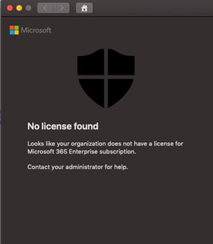

# Troubleshoot license issues for Microsoft Defender ATP for Mac

[!INCLUDE [Microsoft 365 Defender rebranding](../../includes/microsoft-defender.md)]

**Applies to:**

- [Microsoft Defender Advanced Threat Protection (Microsoft Defender ATP) for Mac](microsoft-defender-atp-mac.md)

While you are going through [Microsoft Defender ATP for Mac](microsoft-defender-atp-mac.md) and [Manual deployment](mac-install-manually.md) testing or a Proof Of Concept (PoC), you might get the following error:

**Message:** 

No license found

Looks like your organization does not have a license for Microsoft 365 Enterprise subscription.

Contact your administrator for help.

**Cause:** 

You deployed and/or installed the MDATP for macOS package ("Download installation package") but you might have run the configuration script ("Download onboarding package").

**Solution:**

Follow the MicrosoftDefenderATPOnboardingMacOs.py instructions documented here:
[Client configuration](mac-install-manually.md#client-configuration)

