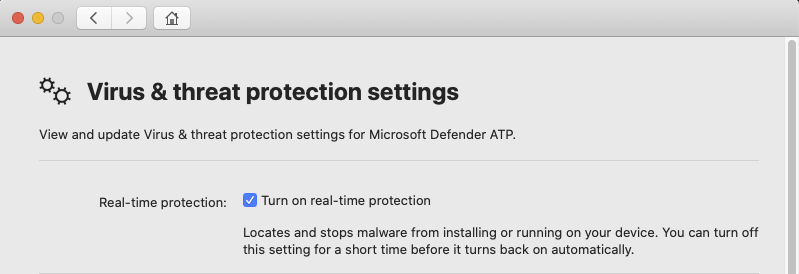

# Troubleshoot performance issues for Microsoft Defender ATP for Mac

[!INCLUDE [Microsoft 365 Defender rebranding](../../includes/microsoft-defender.md)]


**Applies to:**

- [Microsoft Defender Advanced Threat Protection (Microsoft Defender ATP) for Mac](microsoft-defender-atp-mac.md)

This topic provides some general steps that can be used to narrow down performance issues related to Microsoft Defender ATP for Mac.

Real-time protection (RTP) is a feature of Microsoft Defender ATP for Mac that continuously monitors and protects your device against threats. It consists of file and process monitoring and other heuristics.

Depending on the applications that you are running and your device characteristics, you may experience suboptimal performance when running Microsoft Defender ATP for Mac. In particular, applications or system processes that access many resources over a short timespan can lead to performance issues in Microsoft Defender ATP for Mac.

The following steps can be used to troubleshoot and mitigate these issues:

1. Disable real-time protection using one of the following methods and observe whether the performance improves. This approach helps narrow down whether Microsoft Defender ATP for Mac is contributing to the performance issues.

    If your device is not managed by your organization, real-time protection can be disabled using one of the following options:

    - From the user interface. Open Microsoft Defender ATP for Mac and navigate to **Manage settings**.

    

    - From the Terminal. For security purposes, this operation requires elevation.

    ```bash
    mdatp --config realTimeProtectionEnabled false
    ```

    If your device is managed by your organization, real-time protection can be disabled by your administrator using the instructions in [Set preferences for Microsoft Defender ATP for Mac](mac-preferences.md).

2. Open Finder and navigate to **Applications** > **Utilities**. Open **Activity Monitor** and analyze which applications are using the resources on your system. Typical examples include software updaters and compilers.

3. Configure Microsoft Defender ATP for Mac with exclusions for the processes or disk locations that contribute to the performance issues and re-enable real-time protection.

    See [Configure and validate exclusions for Microsoft Defender ATP for Mac](mac-exclusions.md) for details.
