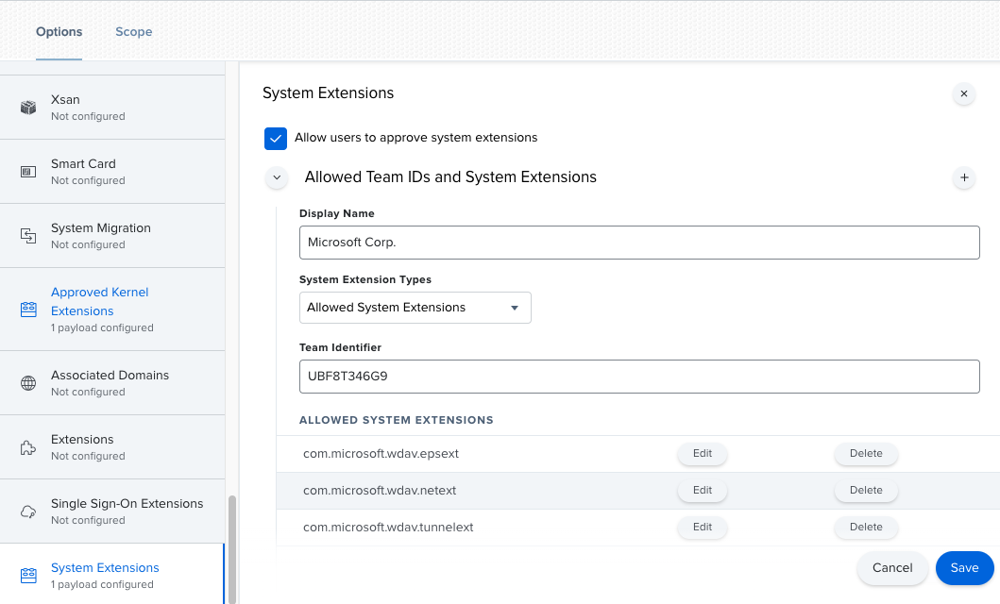
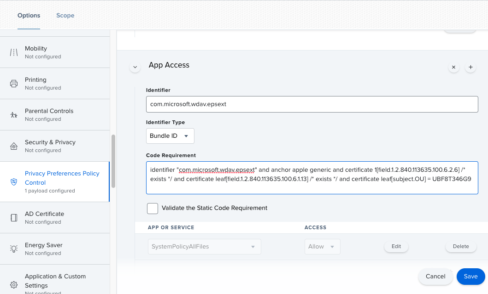
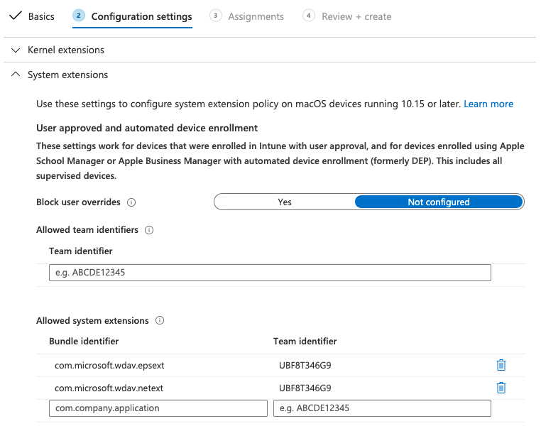
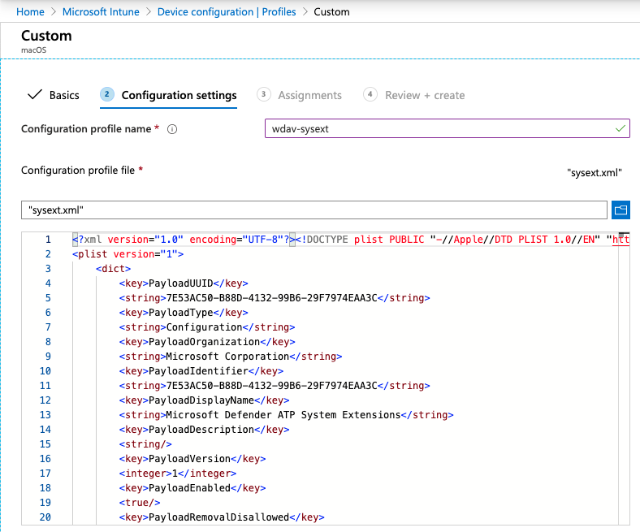

# New configuration profiles for macOS Catalina and newer versions of macOS

In alignment with macOS evolution, we are preparing a Microsoft Defender ATP for Mac update that leverages system extensions instead of kernel extensions. This update will only be applicable to macOS Catalina (10.15.4) and newer versions of macOS.

If you have deployed Microsoft Defender ATP for Mac in a managed environment (through JAMF, Intune, or another MDM solution), you must deploy new configuration profiles. Failure to do these steps will result in users getting approval prompts to run these new components.

## JAMF

### System Extensions Policy

To approve the system extensions, create the following payload:

1. In **Computers > Configuration Profiles** select **Options > System Extensions**.
2. Select **Allowed System Extensions** from the **System Extension Types** drop-down list.
3. Use **UBF8T346G9** for Team Id.
4. Add the following bundle identifiers to the **Allowed System Extensions** list:

    - **com.microsoft.wdav.epsext**
    - **com.microsoft.wdav.netext**

    

### Privacy Preferences Policy Control

Add the following JAMF payload to grant Full Disk Access to the Microsoft Defender ATP Endpoint Security Extension. This policy is a pre-requisite for running the extension on your device.

1. Select **Options** > **Privacy Preferences Policy Control**.
2. Use `com.microsoft.wdav.epsext` as the **Identifier** and `Bundle ID` as **Bundle type**.
3. Set Code Requirement to `identifier "com.microsoft.wdav.epsext" and anchor apple generic and certificate 1[field.1.2.840.113635.100.6.2.6] /* exists */ and certificate leaf[field.1.2.840.113635.100.6.1.13] /* exists */ and certificate leaf[subject.OU] = UBF8T346G9`
4. Set **App or service** to **SystemPolicyAllFiles** and access to **Allow**.

    

### Web Content Filtering Policy

A web content filtering policy is needed to run the network extension. Add the following web content filtering policy:

>[!NOTE]
>JAMF doesn’t have built-in support for content filtering policies, which are a pre-requisite for enabling the network extensions that Microsoft Defender ATP for Mac installs on the device. Furthermore, JAMF sometimes changes the content of the policies being deployed.
>As such, the following steps provide a workaround that involve signing the web content filtering configuration profile.

1. Save the following content to your device as `com.apple.webcontent-filter.mobileconfig`

    ```xml
    <?xml version="1.0" encoding="UTF-8"?><!DOCTYPE plist PUBLIC "-//Apple//DTD PLIST 1.0//EN" "http://www.apple.com/DTDs/PropertyList-1.0.dtd">
    <plist version="1">
        <dict>
            <key>PayloadUUID</key>
            <string>DA2CC794-488B-4AFF-89F7-6686A7E7B8AB</string>
            <key>PayloadType</key>
            <string>Configuration</string>
            <key>PayloadOrganization</key>
            <string>Microsoft Corporation</string>
            <key>PayloadIdentifier</key>
            <string>DA2CC794-488B-4AFF-89F7-6686A7E7B8AB</string>
            <key>PayloadDisplayName</key>
            <string>Microsoft Defender ATP Content Filter</string>
            <key>PayloadDescription</key>
            <string/>
            <key>PayloadVersion</key>
            <integer>1</integer>
            <key>PayloadEnabled</key>
            <true/>
            <key>PayloadRemovalDisallowed</key>
            <true/>
            <key>PayloadScope</key>
            <string>System</string>
            <key>PayloadContent</key>
            <array>
                <dict>
                    <key>PayloadUUID</key>
                    <string>2BA070D9-2233-4827-AFC1-1F44C8C8E527</string>
                    <key>PayloadType</key>
                    <string>com.apple.webcontent-filter</string>
                    <key>PayloadOrganization</key>
                    <string>Microsoft Corporation</string>
                    <key>PayloadIdentifier</key>
                    <string>CEBF7A71-D9A1-48BD-8CCF-BD9D18EC155A</string>
                    <key>PayloadDisplayName</key>
                    <string>Approved Content Filter</string>
                    <key>PayloadDescription</key>
                    <string/>
                    <key>PayloadVersion</key>
                    <integer>1</integer>
                    <key>PayloadEnabled</key>
                    <true/>
                    <key>FilterType</key>
                    <string>Plugin</string>
                    <key>UserDefinedName</key>
                    <string>Microsoft Defender ATP Content Filter</string>
                    <key>PluginBundleID</key>
                    <string>com.microsoft.wdav</string>
                    <key>FilterSockets</key>
                    <true/>
                    <key>FilterDataProviderBundleIdentifier</key>
                    <string>com.microsoft.wdav.netext</string>
                    <key>FilterDataProviderDesignatedRequirement</key>
                    <string>identifier &quot;com.microsoft.wdav.netext&quot; and anchor apple generic and certificate 1[field.1.2.840.113635.100.6.2.6] /* exists */ and certificate leaf[field.1.2.840.113635.100.6.1.13] /* exists */ and certificate leaf[subject.OU] = UBF8T346G9</string>
                </dict>
            </array>
        </dict>
    </plist>
    ```

2. Verify that the above file was copied correctly. From the Terminal, run the following command and verify that it outputs `OK`:

    ```bash
    $ plutil -lint com.apple.webcontent-filter.mobileconfig
    com.apple.webcontent-filter.mobileconfig: OK
    ```

3. Follow the instructions on [this page](https://www.jamf.com/jamf-nation/articles/649/creating-a-signing-certificate-using-jamf-pro-s-built-in-certificate-authority) to create a signing certificate using JAMF’s built-in certificate authority

4. After the certificate is created and installed to your device, run the following command from the Terminal:

    ```bash
    $ security cms -S -N "<certificate name>" -i com.apple.webcontent-filter.mobileconfig -o com.apple.webcontent-filter.signed.mobileconfig
    ```

5. From the JAMF portal, navigate to **Configuration Profiles** and click the **Upload** button. Select `com.apple.webcontent-filter.signed.mobileconfig` when prompted for the file.

## Intune

### System Extensions Policy

To approve the system extensions:

1. In Intune, open **Manage** > **Device configuration**. Select **Manage** > **Profiles** > **Create Profile**.
2. Choose a name for the profile. Change **Platform=macOS** to **Profile type=Extensions**. Select **Create**.
3. In the `Basics` tab, give a name to this new profile.
4. In the `Configuration settings` tab, add the following entries in the `Allowed system extensions` section:

    Bundle identifier         | Team identifier
    --------------------------|----------------
    com.microsoft.wdav.epsext | UBF8T346G9
    com.microsoft.wdav.netext | UBF8T346G9

    

5. In the `Assignments` tab, assign this profile to **All Users & All devices**.
6. Review and create this configuration profile.

### Create and deploy the Custom Configuration Profile

The following configuration profile enables the web content filter and grants Full Disk Access to the Endpoint Security system extension. 

Save the following content to a file named **sysext.xml**:

```xml
<?xml version="1.0" encoding="UTF-8"?><!DOCTYPE plist PUBLIC "-//Apple//DTD PLIST 1.0//EN" "http://www.apple.com/DTDs/PropertyList-1.0.dtd">
<plist version="1">
    <dict>
        <key>PayloadUUID</key>
        <string>7E53AC50-B88D-4132-99B6-29F7974EAA3C</string>
        <key>PayloadType</key>
        <string>Configuration</string>
        <key>PayloadOrganization</key>
        <string>Microsoft Corporation</string>
        <key>PayloadIdentifier</key>
        <string>7E53AC50-B88D-4132-99B6-29F7974EAA3C</string>
        <key>PayloadDisplayName</key>
        <string>Microsoft Defender ATP System Extensions</string>
        <key>PayloadDescription</key>
        <string/>
        <key>PayloadVersion</key>
        <integer>1</integer>
        <key>PayloadEnabled</key>
        <true/>
        <key>PayloadRemovalDisallowed</key>
        <true/>
        <key>PayloadScope</key>
        <string>System</string>
        <key>PayloadContent</key>
        <array>
            <dict>
                <key>PayloadUUID</key>
                <string>2BA070D9-2233-4827-AFC1-1F44C8C8E527</string>
                <key>PayloadType</key>
                <string>com.apple.webcontent-filter</string>
                <key>PayloadOrganization</key>
                <string>Microsoft Corporation</string>
                <key>PayloadIdentifier</key>
                <string>CEBF7A71-D9A1-48BD-8CCF-BD9D18EC155A</string>
                <key>PayloadDisplayName</key>
                <string>Approved Content Filter</string>
                <key>PayloadDescription</key>
                <string/>
                <key>PayloadVersion</key>
                <integer>1</integer>
                <key>PayloadEnabled</key>
                <true/>
                <key>FilterType</key>
                <string>Plugin</string>
                <key>UserDefinedName</key>
                <string>Microsoft Defender ATP Content Filter</string>
                <key>PluginBundleID</key>
                <string>com.microsoft.wdav</string>
                <key>FilterSockets</key>
                <true/>
                <key>FilterDataProviderBundleIdentifier</key>
                <string>com.microsoft.wdav.netext</string>
                <key>FilterDataProviderDesignatedRequirement</key>
                <string>identifier &quot;com.microsoft.wdav.netext&quot; and anchor apple generic and certificate 1[field.1.2.840.113635.100.6.2.6] /* exists */ and certificate leaf[field.1.2.840.113635.100.6.1.13] /* exists */ and certificate leaf[subject.OU] = UBF8T346G9</string>
            </dict>
            <dict>
                <key>PayloadUUID</key>
                <string>56105E89-C7C8-4A95-AEE6-E11B8BEA0366</string>
                <key>PayloadType</key>
                <string>com.apple.TCC.configuration-profile-policy</string>
                <key>PayloadOrganization</key>
                <string>Microsoft Corporation</string>
                <key>PayloadIdentifier</key>
                <string>56105E89-C7C8-4A95-AEE6-E11B8BEA0366</string>
                <key>PayloadDisplayName</key>
                <string>Privacy Preferences Policy Control</string>
                <key>PayloadDescription</key>
                <string/>
                <key>PayloadVersion</key>
                <integer>1</integer>
                <key>PayloadEnabled</key>
                <true/>
                <key>Services</key>
                <dict>
                    <key>SystemPolicyAllFiles</key>
                    <array>
                        <dict>
                            <key>Identifier</key>
                            <string>com.microsoft.wdav.epsext</string>
                            <key>CodeRequirement</key>
                            <string>identifier "com.microsoft.wdav.epsext" and anchor apple generic and certificate 1[field.1.2.840.113635.100.6.2.6] /* exists */ and certificate leaf[field.1.2.840.113635.100.6.1.13] /* exists */ and certificate leaf[subject.OU] = UBF8T346G9</string>
                            <key>IdentifierType</key>
                            <string>bundleID</string>
                            <key>StaticCode</key>
                            <integer>0</integer>
                            <key>Allowed</key>
                            <integer>1</integer>
                        </dict>
                    </array>
                </dict>
            </dict>
        </array>
    </dict>
</plist>
```

Verify that the above file was copied correctly. From the Terminal, run the following command and verify that it outputs `OK`:

    ```bash
    $ plutil -lint sysext.xml
    sysext.xml: OK
    ```

To deploy this custom configuration profile:

1.	In Intune, open **Manage** > **Device configuration**. Select **Manage** > **Profiles** > **Create profile**.
2. Choose a name for the profile. Change **Platform=macOS** and **Profile type=Custom**. Select **Configure**.
3.	Open the configuration profile and upload **sysext.xml**. This file was created in the preceding step.
4.	Select **OK**.

    

