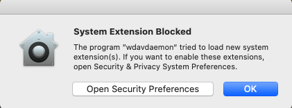
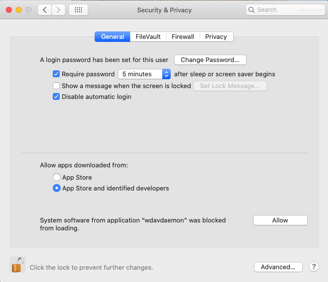
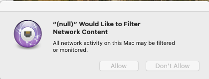
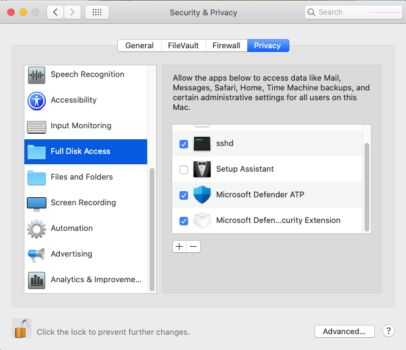

# Microsoft Defender ATP for Mac - System Extensions (Public Preview)

In alignment with macOS evolution, we are preparing a Microsoft Defender ATP for Mac update that leverages system extensions instead of kernel extensions. This update will only be applicable to macOS Catalina (10.15.4) and newer versions of macOS.

This functionality is currently in public preview. This article contains instructions for enabling this functionality on your device. You can choose to try out this feature locally on your own device or configure it remotely through a management tool.

These steps assume you already have Microsoft Defender ATP running on your device. For more information, see [this page](microsoft-defender-atp-mac.md).

## Known issues

- We’ve received reports of the network extension interfering with Apple SSO Kerberos extension.
- The current version of the product still installs a kernel extension. The kernel extension is only used as a fallback mechanism and will be removed before this feature reaches public preview.
- We are still working on a product version that deploys and functions properly on macOS 11 Big Sur.

## Deployment prerequisites

- Minimum operating system version: **10.15.4**
- Minimum product version: **101.03.73**
- Your device must be in the **Insider Fast update channel**. You can check the update channel using the following command:

```bash
mdatp --health releaseRing
```

If your device is not already in the Insider Fast update channel, execute the following command from the Terminal. The channel update takes effect next time the product starts (when the next product update is installed or when the device is rebooted).

```bash
defaults write com.microsoft.autoupdate2 ChannelName -string InsiderFast
```

Alternatively, if you are in a managed environment (JAMF or Intune), you can configure the update channel remotely. For more information, see [this page](mac-updates.md#set-the-channel-name).

## Deployment steps

Select the deployment steps corresponding to your environment and your preferred method of trying out this feature.

### Manual deployment

#### Approve the system extensions & enable network extension

Once all deployment prerequisites are met, restart your device to start the system extension approval and activation process.

You will be presented series of system prompts to approve the Microsoft Defender ATP system extensions. You must approve ALL prompts from the series, because macOS requires an explicit approval for each extension that Microsoft Defender ATP for Mac installs on the device.

For each approval, click **Open Security Preferences** and then click **Allow** to allow the system extension to run.

> [!IMPORTANT]
> Between subsequent approvals, you must close and re-open the **System Preferences** > **Security & Privacy** window, otherwise macOS will not display the next approval. 

> [!IMPORTANT]
> There is a one minute timeout before the product falls back to the kernel extension (to ensure that the device is protected). 
>
> If more than one minute has elapsed, restart the daemon (by rebooting the device or using `sudo killall -9 wdavdaemon`) in order to trigger the approval flow again.





Following the approval of the system extensions, macOS will prompt for an approval to allow network traffic to be filtered. Click **Allow**.



#### Grant Full Disk Access to the Endpoint Security system extension

Open **System Preferences** > **Security & Privacy** > **Privacy** tab and grant **Full Disk Access** to the **Microsoft Defender Endpoint Security Extension**.



#### Reboot your device

In order for the changes to take effect, you must reboot your device.

#### Verify that the system extensions are running

From the Terminal, run the following command:

```bash
mdatp health --field real_time_protection_subsystem
```

Terminal output `endpoint_security_extension` indicates the product is using the system extensions functionality.

### Managed deployment

Refer to [this page](mac-sysext-policies.md#jamf) for the new configuration profiles that must be deployed for this new feature.

In addition to those profiles, make sure the target devices are also configured to be in the Insider Fast update channel, as described in [this section](#deployment-prerequisites).

On a device where all prerequisites are met and the new configuration profiles have been deployed, run:

    ```bash
	$ mdatp health --field real_time_protection_subsystem
    ```

If this command prints `endpoint_security_extension`, then the product is using the system extensions functionality.

## Validate basic scenarios

1. Test EICAR detection. From a Terminal window, run:

```bash
curl -o eicar.txt https://secure.eicar.org/eicar.com.txt
```

Verify that the EICAR file is quarantined. This can be done from the user interface (from the Protection History page) or command line using the following command:

```bash
mdatp threat list
```

2. Test EDR DIY scenario. From a terminal window, run:

```bash
curl -o "MDATP MacOS DIY.zip" https://aka.ms/mdatpmacosdiy
```

    Validate that two alerts have popped up in the portal in the machine page for EICAR and EDR DIY scenarios.

## Frequently asked questions

- Q: Why am I still seeing `kernel_extension` when I run `mdatp health --field real_time_protection_subsystem`?
    
    A: Refer back to the [Deployment prerequisites](#deployment-prerequisites) section and double-check all of them are met. If all prerequisites are met, restart your device and check again.

- Q: When is macOS 11 Big Sur going to be supported?

    A: We are actively working on adding support for macOS 11. We will post more information to the [What's new](mac-whatsnew.md).