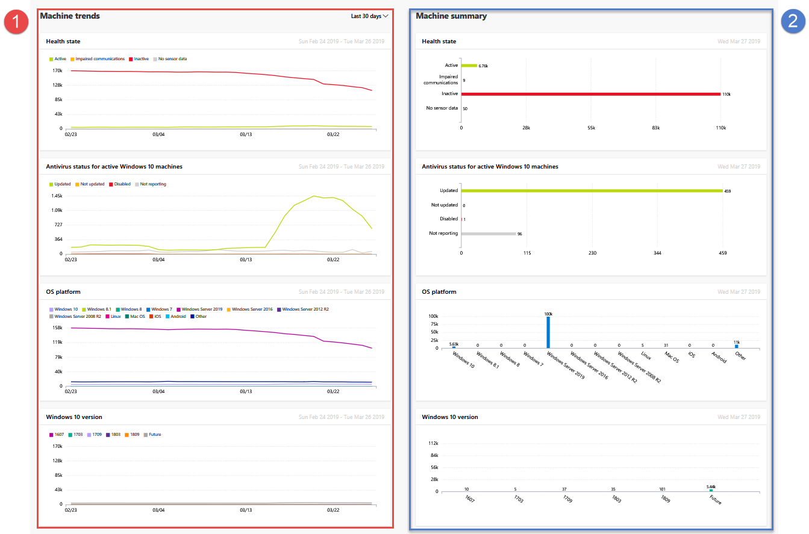

# Machine health and compliance report in Microsoft Defender ATP

**Applies to:**
- [Microsoft Defender Advanced Threat Protection (Microsoft Defender ATP)](https://go.microsoft.com/fwlink/p/?linkid=2069559)

[!include[Prerelease information](prerelease.md)]
 
The machines status report provides high-level information about the devices in your organization. The report includes trending information showing the sensor health state, antivirus status, OS platforms, and Windows 10 versions.

The dashboard is structured into two sections:
 
 
Section | Description
:---|:---
1 | Machine trends
2 | Machine summary (current day)
 
 
 
By default, the machine trends displays machine information from the 30-day period ending in the latest full day. To gain better perspective on trends occurring in your organization, you can fine-tune the reporting period by adjusting the time period shown. To adjust the time period, select a time range from the drop-down options:
 
- 30 days
- 3 months
- 6 months
- Custom
 
While the machines trends shows trending machine information, the machine summary shows machine information scoped to the current day.
 
The machine trends section allows you to drill down to the machines list with the corresponding filter applied to it. For example, clicking on the Inactive bar in the Sensor health state card will bring you the machines list with results showing only machines whose sensor status is inactive. 
 
 
 
 
## Machine attributes
The report is made up of cards that display the following machine attributes:
 
- **Health state**: shows information about the sensor state on devices, providing an aggregated view of devices that are active, experiencing impaired communications, inactive, or where no sensor data is seen.
  
- **Antivirus status for active Windows 10 machines**: shows the number of machines and status of Windows Defender Antivirus.
    
- **OS platforms**: shows the distribution of OS platforms that exists within your organization. 
 
- **Windows 10 versions**: shows the distribution of Windows 10 machines and their versions in your organization.
 
 
 
## Filter data
 
Use the provided filters to include or exclude machines with certain attributes.

You can select multiple filters to apply from the machine attributes. 
 
>[!NOTE]
>These filters apply to **all** the cards in the report.
 
For example, to show data about Windows 10 machines with Active sensor health state:
 
1. Under **Filters > Sensor health state > Active**.
2. Then select **OS platforms > Windows 10**.
3. Select **Apply**.

## Related topic
- [Threat protection report ](threat-protection-reports.md)