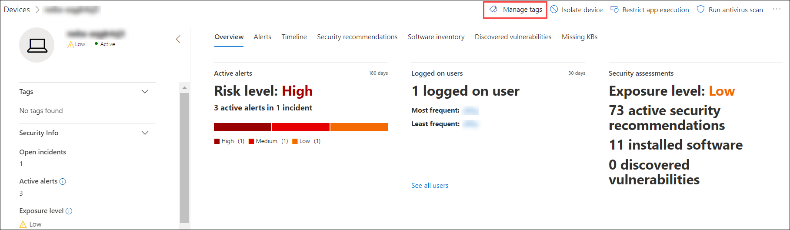
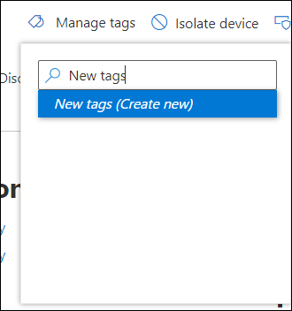
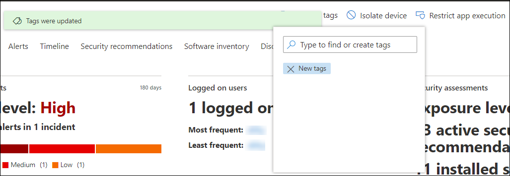

# Create and manage machine tags

Add tags on machines to create a logical group affiliation. Machine tags support proper mapping of the network, enabling you to attach different tags to capture context and to enable dynamic list creation as part of an incident. Tags can be used as a filter in **Machines list** view, or to group machines. For more information on machine grouping, see [Create and manage machine groups](machine-groups.md).

You can add tags on machines using the following ways:

- Using the portal
- Setting a registry key value

To add machine tags using API, see [Add or remove machine tags API](add-or-remove-machine-tags.md).

## Add and manage machine tags using the portal

1. Select the machine that you want to manage tags on. You can select or search for a machine from any of the following views:

    - **Security operations dashboard** - Select the machine name from the Top machines with active alerts section.
    - **Alerts queue** - Select the machine name beside the machine icon from the alerts queue.
    - **Machines list** - Select the machine name from the list of machines.
    - **Search box** - Select Machine from the drop-down menu and enter the machine name.

    You can also get to the alert page through the file and IP views.

2. Select **Manage Tags** from the row of Response actions.

    

3. Type to find or create tags

    

Tags are added to the machine view and will also be reflected on the **Machines list** view. You can then use the **Tags** filter to see the relevant list of machines.

You can also delete tags from this view.

## Add machine tags by setting a registry key value

>[!NOTE]
> Applicable only on the following machines:
>- Windows 10, version 1709 or later
>- Windows Server, version 1803 or later
>- Windows Server 2016
>- Windows Server 2012 R2

Machines with similar tags can be handy when you need to apply contextual action on a specific list of machines.

Use the following registry key entry to add a tag on a machine:

- Registry key: `HKEY_LOCAL_MACHINE\SOFTWARE\Policies\Microsoft\Windows Advanced Threat Protection\DeviceTagging\`
- Registry key value (string): Group

>[!NOTE]
>The device tag is part of the machine information report that's generated once a day. As an alternative, you may choose to restart the endpoint that would transfer a new machine information report.
