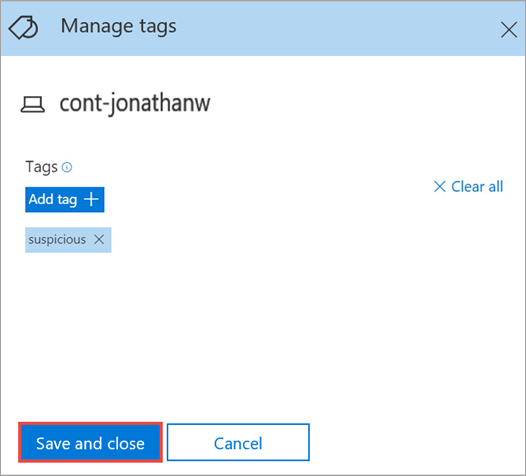
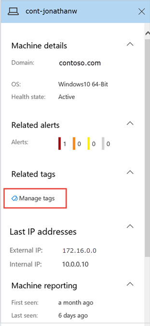

# Create and manage machine tags
Add tags on machines to create a logical group affiliation. Machine group affiliation can represent geographic location, specific activity, importance level and others.

You can create machine groups in the context of role-based access (RBAC) to control who can take specific action or who can see information on a specific machine group or groups by assigning the machine group to a user group. For more information, see [Manage portal access using role-based access control](rbac.md).

You can also use machine groups to assign specific remediation levels to apply during automated investigations. For more information, see [Create and manage machine groups](machine-groups.md).

In an investigation, you can filter the Machines list to just specific machine groups by using the Groups filter. 

Machine tags support proper mapping of the network, enabling you to attach different tags to capture context and to enable dynamic list creation as part of an incident. 

You can add tags on machines using the following ways:
- By setting a registry key value
- By using the portal

## Add machine tags by setting a registry key value
Add tags on machines which can be used as a filter in Machines list view. You can limit the machines in the list by selecting the Tag filter on the Machines list.

>[!NOTE]
> Applicable only on the following machines:
>- Windows 10, version 1709 or later
>- Windows Server, version 1803 or later
>- Windows Server 2016
>- Windows Server 2012 R2 

Machines with similar tags can be handy when you need to apply contextual action on a specific list of machines. 

Use the following registry key entry to add a tag on a machine:

-	Registry key: `HKLM\SOFTWARE\Policies\Microsoft\Windows Advanced Threat Protection\DeviceTagging\`
-	Registry key value (string): Group

>[!NOTE]
>The device tag is part of the machine information report that's generated once a day. As an alternative, you may choose to restart the endpoint that would transfer a new machine information report. 

## Add machine tags using the portal
Dynamic context capturing is achieved using tags. By tagging machines, you can keep track of individual machines in your organization. After adding tags on machines, you can apply the Tags filter on the Machines list to get a narrowed list of machines with the tag.

1.	Select the machine that you want to manage tags on. You can select or search for a machine from any of the following views:

    -	**Security operations dashboard** - Select the machine name from the Top machines with active alerts section.
    -	**Alerts queue** - Select the machine name beside the machine icon from the alerts queue.
    -	**Machines list** - Select the machine name from the list of machines.
    -	**Search box** - Select Machine from the drop-down menu and enter the machine name.

    You can also get to the alert page through the file and IP views.

2.	Open the **Actions** menu and select **Manage tags**.

    

3. Enter tags on the machine. To add more tags, click the + icon.
4. Click **Save and close**. 

    

    Tags are added to the machine view and will also be reflected on the **Machines list** view. You can then use the **Tags** filter to see the relevant list of machines.

### Manage machine tags
You can manage tags from the Actions button or by selecting a machine from the Machines list and opening the machine details panel. 

## Add machine tags using APIs
For more information, see [Add or remove machine tags API](add-or-remove-machine-tags.md).

