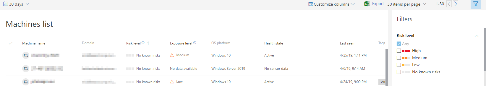

# View and organize the Microsoft Defender ATP Machines list

**Applies to:**

- [Microsoft Defender Advanced Threat Protection (Microsoft Defender ATP)](https://go.microsoft.com/fwlink/p/?linkid=2069559)

>Want to experience Microsoft Defender ATP? [Sign up for a free trial.](https://www.microsoft.com/en-us/WindowsForBusiness/windows-atp?ocid=docs-wdatp-machinesview-abovefoldlink)

The **Machines list** shows a list of the machines in your network where alerts were generated. By default, the queue displays machines with alerts seen in the last 30 days.  

At a glance you'll see information such as domain, risk level, OS platform, and other details for easy identification of machines most at risk.

There are several options you can choose from to customize the machines list view. On the top navigation you can:

- Add or remove columns
- Export the entire list in CSV format
- Select the number of items to show per page
- Apply filters

During the onboarding process, the **Machines list** is gradually populated with machines as they begin to report sensor data. Use this view to track your onboarded endpoints as they come online, or download the complete endpoint list as a CSV file for offline analysis.

>[!NOTE]
> If you export the machine list, it will contain every machine in your organization. It might take a significant amount of time to download, depending on how large your organization is. Exporting the list in CSV format displays the data in an unfiltered manner. The CSV file will include all machines in the organization, regardless of any filtering applied in the view itself.

## Sort and filter the machine list

You can apply the following filters to limit the list of alerts and get a more focused view.

### Risk level

The risk level reflects the overall risk assessment of the machine based on a combination of factors, including the types and severity of active alerts on the machine. Resolving active alerts, approving remediation activities, and suppressing subsequent alerts can lower the risk level.

### Exposure level

The exposure level reflects the current exposure of the machine based on the cumulative impact of its pending security recommendations.

### OS Platform

Select only the OS platforms you're interested in investigating.

### Health state

Filter by the following machine health states:

- **Active** – Machines that are actively reporting sensor data to the service.
- **Inactive** – Machines that have completely stopped sending signals for more than 7 days.
- **Misconfigured** – Machines that have impaired communications with service or are unable to send sensor data. Misconfigured machines can further be classified to:
  - No sensor data
  - Impaired communications

  For more information on how to address issues on misconfigured machines see, [Fix unhealthy sensors](fix-unhealthy-sensors.md).

### Security state

Filter by machines that are well configured or require attention based on the security controls that are enabled in your organization. Applies to active Windows 10 machines only.

- **Well configured** - Machines have the security controls well configured.
- **Requires attention** - Machines where improvements can be made to increase the overall security posture of your organization.

For more information, see [View the Secure Score dashboard](secure-score-dashboard.md).

### Threat mitigation status

To view machines that may be affected by a certain threat, select the threat from the dropdown menu, and then select what vulnerability aspect needs to be mitigated.

To learn more about certain threats, see [Threat analytics](threat-analytics.md). For mitigation information, see [Threat & Vulnerability Management](next-gen-threat-and-vuln-mgt.md).

### Windows 10 version

Select only the Windows 10 versions you're interested in investigating.

### Tags & Groups

Filter the list based on the grouping and tagging that you've added to individual machines. See [Create and manage machine tags](machine-tags.md) and [Create and manage machine groups](machine-groups.md).

## Related topics

- [Investigate machines in the Microsoft Defender ATP Machines list](investigate-machines.md)
