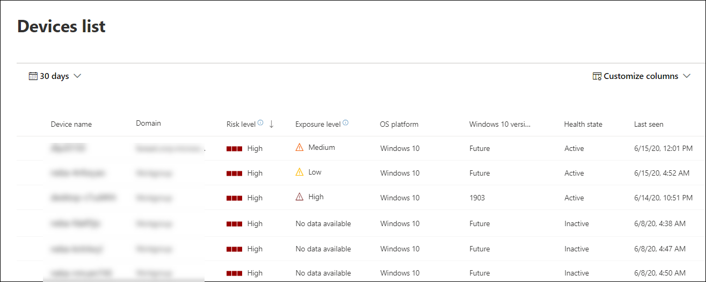

# View and organize the Microsoft Defender for Endpoint Devices list

[!INCLUDE [Microsoft 365 Defender rebranding](../../includes/microsoft-defender.md)]

**Applies to:**

- [Microsoft Defender for Endpoint)](https://go.microsoft.com/fwlink/p/?linkid=2146631)

>Want to experience Defender for Endpoint? [Sign up for a free trial.](https://www.microsoft.com/microsoft-365/windows/microsoft-defender-atp?ocid=docs-wdatp-machinesview-abovefoldlink)

The **Devices list** shows a list of the devices in your network where alerts were generated. By default, the queue displays devices with alerts seen in the last 30 days.  

At a glance you'll see information such as domain, risk level, OS platform, and other details for easy identification of devices most at risk.

There are several options you can choose from to customize the devices list view. On the top navigation you can:

- Add or remove columns
- Export the entire list in CSV format
- Select the number of items to show per page
- Apply filters

During the onboarding process, the **Devices list** is gradually populated with devices as they begin to report sensor data. Use this view to track your onboarded endpoints as they come online, or download the complete endpoint list as a CSV file for offline analysis.

>[!NOTE]
> If you export the device list, it will contain every device in your organization. It might take a significant amount of time to download, depending on how large your organization is. Exporting the list in CSV format displays the data in an unfiltered manner. The CSV file will include all devices in the organization, regardless of any filtering applied in the view itself.

## Sort and filter the device list

You can apply the following filters to limit the list of alerts and get a more focused view.

### Risk level

The risk level reflects the overall risk assessment of the device based on a combination of factors, including the types and severity of active alerts on the device. Resolving active alerts, approving remediation activities, and suppressing subsequent alerts can lower the risk level.

### Exposure level

The exposure level reflects the current exposure of the device based on the cumulative impact of its pending security recommendations. The possible levels are low, medium, and high. Low exposure means your devices are less vulnerable from exploitation.

If the exposure level says "No data available," there are a few reasons why this may be the case:

- Device stopped reporting for more than 30 days – in that case it is considered inactive, and the exposure isn't computed
- Device OS not supported - see [minimum requirements for Microsoft Defender for Endpoint](minimum-requirements.md)
- Device with stale agent (very unlikely)

### OS Platform

Select only the OS platforms you're interested in investigating.

### Health state

Filter by the following device health states:

- **Active** – Devices that are actively reporting sensor data to the service.
- **Inactive** – Devices that have completely stopped sending signals for more than 7 days.
- **Misconfigured** – Devices that have impaired communications with service or are unable to send sensor data. Misconfigured devices can further be classified to:
  - No sensor data
  - Impaired communications

  For more information on how to address issues on misconfigured devices see, [Fix unhealthy sensors](fix-unhealthy-sensors.md).

### Antivirus status

Filter devices by antivirus status. Applies to active Windows 10 devices only.

- **Disabled** - Virus & threat protection is turned off.
- **Not reporting** - Virus & threat protection is not reporting.
- **Not updated** - Virus & threat protection is not up to date.

For more information, see [View the Threat & Vulnerability Management dashboard](tvm-dashboard-insights.md).

### Threat mitigation status

To view devices that may be affected by a certain threat, select the threat from the dropdown menu, and then select what vulnerability aspect needs to be mitigated.

To learn more about certain threats, see [Threat analytics](threat-analytics.md). For mitigation information, see [Threat & Vulnerability Management](next-gen-threat-and-vuln-mgt.md).

### Windows 10 version

Select only the Windows 10 versions you're interested in investigating.

### Tags & Groups

Filter the list based on the grouping and tagging that you've added to individual devices. See [Create and manage device tags](machine-tags.md) and [Create and manage device groups](machine-groups.md).

## Related topics

- [Investigate devices in the Microsoft Defender for Endpoint Devices list](investigate-machines.md)
