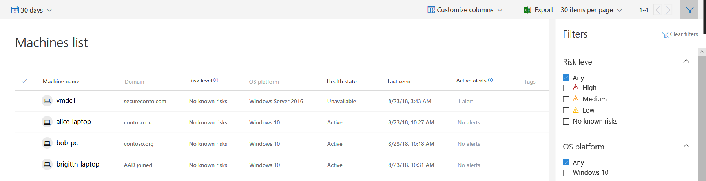

# View and organize the Microsoft Defender ATP Machines list

**Applies to:**

- [Microsoft Defender Advanced Threat Protection (Microsoft Defender ATP)](https://go.microsoft.com/fwlink/p/?linkid=2069559)

>Want to experience Microsoft Defender ATP? [Sign up for a free trial.](https://www.microsoft.com/en-us/WindowsForBusiness/windows-atp?ocid=docs-wdatp-machinesview-abovefoldlink)

The **Machines list** shows a list of the machines in your network where alerts were generated. By default, the queue displays machines with alerts seen in the last 30 days.  

At a glance you'll see information such as domain, risk level, OS platform, and other details. 

There are several options you can choose from to customize the machines list view. 
On the top navigation you can:
- Customize columns to add or remove columns 
- Export the entire list in CSV format
- Select the items to show per page
- Navigate between pages
- Apply filters

Use the machine list in these main scenarios:

- **During onboarding** 
  During the onboarding process, the **Machines list** is gradually populated with machines as they begin to report sensor data. Use this view to track your onboarded endpoints as they come online. Sort and filter by time of last report, **Active malware category**, or **Sensor health state**, or download the complete endpoint list as a CSV file for offline analysis.
    
    >[NOTE]
    > Exporting the list depends on the number of machines in your organization. It might take a significant amount of time to download, depending on how large your organization is.
Exporting the list in CSV format displays the data in an unfiltered manner. The CSV file will include all machines in the organization, regardless of any filtering applied in the view itself.

- **Day-to-day work**  
  The list enables easy identification of machines most at risk in a glance. High-risk machines have the greatest number and highest-severity alerts. Sorting machines by **Active alerts**, helps identify the most vulnerable machines and take action on them.

## Sort and filter the machine list
You can apply the following filters to limit the list of alerts and get a more focused view. 

### Risk level
Machine risk levels are indicators of the active threats that machines could be exposed to. A machine's risk level is determined using the number of active alerts and their severity levels. You can influence a machine's risk level by resolving associated alerts manually or automatically and also by suppressing an alert.

### OS Platform
Limit the alerts queue view by selecting the OS platform that you're interested in investigating.

### Health state
Filter the list to view specific machines grouped together by the following machine health states:

- **Active** – Machines that are actively reporting sensor data to the service.
- **Misconfigured** – Machines that have impaired communications with service or are unable to send sensor data. Misconfigured machines can further be classified to:
  - No sensor data
  - Impaired communications

  For more information on how to address issues on misconfigured machines see,  [Fix unhealthy sensors](fix-unhealthy-sensors.md).
-	**Inactive** – Machines that have completely stopped sending signals for more than 7 days.

### Security state
Filter the list to view specific machines that are well configured or require attention based on the Windows Defender security controls that are enabled in your organization. 

- **Well configured** - Machines have the Windows Defender security controls well configured. 
- **Requires attention** - Machines where improvements can be made to increase the overall security posture of your organization.

For more information, see [View the Secure Score dashboard](secure-score-dashboard.md).

### Tags
You can filter the list based on the grouping and tagging that you've added to individual machines. 

## Related topics
- [Investigate machines in the Microsoft Defender ATP Machines list](investigate-machines.md)

