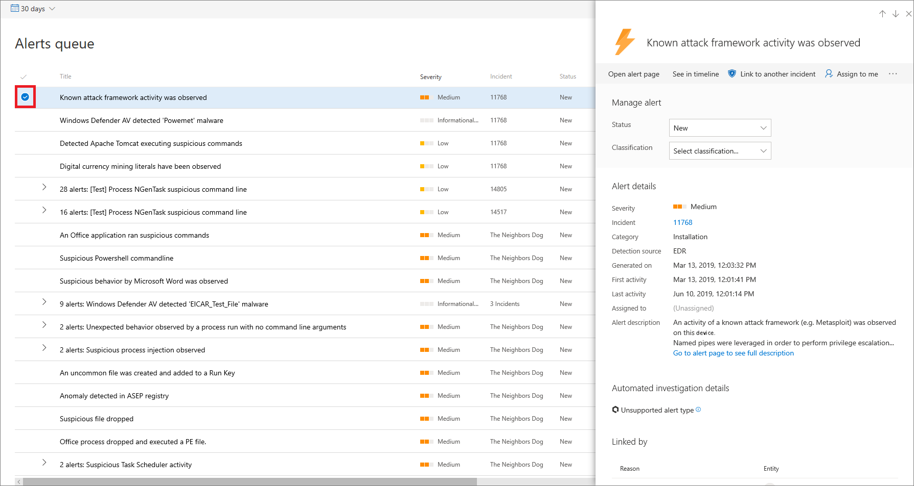

# Manage Microsoft Defender Advanced Threat Protection alerts

**Applies to:**
- [Microsoft Defender Advanced Threat Protection (Microsoft Defender ATP)](https://go.microsoft.com/fwlink/p/?linkid=2069559)

>Want to experience Microsoft Defender ATP? [Sign up for a free trial.](https://www.microsoft.com/en-us/WindowsForBusiness/windows-atp?ocid=docs-wdatp-managealerts-abovefoldlink)

Microsoft Defender ATP notifies you of possible malicious events, attributes, and contextual information through alerts. A summary of new alerts is displayed in the **Security operations dashboard**, and you can access all alerts in the **Alerts queue**.

You can manage alerts by selecting an alert in the **Alerts queue** or the **Alerts related to this machine** section of the machine details view.

Selecting an alert in either of those places brings up the **Alert management pane**.

## Link to another incident
You can create a new incident from the alert or link to an existing incident. 

## Assign alerts
If an alert is no yet assigned, you can select **Assign to me** to assign the alert to yourself.

## Suppress alerts
There might be scenarios where you need to suppress alerts from appearing in Microsoft Defender Security Center. Microsoft Defender ATP lets you create suppression rules for specific alerts that are known to be innocuous such as known tools or processes in your organization. 

Suppression rules can be created from an existing alert. They can be disabled and reenabled if needed.

When a suppression rule is created, it will take effect from the point when the rule is created. The rule will not affect existing alerts already in the queue prior to the rule creation. The rule will only be applied on alerts that satisfy the conditions set after the rule is created.

There are two contexts for a suppression rule that you can choose from:

- **Suppress alert on this machine**
- **Suppress alert in my organization**

The context of the rule lets you tailor what gets surfaced into the portal and ensure that only real security alerts are surfaced into the portal.

You can use the examples in the following table to help you choose the context for a suppression rule:

| **Context**                           | **Definition**                                                                                                                                              | **Example scenarios**                                                                                                                                                                                                  |
|:--------------------------------------|:------------------------------------------------------------------------------------------------------------------------------------------------------------|:-----------------------------------------------------------------------------------------------------------------------------------------------------------------------------------------------------------------------|
| **Suppress alert on this machine**    | Alerts with the same alert title and on that specific machine only will be suppressed.   All other alerts on that machine will not be suppressed. | <ul><li>A security researcher is investigating a malicious script that has been used to attack other machines in your organization.</li><li>A developer regularly creates PowerShell scripts for their team.</li></ul> |
| **Suppress alert in my organization** | Alerts with the same alert title on any machine will be suppressed.                                                                                         | <ul><li>A benign administrative tool is used by everyone in your organization.</li></ul>                                                                                                                               |

### Suppress an alert and create a new suppression rule:
Create custom rules to control when alerts are suppressed, or resolved. You can control the context for when an alert is suppressed by specifying the alert title, Indicator of compromise, and the conditions. After specifying the context, you’ll be able to configure the action and scope on the alert. 

1. Select the alert you'd like to suppress. This brings up the **Alert management** pane.

2.  Select **Create a suppression rule**.

    You can create a suppression rule based on the following attributes:
    
    * File hash 
    * File name - wild card supported
    * File path - wild card supported
    * IP
    * URL - wild card supported

3. Select the **Trigerring IOC**.
    
4. Specify the action and scope on the alert.  
   You can automatically resolve an alert or hide it from the portal. Alerts that are automatically resolved will appear in the resolved section of the alerts queue. Alerts that are marked as hidden will be suppressed from the entire system, both on the machine's associated alerts and from the dashboard. You can also specify to suppress the alert on a specific machine group.

5. Enter a rule name and a comment.

6. Click **Save**.

#### View the list of suppression rules

1. In the navigation pane, select **Settings** > **Alert suppression**.

2. The list of suppression rules shows all the rules that users in your organization have created.

For more information on managing suppression rules, see [Manage suppression rules](manage-suppression-rules.md)

## Change the status of an alert

You can categorize alerts (as **New**, **In Progress**, or **Resolved**) by changing their status as your investigation progresses. This helps you organize and manage how your team can respond to alerts.

For example, a team leader can review all **New** alerts, and decide to assign them to the **In Progress** queue for further analysis.

Alternatively, the team leader might assign the alert to the **Resolved** queue if they know the alert is benign, coming from a machine that is irrelevant (such as one belonging to a security administrator), or is being dealt with through an earlier alert.

## Alert classification
You can choose not to set a classification, or specify whether an alert is a true alert or a false alert. It's important to provide the classification of true positive/false positive. This classification is used to monitor alert quality, and make alerts more accurate. The "determination" field defines additional fidelity for a "true positive" classification. 

## Add comments and view the history of an alert
You can add comments and view historical events about an alert to see previous changes made to the alert.

Whenever a change or comment is made to an alert, it is recorded in the **Comments and history** section.

Added comments instantly appear on the pane.

## Related topics
- [Manage suppression rules](manage-suppression-rules.md)
- [View and organize the Microsoft Defender Advanced Threat Protection Alerts queue](alerts-queue.md)
- [Investigate Microsoft Defender Advanced Threat Protection alerts](investigate-alerts.md)
- [Investigate a file associated with a Microsoft Defender ATP alert](investigate-files.md)
- [Investigate machines in the Microsoft Defender ATP Machines list](investigate-machines.md)
- [Investigate an IP address associated with a Microsoft Defender ATP alert](investigate-ip.md)
- [Investigate a domain associated with a Microsoft Defender ATP alert](investigate-domain.md)
- [Investigate a user account in Microsoft Defender ATP](investigate-user.md)
