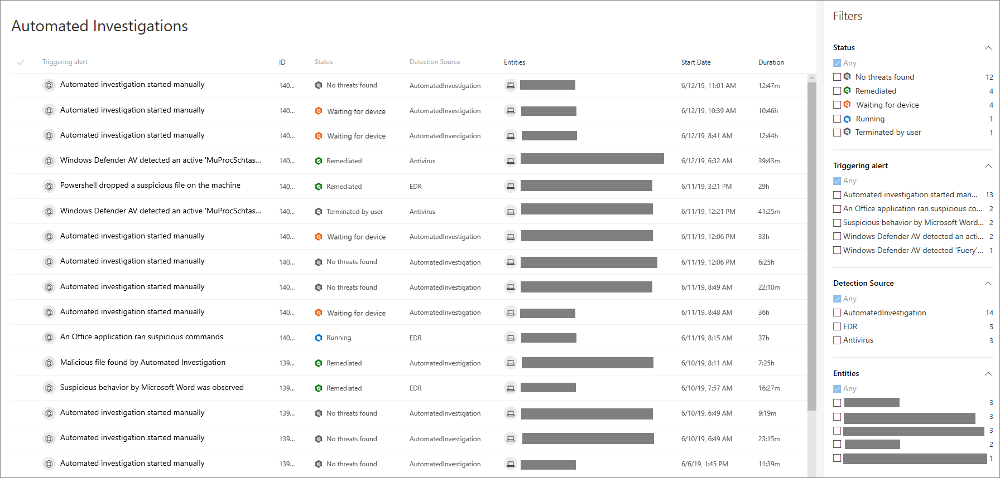
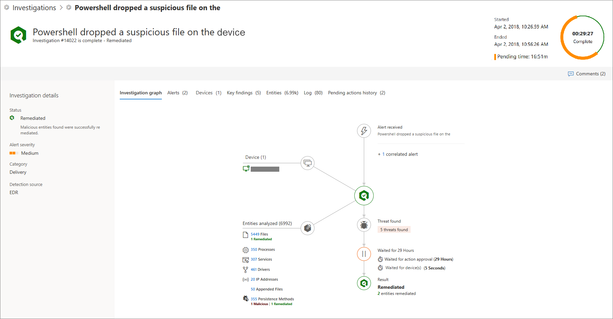
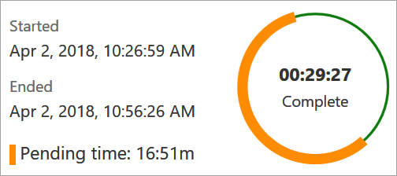
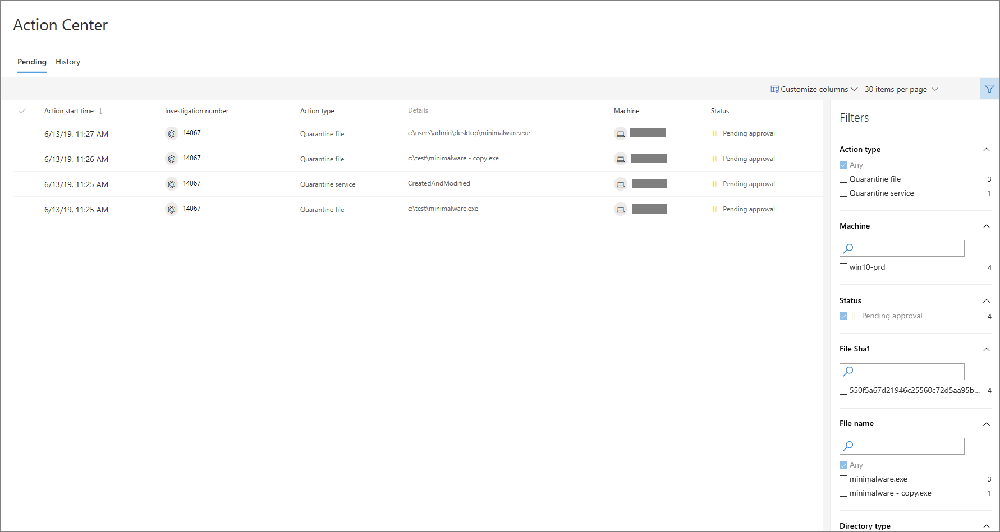

# Learn about the automated investigations dashboard
By default, the Automated investigations list displays investigations initiated in the last week. You can also choose to select other time ranges from the drop-down menu or specify a custom range. 

>[!NOTE]
>If your organization has implemented role-based access to manage portal access, only authorized users or user groups who have permission to view the machine or machine group will be able to view the entire investigation. 

Use the **Customize columns** drop-down menu to select columns that you'd like to show or hide. 

From this view, you can also download the entire list in CSV format using the **Export** button, specify the number of items to show per page, and navigate between pages. You also have the flexibility to filter the list based on your preferred criteria.

 
**Filters** 
You can use the following operations to customize the list of Automated investigations displayed:

**Triggering alert** 
The alert the initiated the Automated investigation.

**Status** 
An Automated investigation can be in one of the following status:

Status | Description
:---|:---
| No threats found                                          | No malicious entities found during the investigation.
| Failed                                                    | A problem has interrupted the investigation, preventing it from completing.                                                         |
| Partially remediated                                      | A problem prevented the remediation of some malicious entities.                                                                     |
| Pending action                                          | Remediation actions require review and approval.                                                                                    |
| Waiting for machine                                       | Investigation paused. The investigation will resume as soon as the machine is available.                                            |
| Queued                                                    | Investigation has been queued and will resume as soon as other remediation activities are completed.                                |
| Running                                                   | Investigation ongoing. Malicious entities found will be remediated.                                                                 |
| Remediated                                                | Malicious entities found were successfully remediated.                                                                              |
| Terminated by system                                      | Investigation was stopped by the system.                                                                                          |
| Terminated by user                                        | A user stopped the investigation before it could complete.  
| Partially investigated                                    | Entities directly related to the alert have been investigated. However, a problem stopped the investigation of collateral entities. |

**Detection source** 
Source of the alert that initiated the Automated investigation. 

**Threat** 
The category of threat detected during the Automated investigation.

**Tags** 
Filter using manually added tags that capture the context of an Automated investigation.

**Machines** 
You can filter the Automated investigations list to zone in a specific machine to see other investigations related to the machine.

**Machine groups** 
Apply this filter to see specific machine groups that you might have created.

**Comments** 
Select between filtering the list between Automated investigations that have comments and those that don't.

## Analyze Automated investigations 
You can view the details of an Automated investigation to see information such as the investigation graph, alerts associated with the investigation, the machine that was investigated, and other information.

In this view, you'll see the name of the investigation, when it started and ended. 

The progress ring shows two status indicators:
- Orange ring - shows the pending portion of the investigation
- Green ring - shows the running time portion of the investigation

 

In the example image, the automated investigation started on 10:26:59 AM and ended on 10:56:26 AM. Therefore, the entire investigation was running for 29 minutes and 27 seconds. 

The pending time of 16 minutes and 51 seconds reflects two possible pending states: pending for asset (for example, the device might have disconnected from the network) or pending for approval. 

From this view, you can also view and add comments and tags about the investigation.

### Investigation page
The investigation page gives you a quick summary on the status, alert severity, category, and detection source.

You'll also have access to the following sections that help you see details of the investigation with finer granularity:

- Investigation graph
- Alerts
- Machines
- Threats
- Entities
- Log
- Pending actions

  >[!NOTE]
  >The Pending actions tab is only displayed if there are actual pending actions.

- Pending actions history

  >[!NOTE]
  >The Pending actions history tab is only displayed when an investigation is complete.

In any of the sections, you can customize columns to further expand to limit the details you see in a section.

### Investigation graph
The investigation graph provides a graphical representation of an Automated investigation. All investigation related information is simplified and arranged in specific sections. Clicking on any of the icons brings you the relevant section where you can view more information.

### Alerts
Shows details such as a short description of the alert that initiated the Automated investigation, severity, category, the machine associated with the alert, user, time in queue, status, investigation state, and who the investigation is assigned to. 

Additional alerts seen on a machine can be added to an Automated investigation as long as the investigation is ongoing. 

Selecting an alert using the check box brings up the alerts details pane where you have the option of opening the alert page, manage the alert by changing its status, see alert details, Automated investigation details, related machine, logged-on users, and comments and history. 

Clicking on an alert title brings you the alert page.

### Machines
Shows details the machine name, IP address, group, users, operating system, remediation level, investigation count, and when it was last investigated.

Machines that show the same threat can be added to an ongoing investigation and will be displayed in this tab. If 10 or more machines are found during this expansion process from the same entity, then that expansion action will require an approval and will be seen in the **Pending actions** view.

Selecting a machine using the checkbox brings up the machine details pane where you can see more information such as machine details and logged-on users.

Clicking on an machine name brings you the machine page.

### Threats
Shows details related to threats associated with this investigation. 

### Entities
Shows details about entities such as files, process, services, drives, and IP addresses. The table details such as the number of entities that were analyzed. You'll gain insight into details such as how many are remediated, suspicious, or determined to be clean.

### Log
Gives a chronological detailed view of all the investigation actions taken on the alert. You'll see the action type, action, status, machine name, description of the action, comments entered by analysts who may have worked on the investigation, execution start time, duration, pending duration.

As with other sections, you can customize columns, select the number of items to show per page, and filter the log.

Available filters include action type, action, status, machine name, and description.

You can also click on an action to bring up the details pane where you'll see information such as the summary of the action and input data. 

### Pending actions history
This tab is only displayed when an investigation is complete and shows all pending actions taken during the investigation.

## Pending actions
If there are pending actions on an Automated investigation, you'll see a pop up similar to the following image. 

When you click on the pending actions link, you'll be taken to the pending actions page. You can also navigate to the page from the navigation page by going to **Automated investigation** > **Pending actions**.

 
The pending actions view aggregates all investigations that require an action for an investigation to proceed or be completed.

Use the Customize columns drop-down menu to select columns that you'd like to show or hide. 

From this view, you can also download the entire list in CSV format using the **Export** feature, specify the number of items to show per page, and navigate between pages.

Pending actions are grouped together in the following tabs:
-  Quarantine file
-  Remove persistence
-  Stop process
-  Expand pivot
-  Quarantine service

>[!NOTE]
>The tab will only appear if there are pending actions for that category.

### Approve or reject an action
You'll need to manually approve or reject pending actions on each of these categories for the automated actions to proceed.

Selecting an investigation from any of the categories opens a panel where you can approve or reject the remediation. Other details such as file or service details, investigation details, and alert details are displayed.

From the panel, you can click on the Open investigation page link to see the investigation details.

You also have the option of selecting multiple investigations to approve or reject actions on multiple investigations. 

## Related topic
- [Investigate Microsoft Defender ATP alerts](investigate-alerts.md)
