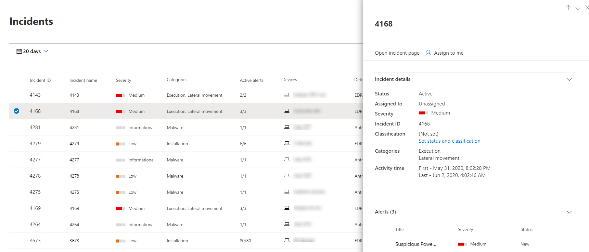
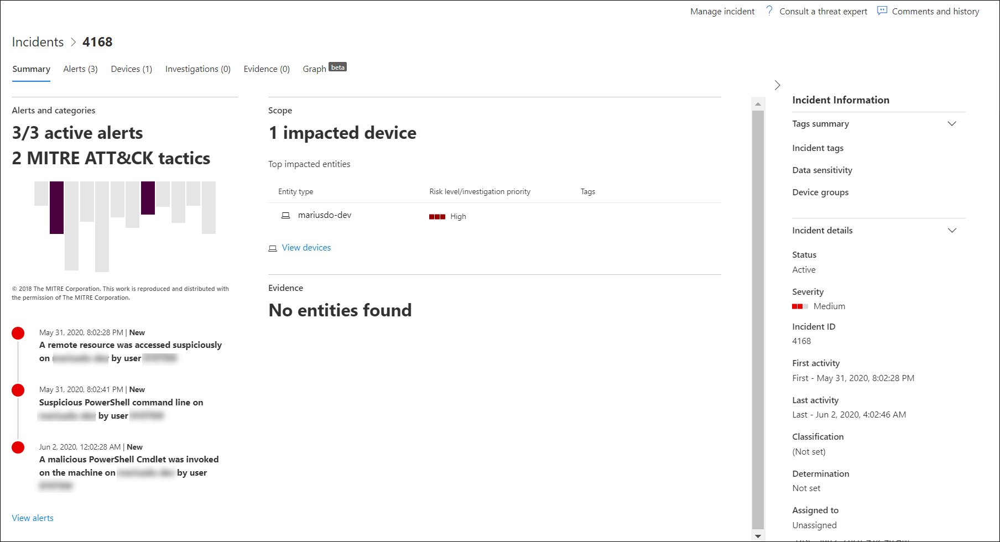
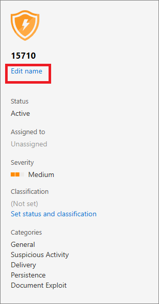

# Manage Microsoft Defender ATP incidents

**Applies to:**
- [Microsoft Defender Advanced Threat Protection (Microsoft Defender ATP)](https://go.microsoft.com/fwlink/p/?linkid=2069559)

Managing incidents is an important part of every cybersecurity operation. You can manage incidents by selecting an incident from the **Incidents queue** or the **Incidents management pane**. You can assign incidents to yourself, change the status, classify, rename, or comment on them to keep track of their progress. 

Selecting an incident from the **Incidents queue** brings up the **Incident management pane** where you can open the incident page for details.

## Assign incidents
If an incident has not been assigned yet, you can select **Assign to me** to assign the incident to yourself. Doing so assumes ownership of not just the incident, but also all the alerts associated with it.

## Change the incident status
You can categorize incidents (as **Active**, or **Resolved**) by changing their status as your investigation progresses. This helps you organize and manage how your team can respond to incidents.

For example, your SoC analyst can review the urgent **Active** incidents for the day, and decide to assign them to himself for investigation.

Alternatively, your SoC analyst might set the incident as **Resolved** if the incident has been remediated. 

## Classify the incident 
You can choose not to set a classification, or decide to specify whether an incident is true or false. Doing so helps the team see patterns and learn from them.

## Rename incident
By default, incidents are assigned with numbers. You can rename the incident if your organization uses a naming convention for easier cybersecurity threat identification.

## Add comments and view the history of an incident
You can add comments and view historical events about an incident to see previous changes made to it.

Whenever a change or comment is made to an alert, it is recorded in the Comments and history section.

Added comments instantly appear on the pane.

## Related topics
- [Incidents queue](incidents-queue.md)
- [View and organize the Incidents queue](view-incidents-queue.md)
- [Investigate incidents](investigate-incidents.md)
