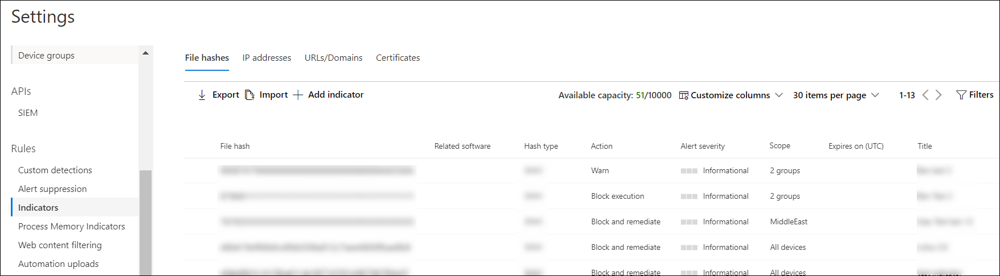

---
title: Manage indicators 
ms.reviewer: 
description: Create indicators for a file hash, IP address, URLs or domains that define the detection, prevention, and exclusion of entities.
keywords: manage, allowed, blocked, whitelist, blacklist, block, clean, malicious, file hash, ip address, urls, domain
search.product: eADQiWindows 10XVcnh
search.appverid: met150
ms.prod: w10
ms.mktglfcycl: deploy
ms.sitesec: library
ms.pagetype: security
ms.author: macapara
author: mjcaparas
ms.localizationpriority: medium
manager: dansimp
audience: ITPro
ms.collection: M365-security-compliance 
ms.topic: article
---

# Manage indicators 

**Applies to:**
- [Microsoft Defender Advanced Threat Protection (Microsoft Defender ATP)](https://go.microsoft.com/fwlink/p/?linkid=2069559)

>Want to experience Microsoft Defender ATP? [Sign up for a free trial.](https://www.microsoft.com/en-us/WindowsForBusiness/windows-atp?ocid=docs-wdatp-automationexclusionlist-abovefoldlink)

Indicator of compromise (IoCs) matching is an essential feature in every endpoint protection solution. This capability is available in Microsoft Defender ATP and gives SecOps the ability to set a list of indicators for detection and for blocking (prevention and response).

Create indicators that define the detection, prevention, and exclusion of entities. You can define the action to be taken as well as the duration for when to apply the action as well as the scope of the machine group to apply it to.

Currently supported sources are the cloud detection engine of Microsoft Defender ATP, the automated investigation and remediation engine, and the endpoint prevention engine (Windows Defender AV).

**Cloud detection engine** 
The cloud detection engine of Microsoft Defender ATP regularly scans collected data and tries to match the indicators you set. When there is a match, action will be taken according to the settings you specified for the IoC.

**Endpoint prevention engine** 
The same list of indicators is honored by the prevention agent. Meaning, if Windows Defender AV is the primary AV configured, the matched indicators will be treated according to the settings. For example, if the action is "Alert and Block", Windows Defender AV will prevent file executions (block and remediate) and a corresponding alert will be raised. On the other hand, if the Action is set to "Allow", Windows Defender AV  will not detect nor block the file from being run.

**Automated investigation and remediation engine** 
The automated investigation and remediation behave the same. If an indicator is set to "Allow", Automated investigation and remediation will ignore a "bad" verdict for it. If set to "Block", Automated investigation and remediation will treat it as "bad".
 

The current supported actions are:
- Allow 
- Alert only
- Alert and block

You can create an indicator for:
- Files
- IP addresses
- URLs/domains

>[!NOTE]
>There is a limit of 5000 indicators per tenant. 

## Create indicators for files
You can prevent further propagation of an attack in your organization by banning potentially malicious files or suspected malware. If you know a potentially malicious portable executable (PE) file, you can block it. This operation will prevent it from being read, written, or executed on machines in your organization.

There are two ways you can create indicators for files:
- By creating an indicator through the settings page
- By creating a contextual indicator using the add indicator button from the file details page

### Before you begin
It's important to understand the following prerequisites prior to creating indicators for files:
- This feature is available if your organization uses Windows Defender Antivirus and Cloud–based protection is enabled. For more information, see [Manage cloud–based protection](../windows-defender-antivirus/deploy-manage-report-windows-defender-antivirus.md).
- The Antimalware client version must be 4.18.1901.x or later.
- Supported on machines on Windows 10, version 1703 or later.
- To start blocking files, you first need to [turn the **Block or allow** feature on](advanced-features.md) in Settings.
- This feature is designed to prevent suspected malware (or potentially malicious files) from being downloaded from the web. It currently supports portable executable (PE) files, including _.exe_ and _.dll_ files. The coverage will be extended over time.

>[!IMPORTANT]
>- The allow or block function cannot be done on files if the file's classification exists on the device's cache prior to the allow or block action 
>- Trusted signed files will be treated differently. Microsoft Defender ATP is optimized to handle malicious files. Trying to block trusted signed files, in some cases, may have performance implications.
>- The PE file needs to be in the machine timeline for you to be able to take this action. 

 
>[!NOTE]
>There may be a couple of minutes of latency between the time the action is taken and the actual file being blocked.

### Create an indicator for files from the settings page

1. In the navigation pane, select **Settings** > **Indicators**.  

2. Select the **File hash** tab.

3. Select **Add indicator**.

4. Specify the following details:
   - Indicator - Specify the entity details and define the expiration of the indicator.
   - Action - Specify the action to be taken and provide a description.
   - Scope - Define the scope of the machine group.

5. Review the details in the Summary tab, then click **Save**.

### Create a contextual indicator from the file details page
One of the options when taking [response actions on a file](respond-file-alerts) is adding an indicator for the file. 

When you add an indicator hash for a file, you can choose to raise an alert and block the file whenever a machine in your organization attempts to run it.

Files automatically blocked by an indicator won't show up in the files's Action center, but the alerts will still be visible in the Alerts queue.

## Create indicators for IPs and URLs/domains
Microsoft Defender ATP can block what Microsoft deems as malicious IPs/URLs through SmartScreen for Microsoft browsers and Network Protection for non-Microsoft browsers and calls made outside the browser.

The threat intelligence data set for this has been managed by Microsoft.

By creating indicators for IPs and URLs or domains, you can now allow or block IPs, URLs or domains based on your own threat intelligence. 

There are two ways you can create indicators for IPs, URLs or domains:
- By creating an indicator through the settings page
- By creating machine groups 

### Before you begin
It's important to understand the following prerequisites prior to creating indicators for IPS, URLs or domains:
- URL/IP allow and block relies on the Microsoft Defender ATP component Network Protection to be enabled in block mode. For more information on Network Protection and configuration instructions, see [Protect your network](network-protection.md)
- The Antimalware client version must be 4.18.1906.x or later. 
- Supported on machines on Windows 10, version 1709 or later. 
- Ensure that **Custom network indicators** is enabled in **Microsoft Defender Security Center > Settings > Advanced features**. For more information, see [Advanced features](advanced-features.md).
 
>[!NOTE]
>There may be up to 2 hours latency (usually less) between the time the action is taken, and the URL and IP being blocked. 

### Create an indicator for IPs, URLs or domains from the settings page

1. In the navigation pane, select **Settings** > **Indicators**.  

2. Select the **IP addresses or URLs/Domains** tab.

3. Select **Add indicator**.

4. Specify the following details:
   - Indicator - Specify the entity details and define the expiration of the indicator.
   - Action - Specify the action to be taken and provide a description.
   - Scope - Define the scope of the machine group.

5. Review the details in the Summary tab, then click **Save**.

## Manage indicators

1. In the navigation pane, select **Settings** > **Indicators**.

2. Select the tab of the entity type you'd like to manage.  

3. Update the details of the indicator and click **Save** or click the **Delete** button if you'd like to remove the entity from the list.

## Import a list of IoCs

You can also choose to upload a CSV file that defines the attributes of indicators, the action to be taken, and other details.

Download the sample CSV to know the supported column attributes.

## Related topic
- [Create contextual IoC](respond-file-alerts.md#add-indicator-to-block-or-allow-a-file)
- [Use the Microsoft Defender ATP indicators API](ti-indicator.md)
- [Use partner integrated solutions](partner-applications.md)

