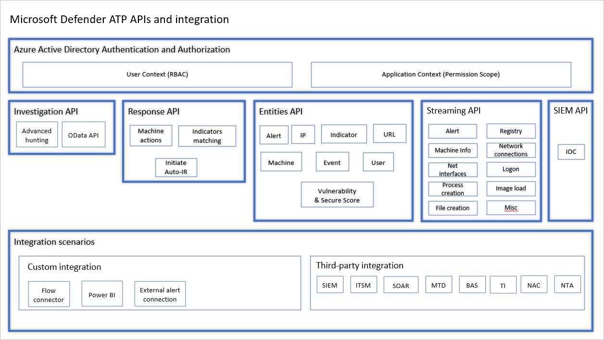
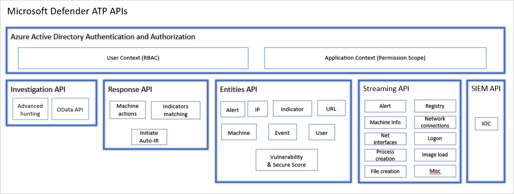

# Overview of management and APIs 

**Applies to:**
- [Microsoft Defender Advanced Threat Protection (Microsoft Defender ATP)](https://go.microsoft.com/fwlink/p/?linkid=2069559)

>Want to experience Microsoft Defender ATP? [Sign up for a free trial.](https://www.microsoft.com/microsoft-365/windows/microsoft-defender-atp?ocid=docs-mgt-apis-abovefoldlink)

Microsoft Defender ATP supports a wide variety of options to ensure that customers can easily adopt the platform. 

Acknowledging that customer environments and structures can vary, Microsoft Defender ATP was created with flexibility and granular control to fit varying customer requirements. 

## Endpoint onboarding and portal access 

Machine onboarding is fully integrated into System Center Configuration Manager and Microsoft Intune for client machines and Azure Security Center for server machines, providing complete end-to-end experience of configuration, deployment, and monitoring. In addition, Microsoft Defender ATP supports Group Policy and other third-party tools used for machines management.

Microsoft Defender ATP provides fine-grained control over what users with access to the portal can see and do through the flexibility of role-based access control (RBAC). The RBAC model supports all flavors of security teams structure:
- Globally distributed organizations and security teams
- Tiered model security operations teams
- Fully segregated devisions with single centralized global security operations teams 

## Integration and APIs
The Microsoft Defender ATP solution is built on top of an integration-ready platform.

Microsoft Defender ATP exposes much of its data and actions through a set of programmatic APIs. Those APIs will enable you to automate workflows and innovate based on Microsoft Defender ATP capabilities.

EFRAT, PLEASE LET ME KNOW WHICH IMAGE IS MORE APPROPRIATE IN THIS PAGE: IMAGE 1 OR IMAGE 2

IMAGE 1:

IMAGE 2:

### Authentication and authorization
Accessing Microsoft Defender ATP APIs is granted in accordance with the service users and permissions model. The API access requires OAuth2.0 authentication. For more information, see [OAuth 2.0 Authorization Code Flow](https://docs.microsoft.com/azure/active-directory/develop/active-directory-v2-protocols-oauth-code). 

For services, the Azure Active Directory (Azure AD) application model is applied where the AAD Global Admin grants the permissions to the application. Any change of the application “manifested” permissions will require Global Admin Consent. 

### Investigation API
You can use the APIs to investigate entities such as machine, user, and file as well as discrete events (for example, process creation and file creation). For more information see, [Supported APIs](exposed-apis-list.md).

There are also [advanced hunting APIs](run-advanced-query-api.md) to hunt for possible threats across your organization.

### Response API
Take actions on machine such as isolate machine from the network, quarantine files, and others using APIs. For more information see, [Machine action](machineaction.md).

Indicator matching is essential feature available in Microsoft Defender ATP that gives SecOps the ability to create indicators that define the detection, prevention, and exclusion of entities. For more information see [Indicator resource type](ti-indicator.md).

When certain conditions that you set are met, you can initiate automated response using the APIs.

EFRAT, PLEASE KINDLY CHECK IF THE ABOVE STATEMENT ABOUT AUTO-IR SHOULD BE INCLUDED, AND IF YES - THAT IT'S ACCURATE. THANKS!

### Entities API
Run API calls on the supported entities. You can create calls such as get alerts, create indicators, and more. 

### Integration scenarios
To further augment the API uses, the platform also supports various integration scenarios. 

Custom integration scenarios help in 

### Streaming API 
Streaming API allows you to receive real-time event and alerts from instances as they occur within a single data stream, providing a low latency, high throughput delivery mechanism.

It enables ingesting complete event data from the Microsoft Defender ATP platform into your local data warehouse or data layer and correlating it against logs collected from other systems. For more information see, [Raw data streaming API](raw-data-export.md).

### SIEM API
Microsoft Defender ATP supports SIEM integration through a variety of methods - specialized SIEM system interface with out of the box connectors, a generic alert API enabling custom implementations, and an action API enabling alert status management. For more information see, [SIEM integration](enable-siem-integration.md)

## Related topics
- 
- [Supported APIs](exposed-apis-list.md)
- [How]

-----------------------------

- It supports integration with a number of security information and event management (SIEM) solutions and also exposes APIs to fully support pulling all the alerts and detection information into any SIEM solution. 
- It supports a rich set of application programming interface (APIs) providing flexibility for those who are already heavily invested in data enrichment and automation:
   - Enriching events coming from other security systems with foot print or prevalence information
   - Triggering file or machine level response actions through APIs
   - Keeping systems in-sync such as importing machine tags from asset management systems into Microsoft Defender ATP, synchronize alerts and incidents status cross ticketing systems with Microsoft Defender ATP.

## Related topics
- [Onboard machines](onboard-configure.md)
- [Manage indicators](manage-indicators.md)
- [Microsoft Defender ATP Public API](apis-intro.md)
- [Pull alerts to your SIEM tools](configure-siem.md)
- [Create and build Power BI reports using Microsoft Defender ATP data](powerbi-reports.md)
- [Role-based access control](rbac.md)

