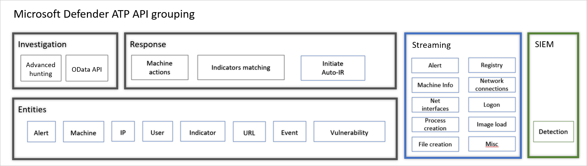

# Overview of management and APIs 

**Applies to:**
- [Microsoft Defender Advanced Threat Protection (Microsoft Defender ATP)](https://go.microsoft.com/fwlink/p/?linkid=2069559)

>Want to experience Microsoft Defender ATP? [Sign up for a free trial.](https://www.microsoft.com/microsoft-365/windows/microsoft-defender-atp?ocid=docs-mgt-apis-abovefoldlink)

Microsoft Defender ATP supports a wide variety of options to ensure that customers can easily adopt the platform. 

Acknowledging that customer environments and structures can vary, Microsoft Defender ATP was created with flexibility and granular control to fit varying customer requirements. 

## Endpoint onboarding and portal access 

Device onboarding is fully integrated into Microsoft Endpoint Configuration Manager and Microsoft Intune for client devices and Azure Security Center for server devices, providing complete end-to-end experience of configuration, deployment, and monitoring. In addition, Microsoft Defender ATP supports Group Policy and other third-party tools used for devices management.

Microsoft Defender ATP provides fine-grained control over what users with access to the portal can see and do through the flexibility of role-based access control (RBAC). The RBAC model supports all flavors of security teams structure:
- Globally distributed organizations and security teams
- Tiered model security operations teams
- Fully segregated divisions with single centralized global security operations teams 

## Available APIs
The Microsoft Defender ATP solution is built on top of an integration-ready platform.

Microsoft Defender ATP exposes much of its data and actions through a set of programmatic APIs. Those APIs will enable you to automate workflows and innovate based on Microsoft Defender ATP capabilities.

  

The Microsoft Defender ATP APIs can be grouped into three:
- Microsoft Defender ATP APIs 
- Raw data streaming API
- SIEM integration

## Microsoft Defender ATP APIs

Microsoft Defender ATP offers a layered API model exposing data and capabilities in a structured, clear and easy to use model, exposed through a standard Azure  AD-based authentication and authorization model allowing access in context of users or SaaS applications. The API model was designed to expose entities and capabilities in a consistent form. 

Watch this video for a quick overview of Microsoft Defender ATP's APIs. 
>[!VIDEO https://www.microsoft.com/en-us/videoplayer/embed/RE4d73M]

The **Investigation API** exposes the richness of Microsoft Defender ATP - exposing calculated or 'profiled' entities (for example, device, user, and file) and discrete events (for example, process creation and file creation) which typically describes a behavior related to an entity, enabling access to data via investigation interfaces allowing a query-based access to data. For more information see, [Supported APIs](exposed-apis-list.md).

The **Response API** exposes the ability to take actions in the service and on devices, enabling customers to ingest indicators, manage settings, alert status, as well as take response actions on devices programmatically such as isolate devices from the network, quarantine files, and others. 

## Raw data streaming API 
Microsoft Defender ATP raw data streaming API provides the ability for customers to ship real-time events and alerts from their instances as they occur within a single data stream, providing a low latency, high throughput delivery mechanism.

The Microsoft Defender ATP event information is pushed directly to Azure storage for long-term data retention, or to Azure Event Hubs for consumption by visualization services or additional data processing engines. 

For more information see, [Raw data streaming API](raw-data-export.md).

## SIEM API
When you enable security information and event management (SIEM) integration it allows you to pull detections from Microsoft Defender Security Center using your SIEM solution or by connecting directly to the detections REST API. This activates the SIEM connector access details section with pre-populated values and an application is created under you Azure Active Directory (AAD) tenant. For more information see, [SIEM integration](enable-siem-integration.md)

## Related topics
- [Access the Microsoft Defender Advanced Threat Protection APIs ](apis-intro.md)
- [Supported APIs](exposed-apis-list.md)
- [Technical partner opportunities](partner-integration.md)

