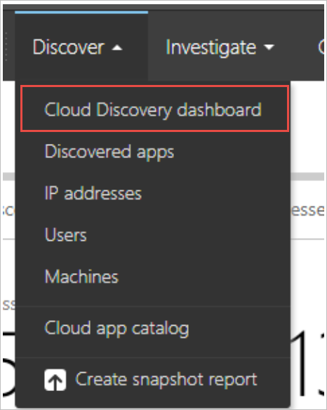
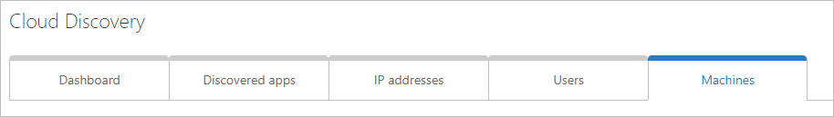

# Configure Microsoft Cloud App Security in Microsoft Defender ATP

**Applies to:**

- [Microsoft Defender Advanced Threat Protection (Microsoft Defender ATP)](https://go.microsoft.com/fwlink/p/?linkid=2069559)

[!include[Prerelease information](prerelease.md)]

To benefit from Microsoft Defender Advanced Threat Protection (ATP) cloud app discovery signals, turn on Microsoft Cloud App Security integration.

>[!NOTE]
>This feature will be available with an E5 license for [Enterprise Mobility + Security](https://www.microsoft.com/cloud-platform/enterprise-mobility-security) on machines running Windows 10, version 1709 (OS Build 16299.1085 with [KB4493441](https://support.microsoft.com/help/4493441)), Windows 10, version 1803 (OS Build 17134.704 with [KB4493464](https://support.microsoft.com/help/4493464)), Windows 10, version 1809 (OS Build 17763.379 with [KB4489899](https://support.microsoft.com/help/4489899)) or later Windows 10 versions.

1. In the navigation pane, select **Preferences setup** > **Advanced features**.
2. Select **Microsoft Cloud App Security** and switch the toggle to **On**.
3. Click **Save preferences**.

Once activated, Microsoft Defender ATP will immediately start forwarding discovery signals to Cloud App Security.

## View the data collected

1. Browse to the [Cloud App Security portal](https://portal.cloudappsecurity.com).

2. Navigate to the Cloud Discovery dashboard.

    

3. Select **Win10 Endpoint Users report**, which contains the data coming from Microsoft Defender ATP.

    

This report is similar to the existing discovery report with one major difference: you can now benefit from visibility to the machine context.

Notice the new **Machines** tab that allows you to view the data split to the device dimensions. This is available in the main report page or any subpage (for example, when drilling down to a specific cloud app).

For more information about cloud discovery, see [Working with discovered apps](https://docs.microsoft.com/cloud-app-security/discovered-apps).

If you are interested in trying Microsoft Cloud App Security, see [Microsoft Cloud App Security Trial](https://signup.microsoft.com/Signup?OfferId=757c4c34-d589-46e4-9579-120bba5c92ed&ali=1).

## Related topic
- [Microsoft Cloud App Security integration](microsoft-cloud-app-security-integration.md)