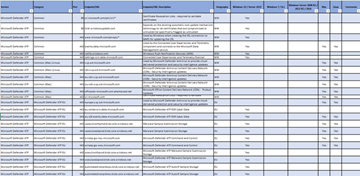

# Microsoft Defender ATP for Linux

This topic describes how to install, configure, update, and use Microsoft Defender ATP for Linux.

> [!CAUTION]
> Running other third-party endpoint protection products alongside Microsoft Defender ATP for Linux is likely to cause performance problems and unpredictable system errors.

## How to install Microsoft Defender ATP for Linux

### Prerequisites

- Access to the Microsoft Defender Security Center portal
- Beginner-level experience in Linux and BASH scripting
- Administrative privileges on the device (in case of manual deployment)

### Installation instructions

There are several methods and deployment tools that you can use to install and configure Microsoft Defender ATP for Linux.

In general you need to take the following steps:

- Ensure that you have a Microsoft Defender ATP subscription, and that you have access to the [Microsoft Defender ATP portal](microsoft-defender-security-center.md).
- Deploy Microsoft Defender ATP for Linux using one of the following deployment methods:
  - The command-line tool:
    - [Manual deployment](linux-install-manually.md)
  - Third-party management tools:
    - [Deploy using Puppet configuration management tool](linux-install-with-puppet.md)
    - [Deploy using Ansible configuration management tool](linux-install-with-ansible.md)

If you experience any installation failures, refer to [Troubleshooting installation failures in Microsoft Defender ATP for Linux](linux-support-install.md).

### System requirements

- Supported Linux server distributions and versions:

  - Red Hat Enterprise Linux 7.2 or higher
  - CentOS 7.2 or higher
  - Ubuntu 16.04 LTS or higher LTS
  - Debian 9 or higher
  - SUSE Linux Enterprise Server 12 or higher
  - Oracle Linux 7.2 or higher

- Minimum kernel version 3.10.0-327
- The `fanotify` kernel option must be enabled
  > [!CAUTION]
  > Running Microsoft Defender ATP for Linux side by side with other `fanotify`-based security solutions is not supported. It can lead to unpredictable results, including hanging the operating system.

- Disk space: 650 MB
- The solution currently provides real-time protection for the following file system types:

  - `btrfs`
  - `ecryptfs`
  - `ext2`
  - `ext3`
  - `ext4`
  - `fuse`
  - `fuseblk`
  - `jfs`
  - `nfs`
  - `overlay`
  - `ramfs`
  - `reiserfs`
  - `tmpfs`
  - `udf`
  - `vfat`
  - `xfs`

After you've enabled the service, you may need to configure your network or firewall to allow outbound connections between it and your endpoints.

### Network connections

The following downloadable spreadsheet lists the services and their associated URLs that your network must be able to connect to. You should ensure that there are no firewall or network filtering rules that would deny access to these URLs. If there are, you may need to create an *allow* rule specifically for them.

|**Item**|**Description**|
|:-----|:-----|
|  [Spreadsheet](https://github.com/MicrosoftDocs/windows-itpro-docs/raw/public/windows/security/threat-protection/microsoft-defender-atp/downloads/mdatp-deployment-strategy.pdf)  | The spreadsheet provides specific DNS records for service locations, geographies, and OS. 

> [!NOTE]
> For a more specific URL list, see [Configure proxy and internet connectivity settings](https://docs.microsoft.com/windows/security/threat-protection/microsoft-defender-atp/configure-proxy-internet#enable-access-to-microsoft-defender-atp-service-urls-in-the-proxy-server).

Microsoft Defender ATP can discover a proxy server by using the following discovery methods:
- Transparent proxy
- Manual static proxy configuration

If a proxy or firewall is blocking anonymous traffic, make sure that anonymous traffic is permitted in the previously listed URLs. For transparent proxies, no additional configuration is needed for Microsoft Defender ATP. For static proxy, follow the steps in [Manual Static Proxy Configuration](linux-static-proxy-configuration.md).

> [!WARNING]
> PAC, WPAD, and authenticated proxies are not supported. Ensure that only a static proxy or transparent proxy is being used.
>
> SSL inspection and intercepting proxies are also not supported for security reasons. Configure an exception for SSL inspection and your proxy server to directly pass through data from Microsoft Defender ATP for Linux to the relevant URLs without interception. Adding your interception certificate to the global store will not allow for interception.

For troubleshooting steps, see [Troubleshoot cloud connectivity issues for Microsoft Defender ATP for Linux](linux-support-connectivity.md).

## How to update Microsoft Defender ATP for Linux

Microsoft regularly publishes software updates to improve performance, security, and to deliver new features. To update Microsoft Defender ATP for Linux, refer to [Deploy updates for Microsoft Defender ATP for Linux](linux-updates.md).

## How to configure Microsoft Defender ATP for Linux

Guidance for how to configure the product in enterprise environments is available in [Set preferences for Microsoft Defender ATP for Linux](linux-preferences.md).

## Resources

- For more information about logging, uninstalling, or other topics, see [Resources](linux-resources.md).
