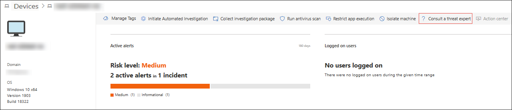
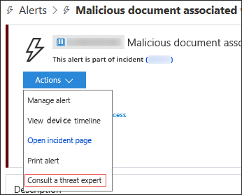

# Microsoft Threat Experts
**Applies to:**
- [Microsoft Defender Advanced Threat Protection (Microsoft Defender ATP)](https://go.microsoft.com/fwlink/p/?linkid=2069559)

Microsoft Threat Experts is a managed threat hunting service that provides Security Operation Centers (SOCs) with expert level monitoring and analysis to help them ensure that critical threats in their unique environments don’t get missed.
  
This new capability provides expert-driven insights and data through targeted attack notification and access to experts on demand.

Watch this video for a quick overview of Microsoft Threat Experts.

>[!VIDEO https://www.microsoft.com/en-us/videoplayer/embed/RE4qZ0B]

## Before you begin 
Microsoft Defender ATP customers need to apply for the Microsoft Threat Experts managed threat hunting service to get proactive Targeted Attack Notifications and to collaborate with experts on demand. Experts on Demand is an add-on service. Targeted Attack Notifications are always included after you have been accepted into Microsoft Threat Experts managed threat hunting service.

If you are not enrolled yet and would like to experience its benefits, go to **Settings** > **General** > **Advanced features** > **Microsoft Threat Experts** to apply. Once accepted, you will get the benefits of Targeted Attack Notifications, and start a  90-day trial of Experts on Demand. Contact your Microsoft representative to get a full Experts on Demand subscription. See [Configure Microsoft Threat Experts capabilities](https://docs.microsoft.com/windows/security/threat-protection/microsoft-defender-atp/configure-microsoft-threat-experts#before-you-begin) for details. 

## Targeted attack notification 
Microsoft Threat Experts provides proactive hunting for the most important threats to your network, including human adversary intrusions, hands-on-keyboard attacks, or advanced attacks like cyberespionage. The managed hunting service includes:  
- Threat monitoring and analysis, reducing dwell time and risk to the business 
- Hunter-trained artificial intelligence to discover and prioritize both known and unknown attacks  
- Identifying the most important risks, helping SOCs maximize time and energy 
- Scope of compromise and as much context as can be quickly delivered to enable fast SOC response. 
 
## Collaborate with experts, on demand 
Customers can engage our security experts directly from within Microsoft Defender Security Center for timely and accurate response. Experts provide insights needed to better understand the complex threats affecting your organization, from alert inquiries, potentially compromised machines, root cause of a suspicious network connection, to additional threat intelligence regarding ongoing advanced persistent threat campaigns. With this capability, you can:

- Get additional clarification on alerts including root cause or scope of the incident 
- Gain clarity into suspicious machine behavior and next steps if faced with an advanced attacker  
- Determine risk and protection regarding threat actors, campaigns, or emerging attacker techniques 
- Seamlessly transition to Microsoft Incident Response (IR) or other third-party Incident Response services when necessary 

The option to **Consult a threat expert** is available in several places in the portal so you can engage with experts in the context of your investigation:

- <i>**Help and support menu**</i> 

- <i>**Machine page actions menu**</i> 

- <i>**Alerts page actions menu**</i> 

- <i>**File page actions menu**</i> 

> [!NOTE]
> Customers with Premier Support subscription mapped to their Office 365 license can track the status of their Experts on Demand cases through Microsoft Services Hub. Watch this video for a quick overview of Microsoft Services Hub.

>[!VIDEO https://www.microsoft.com/videoplayer/embed/RE4pk9f] 
 
   
## Related topic
- [Configure Microsoft Threat Experts capabilities](configure-microsoft-threat-experts.md)
