# Create a notification rule when a local onboarding or offboarding script is used

**Applies to:**
- [Microsoft Defender Advanced Threat Protection (Microsoft Defender ATP)](https://go.microsoft.com/fwlink/p/?linkid=2069559)

Create a notification rule so that when a local onboarding or offboardiing script is used, you'll be notified. 

## Before you begin
You'll need to have access to:
 - Microsoft Flow (Flow Plan 1 at a minimum). For more information, see [Flow pricing page](https://flow.microsoft.com/pricing/).
 - Azure Table or SharePoint List or Library / SQL DB

## Create the notification flow

1. In [flow.microsoft.com](https://flow.microsoft.com/).

2. Navigate to **My flows > New > Scheduled - from blank**. 

    


3. Build a scheduled flow.
   1. Enter a flow name.
   2. Specify the start and time.
   3. Specify the frequency. For example, every 5 minutes.

    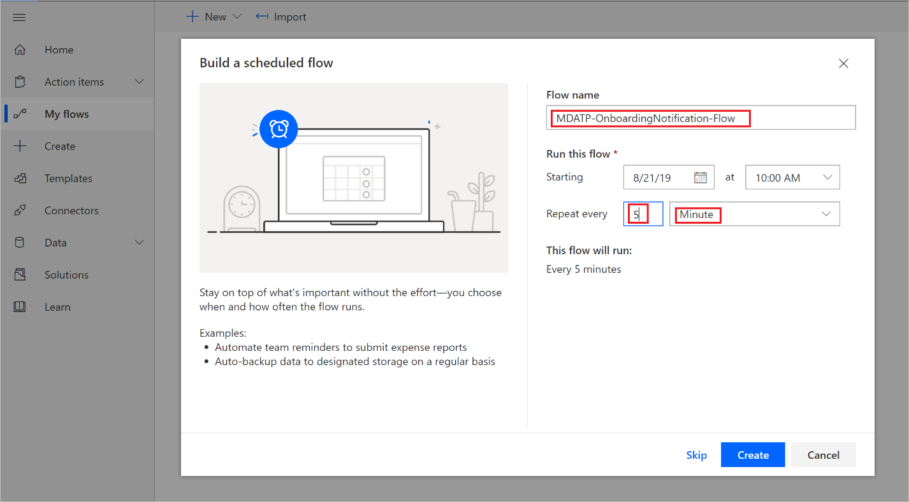

4. Select the + button to add a new action. The new action will be an HTTP request to the Microsoft Defender ATP security center machine(s) API. You can also replace it with the out-of-the-box "WDATP Connector" (action: "Machines - Get list of machines"). 

    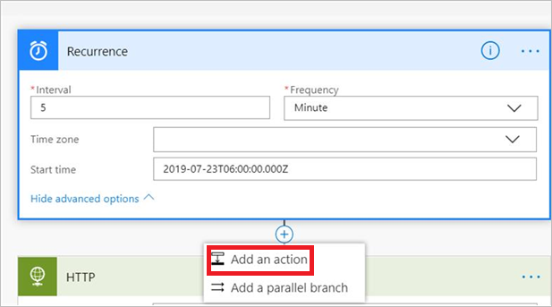


5. Enter the following HTTP fields:

   - Method: "GET" as a value to get the list of machines.
   - URI: Enter `https://api.securitycenter.windows.com/api/machines`.
   - Authentication: Select "Active Directory OAuth".
   - Tenant: Sign-in to http://portal.azure.com and navigate to **Azure Active Directory > App Registrations** and get the Tenant ID value.
   - Audience: `https://securitycenter.onmicrosoft.com/windowsatpservice\`
   - Client ID: Sign-in to http://portal.azure.com and navigate to **Azure Active Directory > App Registrations** and  get the Client ID value.
   - Credential Type: Select "Secret".
   - Secret: Sign-in to http://portal.azure.com and navigate tnd navigate to **Azure Active Directory > App Registrations** and get the Tenant ID value.

    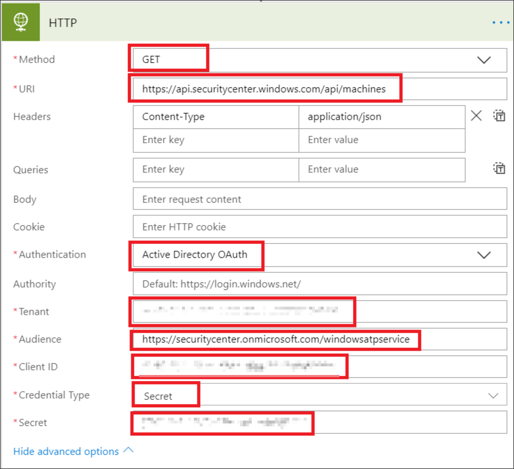


6. Add a new step by selecting **Add new action** then search for **Data Operations** and select 
**Parse JSON**.

    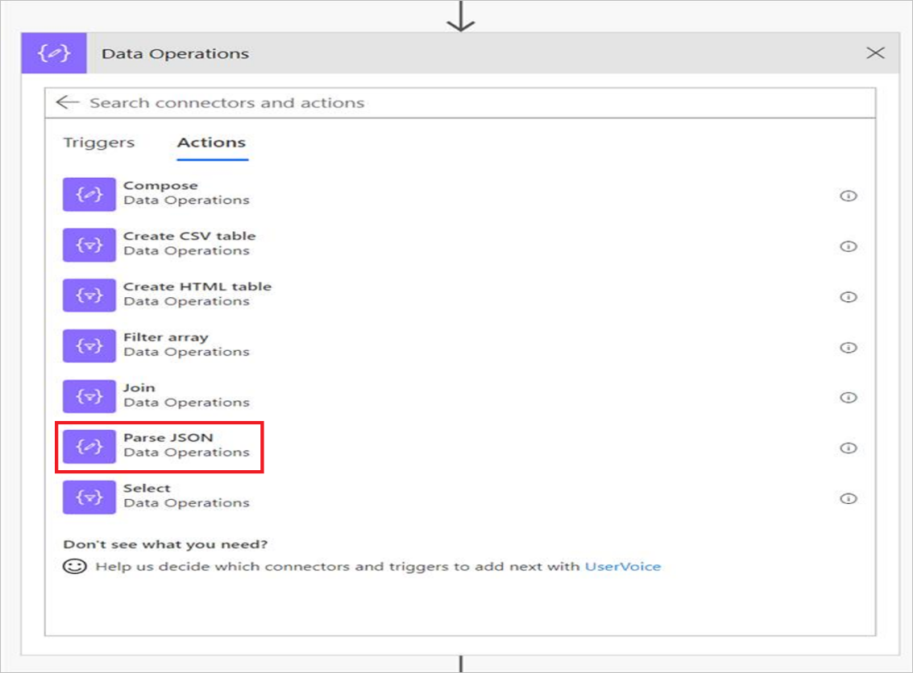

7. Add Body in the **Content** field.

    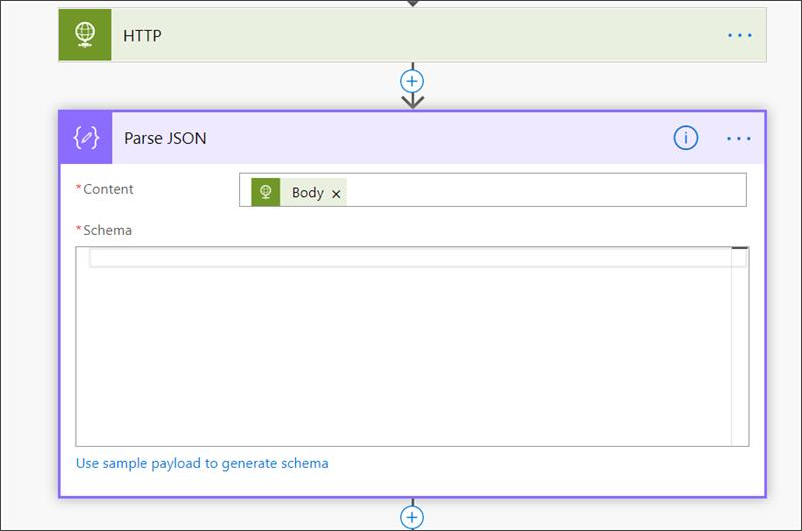

8. Select the **Use sample payload to generate schema** link.

    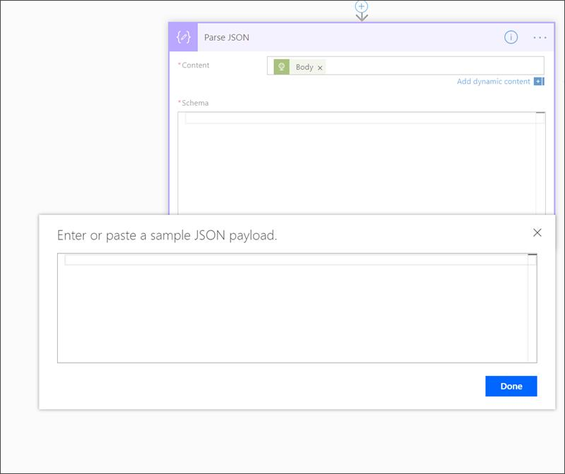

9. Copy and paste the following JSON snippet:

    ```
    {
        "type": "object",
        "properties": {
            "@@odata.context": {
                "type": "string"
            },
            "value": {
                "type": "array",
                "items": {
                    "type": "object",
                    "properties": {
                        "id": {
                            "type": "string"
                        },
                        "computerDnsName": {
                            "type": "string"
                        },
                        "firstSeen": {
                            "type": "string"
                        },
                        "lastSeen": {
                            "type": "string"
                        },
                        "osPlatform": {
                            "type": "string"
                        },
                        "osVersion": {},
                        "lastIpAddress": {
                            "type": "string"
                        },
                        "lastExternalIpAddress": {
                            "type": "string"
                        },
                        "agentVersion": {
                            "type": "string"
                        },
                        "osBuild": {
                            "type": "integer"
                        },
                        "healthStatus": {
                            "type": "string"
                        },
                        "riskScore": {
                            "type": "string"
                        },
                        "exposureScore": {
                            "type": "string"
                        },
                        "aadDeviceId": {},
                        "machineTags": {
                            "type": "array"
                        }
                    },
                    "required": [
                        "id",
                        "computerDnsName",
                        "firstSeen",
                        "lastSeen",
                        "osPlatform",
                        "osVersion",
                        "lastIpAddress",
                        "lastExternalIpAddress",
                        "agentVersion",
                        "osBuild",
                        "healthStatus",
                        "rbacGroupId",
                        "rbacGroupName",
                        "riskScore",
                        "exposureScore",
                        "aadDeviceId",
                        "machineTags"
                    ]
                }
            }
        }
    }

    ```

10.  Extract the values from the JSON call and check if the onboarded machine(s) is / are already registered at the SharePoint list as an example:
- If yes, no notification will be triggered
- If no, will register the new onboarded machine(s) in the SharePoint list and a notification will be sent to the Microsoft Defender ATP admin

    

    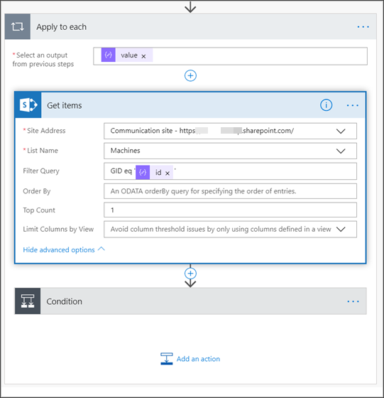

11. Under **Condition**, add the following expression: "length(body('Get_items')?['value'])" and set the condition to equal to 0.

    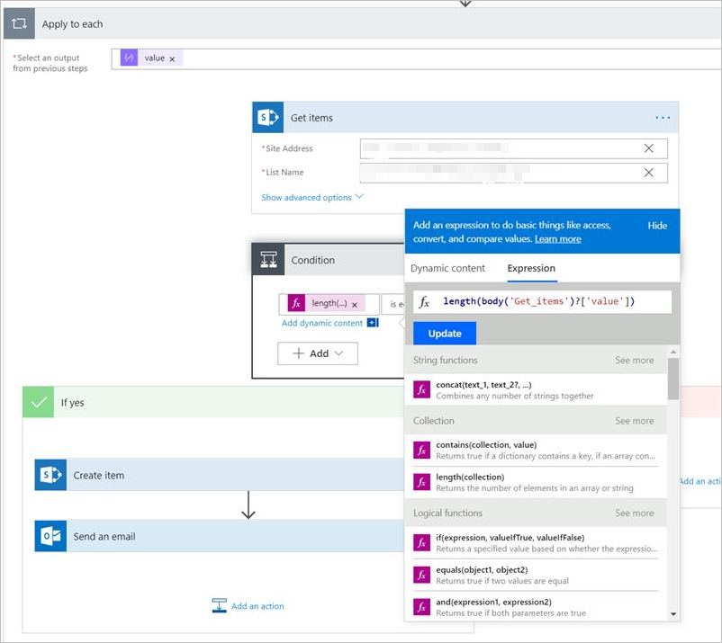  
    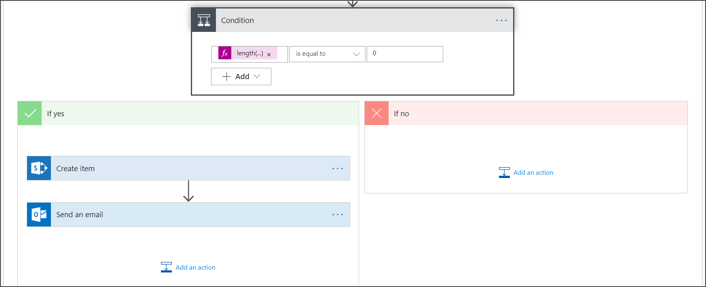 
    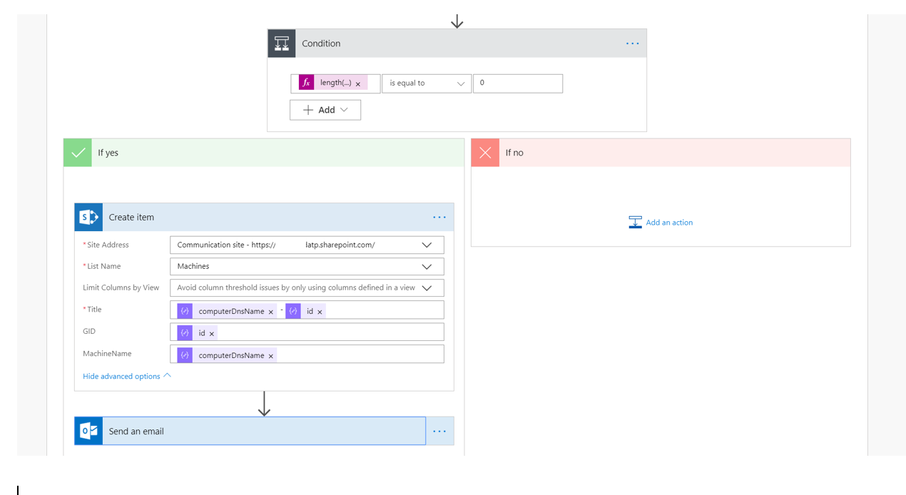  
    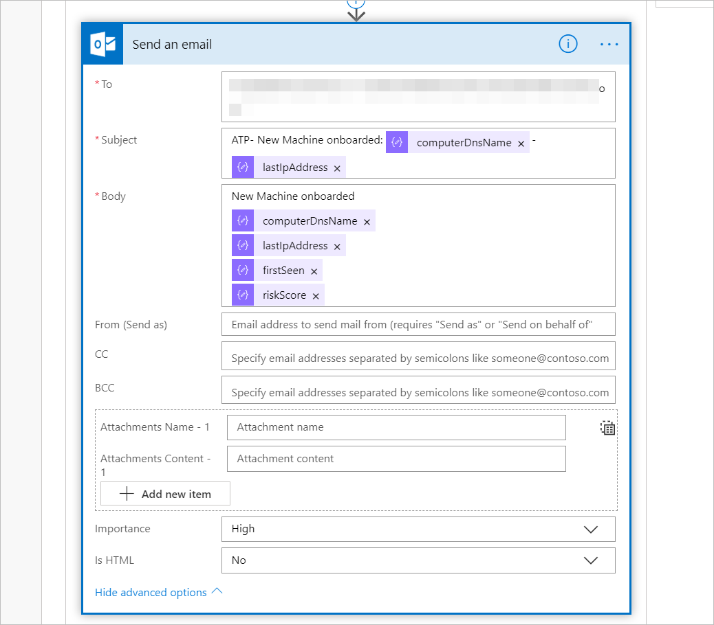

## Alert notification
The following image is an example of an email notification.


## Tips

- You can filter here using lastSeen only:
    - Every 60 min:
      - Take all machines last seen in the past 7 days. 

- For each machine: 
    - If last seen property is on the one hour interval of [-7 days, -7days + 60 minutes ] -> Alert for offboarding possibility.
    - If first seen is on the past hour -> Alert for onboarding.

In this solution you will not have duplicate alerts:
There are tenants that have numerous machines. Getting all those machines might be very expensive and might require paging.

You can split it to two queries: 
1.	For offboarding take only this interval using the OData $filter and only notify if the conditions are met.
2.	Take all machines last seen in the past hour and check first seen property for them (if the first seen property is on the past hour, the last seen must be there too). 

