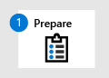
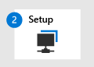

# Onboard to the Microsoft Defender for Endpoint service

[!INCLUDE [Microsoft 365 Defender rebranding](../../includes/microsoft-defender.md)]

**Applies to:**
- [Microsoft Defender for Endpoint](https://go.microsoft.com/fwlink/p/?linkid=2146631)
- [Microsoft 365 Defender](https://go.microsoft.com/fwlink/?linkid=2118804)

> Want to experience Microsoft Defender for Endpoint? [Sign up for a free trial.](https://www.microsoft.com/microsoft-365/windows/microsoft-defender-atp?ocid=docs-wdatp-exposedapis-abovefoldlink)

Learn about the various phases of deploying Microsoft Defender for Endpoint and how to configure the capabilities within the solution. 

Deploying Defender for Endpoint is a three-phase process:

|  [Phase 1: Prepare](prepare-deployment.md) |  [Phase 2: Setup](production-deployment.md) |  Phase 3: Onboard |
| ----- | ----- | ----- |
| | |*You are here!*|

You are currently in the onboarding phase.

These are the steps you need to take to deploy Defender for Endpoint:

- Step 1: Onboard endpoints to the service 
- Step 2: Configure capabilities 

## Step 1: Onboard endpoints using any of the supported management tools
The [Plan deployment](deployment-strategy.md) topic outlines the general steps you need to take to deploy Defender for Endpoint.  

Watch this video for a quick overview of the onboarding process and learn about the available tools and methods.
 
 

> [!VIDEO https://www.microsoft.com/en-us/videoplayer/embed/RE4bGqr]

After identifying your architecture, you'll need to decide which deployment method to use. The deployment tool you choose influences how you onboard endpoints to the service. 

### Onboarding tool options

The following table lists the available tools based on the endpoint that you need to onboard.

| Endpoint     | Tool options                       |
|--------------|------------------------------------------|
| **Windows**  |  [Local script (up to 10 devices)](configure-endpoints-script.md)    [Group Policy](configure-endpoints-gp.md)    [Microsoft Endpoint Manager/ Mobile Device Manager](configure-endpoints-mdm.md)     [Microsoft Endpoint Configuration Manager](configure-endpoints-sccm.md)   [VDI scripts](configure-endpoints-vdi.md)   |
| **macOS**    | [Local scripts](mac-install-manually.md)   [Microsoft Endpoint Manager](mac-install-with-intune.md)   [JAMF Pro](mac-install-with-jamf.md)   [Mobile Device Management](mac-install-with-other-mdm.md) |
| **Linux Server** | [Local script](linux-install-manually.md)   [Puppet](linux-install-with-puppet.md)   [Ansible](linux-install-with-ansible.md)|
| **iOS**      | [App-based](ios-install.md)                                |
| **Android**  | [Microsoft Endpoint Manager](android-intune.md)               | 

## Step 2: Configure capabilities
After onboarding the endpoints, you'll then configure the various capabilities such as endpoint detection and response, next-generation protection, and attack surface reduction. 

## Example deployments
In this deployment guide, we'll guide you through using two deployment tools to onboard endpoints and how to configure capabilities.

The tools in the example deployments are:
- [Onboarding using Microsoft Endpoint Configuration Manager](onboarding-endpoint-configuration-manager.md)
- [Onboarding using Microsoft Endpoint Manager](onboarding-endpoint-manager.md)

Using the mentioned deployment tools above, you'll then be guided in configuring the following Defender for Endpoint capabilities:
- Endpoint detection and response configuration
- Next-generation protection configuration
- Attack surface reduction configuration

## Related topics
- [Onboarding using Microsoft Endpoint Configuration Manager](onboarding-endpoint-configuration-manager.md)
- [Onboarding using Microsoft Endpoint Manager](onboarding-endpoint-manager.md)
