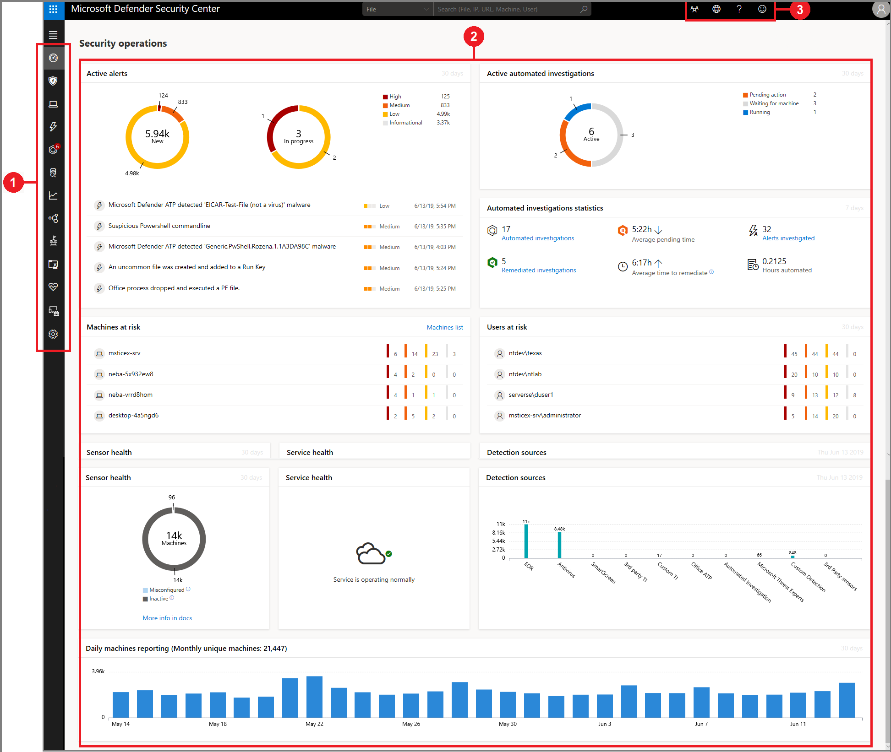

# Microsoft Defender Security Center portal overview

**Applies to:**
- [Microsoft Defender Advanced Threat Protection (Microsoft Defender ATP)](https://go.microsoft.com/fwlink/p/?linkid=2069559)

>Want to experience Microsoft Defender ATP? [Sign up for a free trial.](https://www.microsoft.com/en-us/WindowsForBusiness/windows-atp?ocid=docs-wdatp-portaloverview-abovefoldlink) 

Enterprise security teams can use Microsoft Defender Security Center to monitor and assist in responding to alerts of potential advanced persistent threat (APT) activity or data breaches.

You can use [Microsoft Defender Security Center](https://securitycenter.windows.com/) to:
- View, sort, and triage alerts from your endpoints
- Search for more information on observed indicators such as files and IP Addresses
- Change Microsoft Defender ATP settings, including time zone and review licensing information.

## Microsoft Defender Security Center
When you open the portal, you’ll see the main areas of the application:

 

- (1) Navigation pane
- (2) Main portal
- (3) Search, Community center, Time settings, Help and support, Feedback

> [!NOTE]
> Malware related detections will only appear if your machines are using Windows Defender Antivirus as the default real-time protection antimalware product.

You can navigate through the portal using the menu options available in all sections. Refer to the following table for a description of each section.

Area | Description
:---|:---
(1) Navigation pane | Use the navigation pane to move between the **Dashboards**, **Alerts queue**, **Automated investigations**, **Machines list**, **Service health**, **Advanced hunting**, and **Settings**.
**Dashboards**	| Access the Security operations, the Secure Score, or Threat analytics dashboard.
**Incidents** | View alerts that have been aggregated as incidents.
**Alerts** | View alerts generated from machines in your organizations.
**Automated investigations** | Displays a list of automated investigations that's been conducted in the network, the status of each investigation and other details such as when the investigation started and the duration of the investigation.
**Advanced hunting** | Advanced hunting allows you to proactively hunt and investigate across your organization using a powerful search and query tool.
**Machines list** | Displays the list of machines that are onboarded to Microsoft Defender ATP, some information about them, and the corresponding number of alerts.
**Service health** | Provides information on the current status of the Window Defender ATP service. You'll be able to verify that the service health is healthy or if there are current issues.
**Settings** |	Shows the settings you selected during onboarding and lets you update your industry preferences and retention policy period. You can also set other configuration settings such as email notifications, activate the preview experience, enable or turn off advanced features, SIEM integration, threat intel API, build Power BI reports, and set baselines for the Secure Score dashboard.
**(2) Main portal** | Main area where you will see the different views such as the Dashboards, Alerts queue, and Machines list.
**(3) Community center, Time settings,  Help and support, Feedback** | **Community center** -Access the Community center to learn, collaborate, and share experiences about the product.     **Time settings** - Gives you access to the configuration settings where you can set time zones and view license information.     **Help and support** - Gives you access to the Microsoft Defender ATP guide, Microsoft support, and Premier support.   **Feedback** - Access the feedback button to provide comments about the portal. 

## Microsoft Defender ATP icons
The following table provides information on the icons used all throughout the portal:

Icon | Description
:---|:---
| Microsoft Defender ATP logo
| Alert – Indication of an activity correlated with advanced attacks.
| Detection – Indication of a malware threat detection.
| Active threat – Threats actively executing at the time of detection.
| Remediated – Threat removed from the machine.
| Not remediated – Threat not removed from the machine.
| Indicates events that triggered an alert in the **Alert process tree**.
| Machine icon
| Windows Defender Antivirus events
| Windows Defender Application Guard events
| Windows Defender Device Guard events
| Windows Defender Exploit Guard events
| Windows Defender SmartScreen events
| Windows Firewall events
| Response action
| Process events
| Network events
| File  events
| Registry events
| Load DLL events
| Other events
| Access token modification
| File creation
| Signer
| File path
| Command line
| Unsigned file
| Process tree
| Memory allocation
| Process injection
| Powershell command run
 | Community center 
 | Notifications
 | Automated investigation - no threats found
 | Automated investigation - failed
 | Automated investigation - partially investigated
 | Automated investigation - terminated by system
 | Automated investigation - pending
 | Automated investigation - running
 | Automated investigation - remediated 
 | Automated investigation - partially remediated
 | Threat & Vulnerability Management - threat insights
 | Threat & Vulnerability Management - possible active alert 
 | Threat & Vulnerability Management - recommendation insights

## Related topics
- [Understand the Microsoft Defender Advanced Threat Protection portal](use.md)
- [View the Security operations dashboard](security-operations-dashboard.md)
- [View the Secure Score dashboard and improve your secure score](secure-score-dashboard.md)
- [View the Threat analytics dashboard and take recommended mitigation actions](threat-analytics.md)
