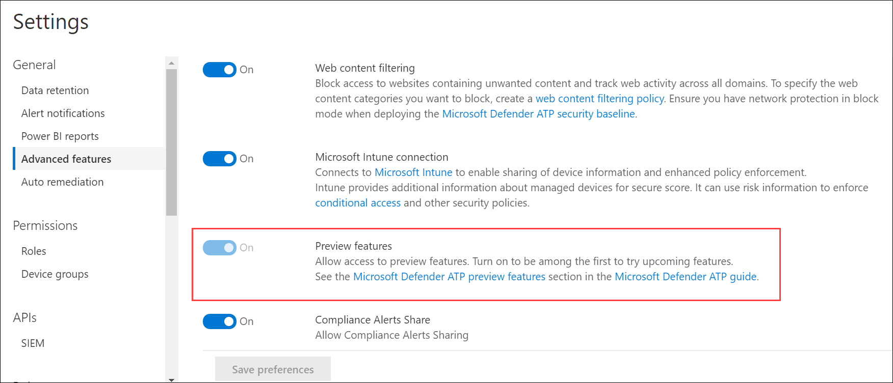

# Turn on the preview experience in Microsoft Defender ATP

**Applies to:**
- [Microsoft Defender Advanced Threat Protection (Microsoft Defender ATP)](https://go.microsoft.com/fwlink/p/?linkid=2069559)

>Want to experience Microsoft Defender ATP? [Sign up for a free trial.](https://www.microsoft.com/en-us/WindowsForBusiness/windows-atp?ocid=docs-wdatp-previewsettings-abovefoldlink)

Turn on the preview experience setting to be among the first to try upcoming features.

1. In the navigation pane, select **Settings** > **Advanced features**.

    

2. Toggle the setting between **On** and **Off** and select **Save preferences**.

## Related topics
- [Update general settings in Microsoft Defender ATP](data-retention-settings.md)
- [Turn on advanced features in Microsoft Defender ATP](advanced-features.md)
- [Configure email notifications in Microsoft Defender ATP](configure-email-notifications.md)
- [Enable SIEM integration in Microsoft Defender ATP](enable-siem-integration.md)
- [Enable the custom threat intelligence API in Microsoft Defender ATP](enable-custom-ti.md)
- [Create and build Power BI reports](powerbi-reports.md)
