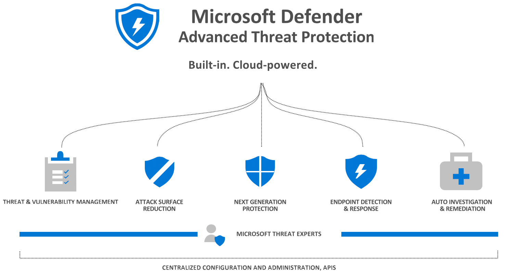

# Microsoft Defender Advanced Threat Protection product brief 

**Applies to:**
- [Microsoft Defender Advanced Threat Protection (Microsoft Defender ATP)](https://go.microsoft.com/fwlink/p/?linkid=2069559)

Microsoft Defender ATP is a platform designed to
help enterprise networks prevent, detect, investigate, and respond to advanced
threats.

## Platform capabilities

Capability | Description 
:---|:---
**Threat and Vulnerability Management**  | This built-in capability uses a game-changing risk-based approach to the discovery, prioritization, and remediation of endpoint vulnerabilities and misconfigurations.
**Attack Surface Reduction** |  The attack surface reduction set of capabilities provide the first line of defense in the stack. By ensuring configuration settings are properly set and exploit mitigation techniques are applied, these set of capabilities resist attacks and exploitations.
**Next Generation Protection** |  To further reinforce the security perimeter of the organizations network, Microsoft Defender ATP uses next generation protection designed to catch all types of emerging threats.
**Endpoint Detection & Response** | Endpoint detection and response capabilities are put in place to detect, investigate, and respond to advanced threats that may have made it past the first two security pillars. 
**Auto Investigation & Remediation** | In conjunction with being able to quickly respond to advanced attacks, Microsoft Defender ATP offers automatic investigation and remediation capabilities that help reduce the volume of alerts in minutes at scale. 
**Microsoft Threat Experts** | Microsoft Defender ATP's new managed threat hunting service provides proactive hunting, prioritization, and additional context and insights that further empower Security operation centers (SOCs) to identify and respond to threats quickly and accurately.
**Secure Score** | Microsoft Defender ATP includes a secure score to help dynamically assess the security state of the enterprise network, identify unprotected systems, and take recommended actions to improve the overall security of the organization. 
 **Advance Hunting** | Create custom threat intelligence and use a powerful search and query tool to hunt for possible threats in the organization.
**Management and API** | Integrate Microsoft Defender Advanced Threat Protection into existing workflows.  
 **Microsoft Threat Protection** | Microsoft Defender ATP is part of the Microsoft Threat Protection solution that helps implement end-to-end security across possible attack surfaces in the modern workplace. Bring the power of Microsoft threat protection to the organization.             |   |

Microsoft Defender ATP uses the following combination of technology built into Windows 10 and Microsoft's robust cloud service:

-   **Endpoint behavioral sensors**: Embedded in Windows 10, these sensors
    collect and process behavioral signals from the operating system and sends this sensor data to your private, isolated, cloud instance of Microsoft Defender ATP.

-   **Cloud security analytics**: Leveraging big-data, machine-learning, and
    unique Microsoft optics across the Windows ecosystem,
    enterprise cloud products (such as Office 365), and online assets, behavioral signals
    are translated into insights, detections, and recommended responses
    to advanced threats.

-   **Threat intelligence**: Generated by Microsoft hunters, security teams,
    and augmented by threat intelligence provided by partners, threat
    intelligence enables Microsoft Defender ATP to identify attacker
    tools, techniques, and procedures, and generate alerts when these
    are observed in collected sensor data.

## Licensing requirements
Microsoft Defender Advanced Threat Protection requires one of the following Microsoft Volume Licensing offers:

- Windows 10 Enterprise E5
- Windows 10 Education A5
- Microsoft 365 E5 (M365 E5) which includes Windows 10 Enterprise E5
- Microsoft 365 A5 (M365 A5)

## Related topic
- [Prepare deployment](prepare-deployment.md)