# Microsoft Defender ATP production deployment

**Applies to:**
- [Microsoft Defender Advanced Threat Protection (Microsoft Defender ATP)](https://go.microsoft.com/fwlink/p/?linkid=2069559)

Proper planning is the foundation of a successful deployment. In this deployment scenario, you'll be guided through the steps on:
- Tenant configuration
- Network configuration
- Onboarding using System Center Configuration Manager
- Endpoint detection and response
- Next generation protection
- Attack surface reduction

>[!NOTE]
>For the purpose of guiding you through a typical deployment, this scenario will only cover the use of System Center Configuration Manager. Microsoft Defnder ATP supports the use of other onboarding tools but will not cover those scenarios in the deployment guide. For more information, see [Onboard machines to Microsoft Defender ATP](onboard-configure.md).

## Tenant Configuration

When accessing [Microsoft Defender Security Center](https://securitycenter.windows.com/) for the first time there will be a setup wizard that will guide you through some initial steps. At the end of the setup wizard there will be a dedicated cloud instance of Microsoft Defender ATP created. The easiest method is to perform these steps from a Windows 10 client machine.

1. From a web browser, navigate to <https://securitycenter.windows.com>.

    

2. If going through a TRIAL license, go to the link (<https://signup.microsoft.com/Signup?OfferId=6033e4b5-c320-4008-a936-909c2825d83c&dl=WIN_DEF_ATP&pc=xxxxxxx-xxxxxx-xxx-x>)

    Once the authorization step is completed, the **Welcome** screen will be displayed.
3. Go through the authorization steps.

    

4. Set up preferences.

   **Data storage location** - It's important to set this up correctly. Determine where the customer wants to be primarily hosted: US, EU or UK. You cannot change the location after this setup and Microsoft will not transfer the data from the specified geolocation. 

    **Data retention** - The default is 6 months.

    **Enable preview features** - The default is on, can be changed later.

    

5. Select **Next**.

     

6. Select **Continue**.


## Network configuration
If the organization does not require the endpoints to use a Proxy to access the
Internet, skip this section.

The Microsoft Defender ATP sensor requires Microsoft Windows HTTP (WinHTTP) to
report sensor data and communicate with the Microsoft Defender ATP service. The
embedded Microsoft Defender ATP sensor runs in the system context using the
LocalSystem account. The sensor uses Microsoft Windows HTTP Services (WinHTTP)
to enable communication with the Microsoft Defender ATP cloud service. The
WinHTTP configuration setting is independent of the Windows Internet (WinINet)
internet browsing proxy settings and can only discover a proxy server by using
the following discovery methods:

**Auto-discovery methods:**

-   Transparent proxy

-   Web Proxy Auto-discovery Protocol (WPAD)

If a Transparent proxy or WPAD has been implemented in the network topology,
there is no need for special configuration settings. For more information on
Microsoft Defender ATP URL exclusions in the proxy, see the
Appendix section in this document for the URLs Whitelisting or on
[Microsoft
Docs](https://docs.microsoft.com/windows/security/threat-protection/windows-defender-atp/configure-proxy-internet-windows-defender-advanced-threat-protection#enable-access-to-windows-defender-atp-service-urls-in-the-proxy-server).

**Manual static proxy configuration:**

-   Registry based configuration

-   WinHTTP configured using netsh command <br> Suitable only for desktops in a
    stable topology (for example: a desktop in a corporate network behind the
    same proxy)

### Configure the proxy server manually using a registry-based static proxy

Configure a registry-based static proxy to allow only Microsoft Defender ATP
sensor to report diagnostic data and communicate with Microsoft Defender ATP
services if a computer is not permitted to connect to the Internet. The static
proxy is configurable through Group Policy (GP). The group policy can be found
under:

-   Administrative Templates \> Windows Components \> Data Collection and
    Preview Builds \> Configure Authenticated Proxy usage for the Connected User
    Experience and Telemetry Service

    -   Set it to **Enabled** and select **Disable Authenticated Proxy usage**

1. Open the Group Policy Management Console.
2. Create a policy or edit an existing policy based off the organizational practices.
3. Edit the Group Policy and navigate to **Administrative Templates \> Windows Components \> Data Collection and Preview Builds \> Configure Authenticated Proxy usage for the Connected User Experience and Telemetry Service**. 
    

4. Select **Enabled**.
5. Select **Disable Authenticated Proxy usage**.
   
6. Navigate to **Administrative Templates \> Windows Components \> Data Collection and Preview Builds \> Configure connected user experiences and telemetry**.
    
7. Select **Enabled**.
8. Enter the **Proxy Server Name**.

The policy sets two registry values `TelemetryProxyServer` as REG_SZ and `DisableEnterpriseAuthProxy` as REG_DWORD under the registry key `HKLM\Software\Policies\Microsoft\Windows\DataCollection`.

The registry value `TelemetryProxyServer` takes the following string format:

```text
<server name or ip>:<port>
```

For example: 10.0.0.6:8080

The registry value `DisableEnterpriseAuthProxy` should be set to 1.

###  Configure the proxy server manually using netsh command

Use netsh to configure a system-wide static proxy.

> [!NOTE]
> - This will affect all applications including Windows services which use WinHTTP with default proxy.</br>
> - Laptops that are changing topology (for example: from office to home) will malfunction with netsh. Use the registry-based static proxy configuration.

1. Open an elevated command-line:

    a. Go to **Start** and type **cmd**.

    b. Right-click **Command prompt** and select **Run as administrator**.

2. Enter the following command and press **Enter**:

   ```PowerShell
   netsh winhttp set proxy <proxy>:<port>
   ```

   For example: netsh winhttp set proxy 10.0.0.6:8080


###  Proxy Configuration for down-level machines

Down-Level machines include Windows 7 SP1 and Windows 8.1 workstations as well
as Windows Server 2008 R2, Windows Sever 2012, Windows Server 2012 R2, and
versions of Windows Server 2016 prior to Windows Server CB 1803. These operating
systems will have the proxy configured as part of the Microsoft Management Agent
to handle communication from the endpoint to Azure. Refer to the
Microsoft Management Agent Fast Deployment Guide for information on how a proxy
is configured on these machines.

### Proxy Service URLs
URLs that include v20 in them are only needed if you have Windows 10, version
1803 or later machines. For example, ```us-v20.events.data.microsoft.com``` is only
needed if the machine is on Windows 10, version 1803 or later.

 Service location | Microsoft.com DNS record
-|-
Common URLs for all locations | ```crl.microsoft.com```<br> ```ctldl.windowsupdate.com``` <br>```events.data.microsoft.com```<br>```notify.windows.com```<br> ```settings-win.data.microsoft.com```
European Union | ```eu.vortex-win.data.microsoft.com``` <br> ```eu-v20.events.data.microsoft.com``` <br> ```usseu1northprod.blob.core.windows.net```  <br>```usseu1westprod.blob.core.windows.net``` <br> ```winatp-gw-neu.microsoft.com``` <br> ```winatp-gw-weu.microsoft.com``` <br>```wseu1northprod.blob.core.windows.net``` <br>```wseu1westprod.blob.core.windows.net``` 
United Kingdom | ```uk.vortex-win.data.microsoft.com``` <br>```uk-v20.events.data.microsoft.com``` <br>```ussuk1southprod.blob.core.windows.net``` <br>```ussuk1westprod.blob.core.windows.net``` <br>```winatp-gw-uks.microsoft.com``` <br>```winatp-gw-ukw.microsoft.com``` <br>```wsuk1southprod.blob.core.windows.net``` <br>```wsuk1westprod.blob.core.windows.net``` 
United States | ```us.vortex-win.data.microsoft.com``` <br> ```ussus1eastprod.blob.core.windows.net``` <br> ```ussus1westprod.blob.core.windows.net``` <br> ```ussus2eastprod.blob.core.windows.net``` <br> ```ussus2westprod.blob.core.windows.net``` <br> ```ussus3eastprod.blob.core.windows.net``` <br> ```ussus3westprod.blob.core.windows.net``` <br> ```ussus4eastprod.blob.core.windows.net``` <br> ```ussus4westprod.blob.core.windows.net``` <br> ```us-v20.events.data.microsoft.com``` <br> ```winatp-gw-cus.microsoft.com``` <br> ```winatp-gw-eus.microsoft.com``` <br> ```wsus1eastprod.blob.core.windows.net``` <br> ```wsus1westprod.blob.core.windows.net``` <br> ```wsus2eastprod.blob.core.windows.net``` <br> ```wsus2westprod.blob.core.windows.net```


If a proxy or firewall is blocking anonymous traffic, as Microsoft Defender ATP sensor is connecting from system context, make sure anonymous traffic is permitted in the previously listed URLs.

###  Microsoft Defender ATP service backend IP range

If you network devices don't support the URLs white-listed in the prior section, you can use the following information.

Microsoft Defender ATP is built on Azure cloud, deployed in the following regions:

- \+\<Region Name="uswestcentral">
- \+\<Region Name="useast2">
- \+\<Region Name="useast">
- \+\<Region Name="europenorth">
- \+\<Region Name="europewest">
- \+\<Region Name="uksouth">
- \+\<Region Name="ukwest">

You can find the Azure IP range on [Microsoft Azure Datacenter IP Ranges](https://www.microsoft.com/en-us/download/details.aspx?id=41653).

> [!NOTE]
> As a cloud-based solution, the IP range can change. It's recommended you move to DNS resolving setting.

## Onboarding using System Center Configuration Manager 
### Collection creation
To onboard Windows 10 devices with System Center Configuration Manager, the
deployment can target either and existing collection or a new collection can be
created for testing. The onboarding like group policy or manual method does
not install any agent on the system. Within the Configuration Manager console
the onboarding process will be configured as part of the compliance settings
within the console. Any system that receives this required configuration will
maintain that configuration for as long as the Configuration Manager client
continues to receive this policy from the management point. Follow the steps
below to onboard systems with Configuration Manager.

1. In System Center Configuration Manager console, navigate to **Assets and Compliance \> Overview \> Device Collections**.            

    

2. Right Click **Device Collection** and select **Create Device Collection**.

    

3. Provide a **Name** and **Limiting Collection**, then select **Next**.

    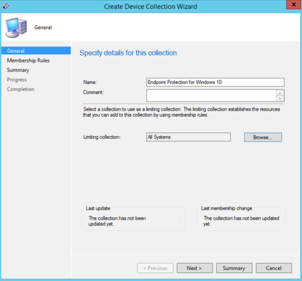

4. Select **Add Rule** and choose **Query Rule**.

    

5.  Click **Next** on the **Direct Membership Wizard** and click on **Edit Query Statement**.

     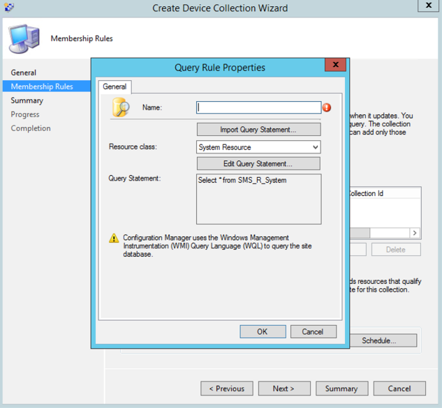

6. Select **Criteria** and then choose the star icon.

     

7. Keep criterion type as **simple value**, choose where as **Operating System - build number**, operator as **is equal to** and value **10240** and click on **OK**.

    

8. Select **Next** and **Close**.

    

9. Select **Next**.

    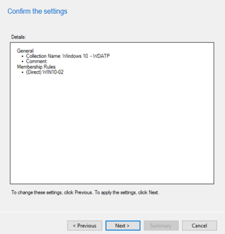

After completing this task, you now have a device collection with all the Windows 10 endpoints in the environment. 

## Endpoint detection and response
### Windows 10
From within the Microsoft Defender Security Center it is possible to download
the '.onboarding' policy that can be used to create the policy in System Center Configuration
Manager and deploy that policy to Windows 10 devices.

1. From a Microsoft Defender Security Center Portal, select [Settings and then Onboarding](https://securitycenter.windows.com/preferences2/onboarding).


2. Under Deployment method select the supported version of **System Center Configuration Manager**.

    

3.	Select **Download package**.

    

4. Save the package to an accessible location.
5. In  System Center Configuration Manager, navigate to: **Assets and Compliance > Overview > Endpoint Protection > Microsoft Defender ATP Policies**.

6. Right-click **Microsoft Defender ATP Policies** and select **Create Microsoft Defender ATP Policy**.

    

7. Enter the name and description, verify **Onboarding** is selected, then select **Next**.

    

8. Click **Browse**.

9. Navigate to the location of the downloaded file from step 4 above.

    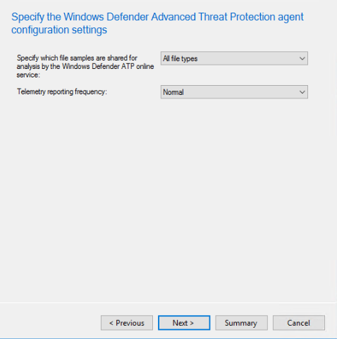

10. Click **Next**.
11. Configure the Agent with the appropriate samples (**None** or **All file types**).

    

12. Select the appropriate telemetry (**Normal** or **Expedited**) then click **Next**.

    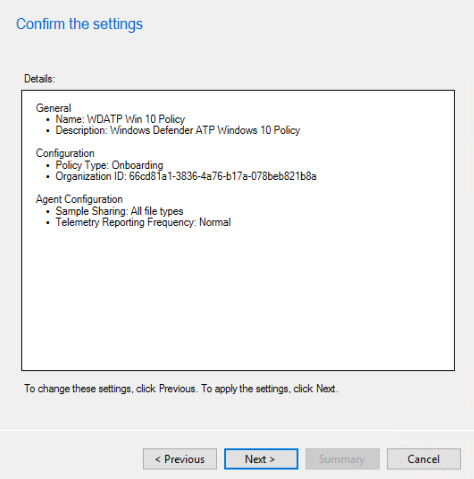

14. Verify the configuration, then click **Next**.

     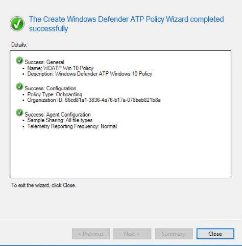

15. Click **Close** when the Wizard completes.

16.  In the System Center Configuration Manager console, right-click the Microsoft Defender ATP policy you just created and select **Deploy**.

     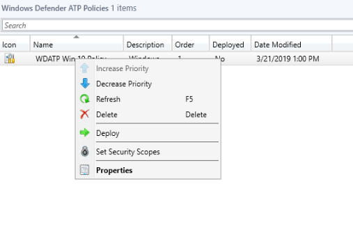

17. On the right panel, select the previously created collection and click **OK**.

    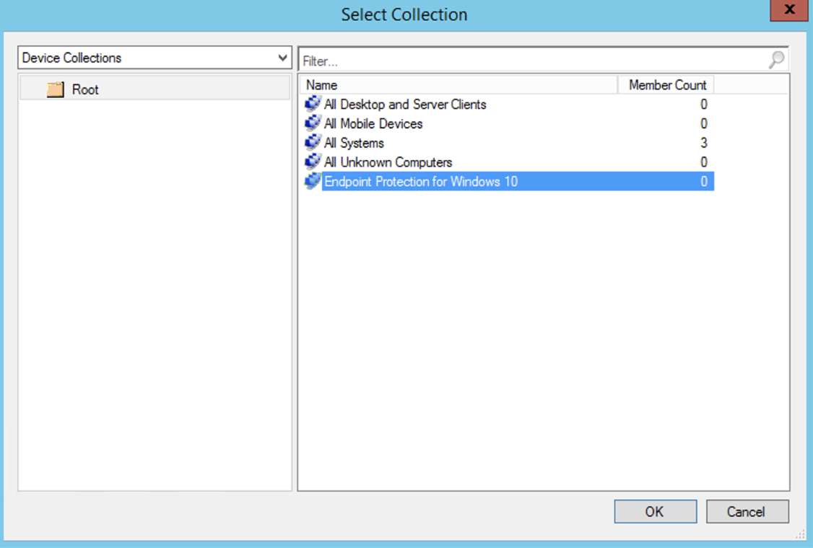


### Previous versions of Windows Client (Windows 7 and Windows 8.1)
Follow the steps below to identify the Microsoft Defender ATP Workspace ID and Workspace Key, that will be required for the onboarding of previous versions of Windows.

1. From a Microsoft Defender Security Center Portal, select **Settings > Onboarding**.

2. Under operating system choose **Windows 7 SP1 and 8.1**.

    

3. Copy the **Workspace ID** and **Workspace Key** and save them. They will be used later in the process.

Before the systems can be onboarded into the workspace, the deployment scripts need to be updated to contain the correct information. Failure to do so will result in the systems not being properly onboarded. Depending on the deployment method, this step may have already been completed.

Edit the InstallMMA.cmd with a text editor, such as notepad and update the
following lines and save the file:

   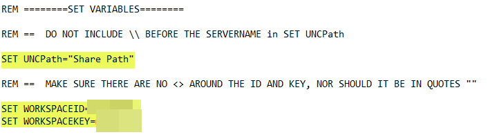

Edit the ConfiguerOMSAgent.vbs with a text editor, such as notepad, and update the following lines and save the file:

   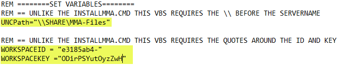

Microsoft Monitoring Agent (MMA) is currently (as of January 2019) supported on the following Windows Operating
Systems:

-   Server SKUs: Windows Server 2008 SP1 or Newer

-   Client SKUs: Windows 7 SP1 and later

The MMA agent will need to be installed on Windows devices. To install the
agent, some systems will need to download the [Update for customer experience
and diagnostic
telemetry](https://support.microsoft.com/help/3080149/update-for-customer-experience-and-diagnostic-telemetry)
in order to collect the data with MMA. These system versions include but may not
be limited to:

-   Windows 8.1

-   Windows 7

-   Windows Server 2016

-   Windows Server 2012 R2

-   Windows Server 2008 R2

Specifically, for Windows 7 SP1, the following patches must be installed:

-   Install
    [KB4074598](https://support.microsoft.com/help/4074598/windows-7-update-kb4074598)

-   Install either [.NET Framework
    4.5](https://www.microsoft.com/en-us/download/details.aspx?id=30653) (or
    later) **or**
    [KB3154518](https://support.microsoft.com/help/3154518/support-for-tls-system-default-versions-included-in-the-net-framework).
    Do not install both on the same system.

To deploy the MMA with System Center Configuration Manager, follow the steps
below to utilize the provided batch files to onboard the systems. The CMD file
when executed, will require the system to copy files from a network share by the
System, the System will install MMA, Install the DependencyAgent, and configure
MMA for enrollment into the workspace.


1. In  System Center Configuration Manager console, navigate to **Software
    Library**.

2.  Expand **Application Management**.

3.  Right-click **Packages**  then select **Create Package**.

4. Provide a Name for the package, then click **Next**

    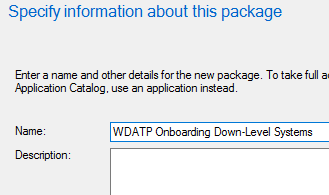

5. Verify **Standard Program** is selected.

   

6.  Click **Next**.

    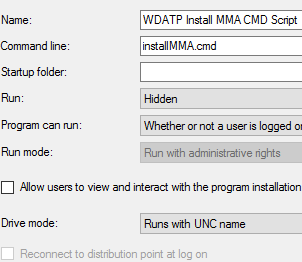

7. Enter a program name.

8.  Browse to the location of the InstallMMA.cmd.

9.  Set Run to **Hidden**.

10.  Set **Program can run** to **Whether or not a user is logged on**.

11.  Click **Next**.

12.  Set the **Maximum allowed run time** to 720.

13.  Click **Next**.

   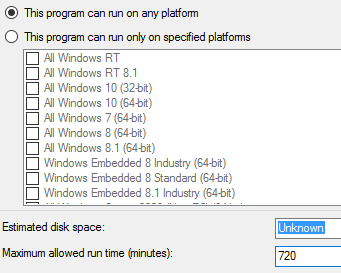

14. Verify the configuration, then click **Next**.

    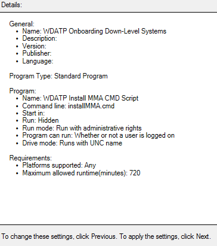

15. Click **Next**.

16. Click **Close**.

17.  In the System Center Configuration Manager console, right-click the Microsoft Defender ATP
    Onboarding Package just created and select **Deploy**.

18. On the right panel select the appropriate collection.

19.  Click **OK**.

## Next generation protection 
Microsoft Defender Antivirus is a built-in antimalware solution that provides next generation protection for desktops, portable computers, and servers.

1. In the System Center Configuration Manager console, navigate to **Assets and Compliance \> Overview \> Endpoint Protection \> Antimalware Polices** and choose **Create Antimalware Policy**.

    

2. Select **Scheduled scans**, **Scan settings**, **Default actions**, **Real-time protection**, **Exclusion settings**, **Advanced**, **Threat overrides**, **Cloud Protection Service** and **Security intelligence   updates** and choose **OK**.

    

    In certain industries or some select enterprise customers might have specific
needs on how Antivirus is configured.

  
    [Quick scan versus full scan and custom scan](https://docs.microsoft.com/windows/security/threat-protection/windows-defender-antivirus/scheduled-catch-up-scans-windows-defender-antivirus#quick-scan-versus-full-scan-and-custom-scan)

    For more details, see [Windows Security configuration framework](https://docs.microsoft.com/windows/security/threat-protection/windows-security-configuration-framework/windows-security-configuration-framework)
  
    
    

    

    

    

    

    

    

    

3. Right-click on the newly created antimalware policy and select **Deploy** .

    

4. Target the new antimalware policy to your Windows 10 collection and click **OK**.

     

After completing this task, you now have successfully configured Windows
Defender Antivirus.

## Attack Surface Reduction
The attack surface reduction pillar of Microsoft Defender ATP includes the feature set that is available under Exploit Guard. Attack surface reduction (ASR) rules, Controlled Folder Access, Network Protection and Exploit
Protection. All these features provide an audit mode and a block mode. In audit mode there is no end user impact all it does is collect additional telemetry and make it available in the Microsoft Defender Security Center. The goal with a deployment is to step by step move security controls into block mode.

To set ASR rules in Audit mode:

1. In the System Center Configuration Manager console, navigate to **Assets and Compliance \> Overview \> Endpoint Protection \> Windows Defender Exploit Guard** and choose **Create Exploit Guard Policy**.

   


2.  Select **Attack Surface Reduction**.
   

3. Set rules to **Audit** and click **Next**.

    

4. Confirm the new Exploit Guard policy by clicking on **Next**.

    

    
5. Once the policy is created click **Close**.

    

    

6.  Right-click on the newly created policy and choose **Deploy**.
    
    

7. Target the policy to the newly created Windows 10 collection and click **OK**.

    

After completing this task, you now have successfully configured ASR rules in audit mode.  
  
Below are additional steps to verify whether ASR rules are correctly applied to
endpoints. (This may take few minutes)


1. From a web browser, navigate to <https://securitycenter.windows.com>.

2.  Select **Configuration management** from left side menu.

    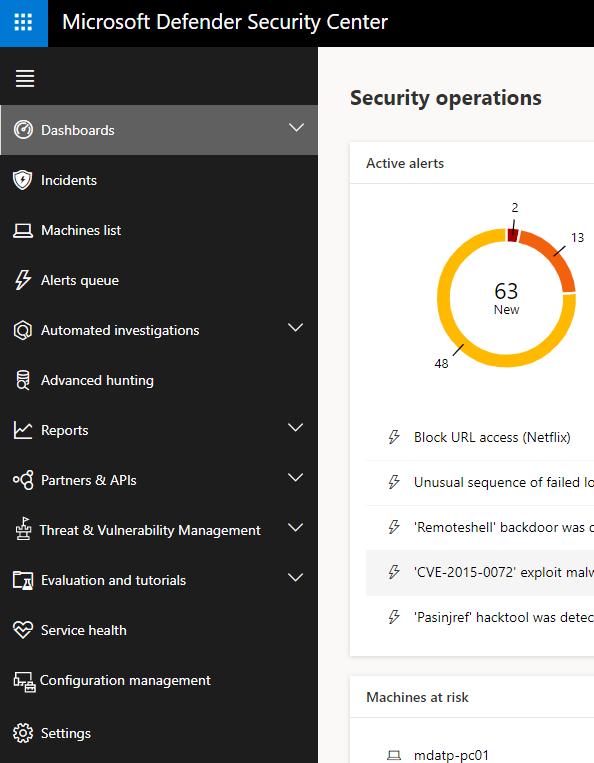

3. Click **Go to attack surface management** in the Attack surface management panel. 
    
    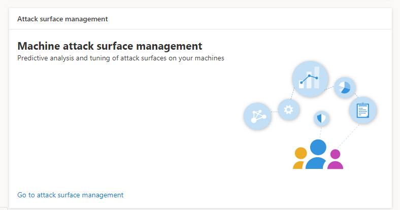

4. Click **Configuration** tab in Attack Surface reduction rules reports. It shows ASR rules configuration overview and ASR rules status on each devices.

    

5. Click each device shows configuration details of ASR rules.

    

See [Optimize ASR rule deployment and
detections](https://docs.microsoft.com/windows/security/threat-protection/microsoft-defender-atp/configure-machines-asr)   for more details.  


### To set Network Protection rules in Audit mode:
1. In the System Center Configuration Manager console, navigate to **Assets and  Compliance \> Overview \> Endpoint Protection \> Windows Defender Exploit Guard** and choose **Create Exploit Guard Policy**.

    

2. Select **Network protection**.

3. Set the setting to **Audit** and click **Next**. 

    

4. Confirm the new Exploit Guard Policy by clicking **Next**.
    
    

5. Once the policy is created click on **Close**.

    

6. Right-click on the newly created policy and choose **Deploy**.

    

7. Select the policy to the newly created Windows 10 collection and choose **OK**.

    

After completing this task, you now have successfully configured Network
Protection in audit mode.

### To set Controlled Folder Access rules in Audit mode:

1. In the System Center Configuration Manager console, navigate to **Assets and Compliance \> Overview \> Endpoint Protection \> Windows Defender Exploit Guard** and choose **Create Exploit Guard Policy**.

    

2. Select **Controlled folder access**.
    
3. Set the configuration to **Audit** and click **Next**.

        
    
4. Confirm the new Exploit Guard Policy by clicking on **Next**.

    

5. Once the policy is created click on **Close**.

    

6. Right-click on the newly created policy and choose **Deploy**.

    

7.  Target the policy to the newly created Windows 10 collection and click **OK**.

    

After completing this task, you now have successfully configured Controlled folder access in audit mode.

