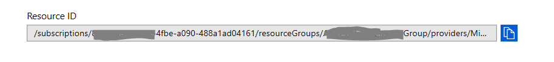
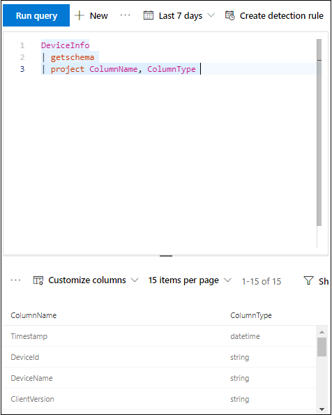

# Configure Microsoft Defender ATP to stream Advanced Hunting events to your Event hub

**Applies to:**

- [Microsoft Defender Advanced Threat Protection (Microsoft Defender ATP)](https://go.microsoft.com/fwlink/p/?linkid=2069559)

- Want to experience Microsoft Defender ATP? [Sign up for a free trial.](https://www.microsoft.com/en-us/WindowsForBusiness/windows-atp?ocid=docs-wdatp-configuresiem-abovefoldlink) 

## Preparations:

- Create an [Event hub](https://docs.microsoft.com/en-us/azure/event-hubs/) in your tenant.
- Log in to your [Azure tenant](https://ms.portal.azure.com/), go to > Subscriptions > Your subscription > Resource Providers > Register to **Microsoft.insights**

## Enable raw data streaming:

- Log in to [MDATP portal](https://securitycenter.windows.com) with Global Admin user.
- Go to [Data export settings page](https://securitycenter.windows.com/interoperability/dataexport) on MDATP portal.
- Click on **Add data export settings**.
- Choose a Name to your new settings.
- Choose **Forward events to Azure Event Hub**
- Type your **Event hub name** and your **Event hub resource Id**.
  In order to get your **Event hub resource Id**, go to your Event hub namespace page on [Azure](https://ms.portal.azure.com/) > properties tab > copy the text under **Resource ID**:

  
- Choose the events you want to stream and click Save.

## The schema of the events in the Event-Hub:

```
{
	"records": [
					{
						"time": "<The time WDATP received the event>"
						"tenantId": "<The Id of the tenant that the event belongs to>"
						"category": "<The Advanced Hunting table name with 'AdvancedHunting-' prefix>"
						"properties": { <WDATP Advanced Hunting event as Json> }
					}
					...
				]
}
```

- As you can see, each event hub message in the Event-Hub contains list of records.
- Each record contains the event name, the time WDATP received the event, the tenant it belongs ( You will only get events from your tenant ), and the event in Json format in a property called "properties".
- Check out [Advanced Hunting overview](overview-hunting.md) to learn about the schema of WDATP events.

## Data types mapping:

In order to get the data types for our events properties do the following:

- Login to our portal and go to [Advanced Hunting page](https://securitycenter.windows.com/hunting-package).
- Run the following query to get the data types mapping for each event: 
```
{EventType}
| getschema
| project ColumnName, ColumnType 

```

- Here is an example for Machine Info event: 



## Related topics
- [Overview of Advanced Hunting](overview-hunting.md)
- [MDATP Streaming API](raw-data-export.md)
- [Stream MDATP events to your Azure storage account](raw-data-export-storage.md)
- [Azure Event Hub documentation](https://docs.microsoft.com/en-us/azure/event-hubs/)
