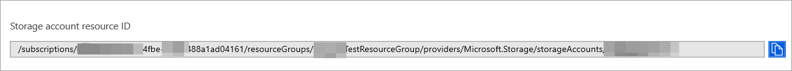
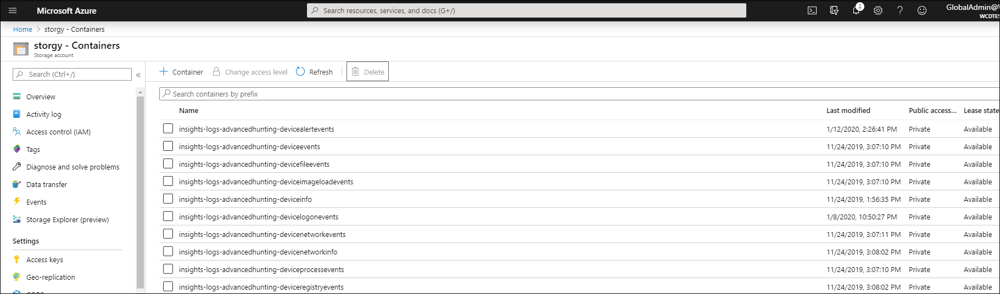

# Configure Microsoft Defender ATP to stream Advanced Hunting events to your Storage account

**Applies to:**

- [Microsoft Defender Advanced Threat Protection (Microsoft Defender ATP)](https://go.microsoft.com/fwlink/p/?linkid=2069559)

Want to experience Microsoft Defender ATP? [Sign up for a free trial.](https://www.microsoft.com/en-us/WindowsForBusiness/windows-atp?ocid=docs-wdatp-configuresiem-abovefoldlink) 

## Before you begin:

1. Create a [Storage account](https://docs.microsoft.com/en-us/azure/storage/common/storage-account-overview) in your tenant.
2. Log in to your [Azure tenant](https://ms.portal.azure.com/), go to > Subscriptions > Your subscription > Resource Providers > Register to **Microsoft.insights**

## Enable raw data streaming:

1. Log in to [Microsoft Defender ATP portal](https://securitycenter.windows.com) with Global Admin user.
2. Go to [Data export settings page](https://securitycenter.windows.com/interoperability/dataexport) on Microsoft Defender ATP portal.
3. Click on **Add data export settings**.
4. Choose a Name to your new settings.
5. Choose **Forward events to Azure Storage**
6. Type your **Storage Account Resource Id**. In order to get your **Storage Account Resource Id**, go to your Storage account page on [Azure portal](https://ms.portal.azure.com/) > properties tab > copy the text under **Storage account resource ID**:

  

7. Choose the events you want to stream and click **Save**.

## The schema of the events in the Storage account:

- A blob container will be created for each event type: 



- The schema of each row in a blob is the following JSON: 

```
{
        "time": "<The time WDATP received the event>"
        "tenantId": "<Your tenant ID>"
        "category": "<The Advanced Hunting table name with 'AdvancedHunting-' prefix>"
        "properties": { <WDATP Advanced Hunting event as Json> }
}               
```

- Each blob contains multiple rows.
- Each row contains the event name, the time Microsofte Defender ATP received the event, the tenant it belongs (you will only get events from your tenant), and the event in JSON format in a property called "properties".
- For more information about the schema of Microsoft Defender ATP events, see [Advanced Hunting overview](overview-hunting.md).

## Data types mapping:

In order to get the data types for our events properties do the following:

1. Log in to [Microsoft Defender Security Center](https://securitycenter.windows.com) and go to [Advanced Hunting page](https://securitycenter.windows.com/hunting-package).
2. Run the following query to get the data types mapping for each event: 

```
{EventType}
| getschema
| project ColumnName, ColumnType 

```

- Here is an example for Machine Info event: 


## Related topics
- [Overview of Advanced Hunting](overview-hunting.md)
- [Microsoft Defender Advanced Threat Protection Streaming API](raw-data-export.md)
- [Stream Microsoft Defender Advanced Threat Protection events to your Azure storage account](raw-data-export-storage.md)
- [Azure Storage Account documentation](https://docs.microsoft.com/en-us/azure/storage/common/storage-account-overview)
