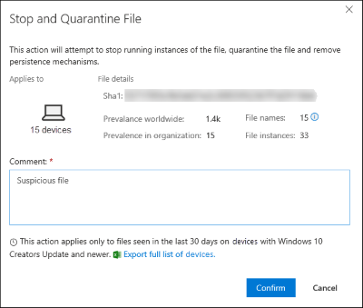
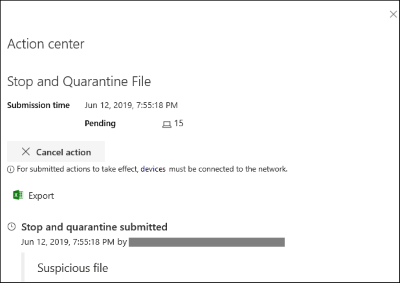
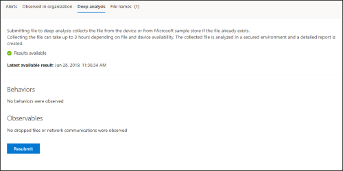

# Take response actions on a file

**Applies to:**

- [Microsoft Defender Advanced Threat Protection (Microsoft Defender ATP)](https://go.microsoft.com/fwlink/p/?linkid=2069559)
 
[!include[Prerelease information](../../includes/prerelease.md)]

>Want to experience Microsoft Defender ATP? [Sign up for a free trial.](https://www.microsoft.com/microsoft-365/windows/microsoft-defender-atp?ocid=docs-wdatp-responddile-abovefoldlink)

Quickly respond to detected attacks by stopping and quarantining files or blocking a file. After taking action on files, you can check activity details in the Action center.

Response actions are available on a file's detailed profile page. Once on this page, you can switch between the new and old page layouts by toggling **new File page**. The rest of this article describes the newer page layout.

Response actions run along the top of the file page, and include:

- Stop and Quarantine File
- Add Indicator
- Download file
- Consult a threat expert
- Action center

You can also submit files for deep analysis, to run the file in a secure cloud sandbox. When the analysis is complete, you'll get a detailed report that provides information about the behavior of the file. You can submit files for deep analysis and read past reports by selecting the **Deep analysis** tab. It's located below the file information cards.

Some actions require certain permissions. The following table describes what action certain permissions can take on portable executable (PE) and non-PE files:

Permission | PE files | Non-PE files
:---|:---|:---
View data | X | X
Alerts investigation | &#x2611; | X
Live response basic | X | X
Live response advanced | &#x2611; |&#x2611;

For more information on roles, see [Create and manage roles for role-based access control](user-roles.md).

## Stop and quarantine files in your network

You can contain an attack in your organization by stopping the malicious process and quarantining the file where it was observed.

>[!IMPORTANT]
>You can only take this action if:
>
> - The device you're taking the action on is running Windows 10, version 1703 or later
> - The file does not belong to trusted third-party publishers or not signed by Microsoft
> - Microsoft Defender Antivirus must at least be running on Passive mode. For more information, see [Microsoft Defender Antivirus compatibility](../microsoft-defender-antivirus/microsoft-defender-antivirus-compatibility.md).

The **Stop and Quarantine File** action includes stopping running processes, quarantining the files, and deleting persistent data such as registry keys.

This action takes effect on devices with Windows 10, version 1703 or later, where the file was observed in the last 30 days.

>[!NOTE]
>You’ll be able to restore the file from quarantine at any time.

### Stop and quarantine files

1. Select the file you want to stop and quarantine. You can select a file from any of the following views or use the Search box:

    - **Alerts** - select the corresponding links from the Description or Details in the Artifact timeline
    - **Search box** - select **File** from the drop–down menu and enter the file name

    >[!NOTE]
    >The stop and quarantine file action is limited to a maximum of 1000 devices. To stop a file on a larger number of devices, see [Add indicator to block or allow file](#add-indicator-to-block-or-allow-a-file).

2. Go to the top bar and select **Stop and Quarantine File**.

    

3. Specify a reason, then select **Confirm**.

    

    The Action center shows the submission information:

    

    - **Submission time** - Shows when the action was submitted.
    - **Success** - Shows the number of devices where the file has been stopped and quarantined.
    - **Failed** - Shows the number of devices where the action failed and details about the failure.
    - **Pending** - Shows the number of devices where the file is yet to be stopped and quarantined from. Cases can take extra time when the device is offline or not connected to the network.

4. Select any of the status indicators to view more information about the action. For example, select **Failed** to see where the action failed.

**Notification on device user**:</br>
When the file is being removed from a device, the following notification is shown:


In the device timeline, a new event is added for each device where a file was stopped and quarantined.

A warning is shown before the action is implemented for files widely used throughout an organization. It's to validate that the operation is intended.

## Restore file from quarantine

You can roll back and remove a file from quarantine if you’ve determined that it’s clean after an investigation. Run the following command on each device where the file was quarantined.

1. Open an elevated command–line prompt on the device:

    a. Go to **Start** and type _cmd_.

    b. Right–click **Command prompt** and select **Run as administrator**.

2. Enter the following command, and press **Enter**:

   ```Powershell
   “%ProgramFiles%\Windows Defender\MpCmdRun.exe” –Restore –Name EUS:Win32/CustomEnterpriseBlock –All
   ```

> [!NOTE]
> In some scenarios, the **ThreatName** may appear as: EUS:Win32/CustomEnterpriseBlock!cl.
> 
> Microsoft Defender ATP will restore all custom blocked files that were quarantined on this device in the last 30 days.

## Download or collect file

Selecting **Download file** from the response actions allows you to download a local, password-protected .zip archive containing your file. A flyout will appear where you can record a reason for downloading the file, and set a password.

By default, you will not be able to download files that are in quarantine.


### Download quarantined files

You can turn on a setting to backup quarantined files in a secure and compliant location so they can be downloaded directly from quarantine. Once this setting is enabled, the **Download file** button will always be available.

Go to **Settings** > **Advanced features** > **Download quarantined files** and switch the toggle to **On**.

### Collect files

If a file is not already stored by Microsoft Defender ATP, you can't download it. Instead, you'll see a **Collect file** button in the same location. If a file hasn't been seen in the organization in the past 30 days, **Collect file** will be disabled.

## Add indicator to block or allow a file

Prevent further propagation of an attack in your organization by banning potentially malicious files or suspected malware. If you know a potentially malicious portable executable (PE) file, you can block it. This operation will prevent it from being read, written, or executed on devices in your organization.

>[!IMPORTANT]
>
>- This feature is available if your organization uses Microsoft Defender Antivirus and Cloud–based protection is enabled. For more information, see [Manage cloud–based protection](../microsoft-defender-antivirus/deploy-manage-report-microsoft-defender-antivirus.md).
>
>- The Antimalware client version must be 4.18.1901.x or later.
>- This feature is designed to prevent suspected malware (or potentially malicious files) from being downloaded from the web. It currently supports portable executable (PE) files, including _.exe_ and _.dll_ files. The coverage will be extended over time.
>- This response action is available for devices on Windows 10, version 1703 or later.
>- The allow or block function cannot be done on files if the file's classification exists on the device's cache prior to the allow or block action.

>[!NOTE]
> The PE file needs to be in the device timeline for you to be able to take this action.
>
> There may be a couple of minutes of latency between the time the action is taken and the actual file being blocked.

### Enable the block file feature

To start blocking files, you first need to [turn the **Block or allow** feature on](advanced-features.md) in Settings.
  
### Allow or block file

When you add an indicator hash for a file, you can choose to raise an alert and block the file whenever a device in your organization attempts to run it.

Files automatically blocked by an indicator won't show up in the file's Action center, but the alerts will still be visible in the Alerts queue.

For more information on blocking and raising alerts on files, see [manage indicators](manage-indicators.md) .

To stop blocking a file, remove the indicator. You can do so via the **Edit Indicator** action on the file's profile page. This action will be visible in the same position as the **Add Indicator** action, before you added the indicator.

You can also edit indicators from  the **Settings** page, under **Rules** > **Indicators**. Indicators are listed in this area by their file's hash.

## Consult a threat expert

Consult a Microsoft threat expert for more insights on a potentially compromised device, or already compromised devices. Microsoft Threat Experts are engaged directly from within the Microsoft Defender Security Center for timely and accurate response. Experts provide insights on a potentially compromised device and help you understand complex threats and targeted attack notifications. They can also provide information about the alerts or a threat intelligence context that you see on your portal dashboard.

See [Consult a Microsoft Threat Expert](https://docs.microsoft.com/windows/security/threat-protection/microsoft-defender-atp/configure-microsoft-threat-experts#consult-a-microsoft-threat-expert-about-suspicious-cybersecurity-activities-in-your-organization) for details.

## Check activity details in Action center

The **Action center** provides information on actions that were taken on a device or file. You can view the following details:

- Investigation package collection
- Antivirus scan
- App restriction
- Device isolation

All other related details are also shown, such as submission date/time, submitting user, and if the action succeeded or failed.


## Deep analysis

Cyber security investigations are typically triggered by an alert. Alerts are related to one or more observed files that are often new or unknown. Selecting a file takes you to the file view where you can see the file's metadata. To enrich the data related to the file, you can submit the file for deep analysis.

The Deep analysis feature executes a file in a secure, fully instrumented cloud environment. Deep analysis results show the file's activities, observed behaviors, and associated artifacts, such as dropped files, registry modifications, and communication with IPs.
Deep analysis currently supports extensive analysis of portable executable (PE) files (including _.exe_ and _.dll_ files).

Deep analysis of a file takes several minutes. Once the file analysis is complete, the Deep Analysis tab will update to display a summary and the date and time of the latest available results.

The deep analysis summary includes a list of observed *behaviors*, some of which can indicate malicious activity, and *observables*, including contacted IPs and files created on the disk. If nothing was found, these sections will display a brief message.

Results of deep analysis are matched against threat intelligence and any matches will generate appropriate alerts.

Use the deep analysis feature to investigate the details of any file. Analysis is helpful during an alert investigation or for any reason where you suspect malicious behavior. This feature is available within the **Deep analysis** tab, on the file's profile page.

>[!VIDEO https://www.microsoft.com/en-us/videoplayer/embed/RE4aAYy?rel=0] 

**Submit for deep analysis** is enabled when the file is available in the Microsoft Defender ATP backend sample collection, or if it was observed on a supported Windows 10 device.

> [!NOTE]
> Only files from Windows 10 can be automatically collected.

You can also submit a sample through the [Microsoft Security Center Portal](https://www.microsoft.com/security/portal/submission/submit.aspx) if the file wasn't observed on a Windows 10 device, and wait for **Submit for deep analysis** button to become available.

> [!NOTE]
> Due to backend processing flows in the Microsoft Security Center Portal, there could be up to 10 minutes of latency between file submission and availability of the deep analysis feature in Microsoft Defender ATP.

When the sample is collected, Microsoft Defender ATP runs the file in a secure environment. It then creates a detailed report of observed behaviors and associated artifacts. Examples include files dropped on devices, communication to IPs, and registry modifications.

### Submit files for deep analysis

1. Select the file that you want to submit for deep analysis. You can select or search a file from any of the following views:

    - Alerts - select the file links from the **Description** or **Details** in the Artifact timeline
    - **Devices list** - select the file links from the **Description** or **Details** in the **Device in organization** section
    - Search box - select **File** from the drop–down menu and enter the file name

2. In the **Deep analysis** tab of the file view, select **Submit**.

    

>**Note**&nbsp;&nbsp;Only PE files are supported, including _.exe_ and _.dll_ files

A progress bar is displayed and provides information on the different stages of the analysis. You can then view the report when the analysis is done.

> [!NOTE]
> Depending on device availability, sample collection time can vary. There is a 3–hour timeout for sample collection. The collection will fail and the operation will abort if there is no online Windows 10 device reporting at that time. You can re–submit files for deep analysis to get fresh data on the file.

### View deep analysis reports

View the deep analysis report to see more in-depth insights on the file you submitted. This feature is available in the file view context.

You can view the comprehensive report that provides details on the following sections:

- Behaviors
- Observables

The details provided can help you investigate if there are indications of a potential attack.

1. Select the file you submitted for deep analysis.
2. Select the **Deep analysis** tab. If there are any previous reports, the report summary will appear in this tab.

    

**Troubleshoot deep analysis**

If you come across a problem when trying to submit a file, try each of the following troubleshooting steps.

1. Ensure that the file in question is a PE file. PE files typically have _.exe_ or _.dll_ extensions (executable programs or applications).
2. Ensure the service has access to the file, that it still exists, and hasn't been corrupted or modified.
3. Wait a short while and try to submit the file again. The queue may be full, or there was a temporary connection or communication error.
4. If the sample collection policy isn't configured, then the default behavior is to allow sample collection. If it's configured, then verify the policy setting allows sample collection before submitting the file again. When sample collection is configured, then check the following registry value:

    ```Powershell
    Path: HKLM\SOFTWARE\Policies\Microsoft\Windows Advanced Threat Protection
    Name: AllowSampleCollection
    Type: DWORD
    Hexadecimal value :
      Value = 0 – block sample collection
      Value = 1 – allow sample collection
    ```

1. Change the organizational unit through the Group Policy. For more information, see [Configure with Group Policy](configure-endpoints-gp.md).
2. If these steps don't resolve the issue, contact [winatp@microsoft.com](mailto:winatp@microsoft.com).

## Related topics

- [Take response actions on a device](respond-machine-alerts.md)
- [Investigate files](investigate-files.md)
