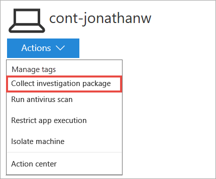
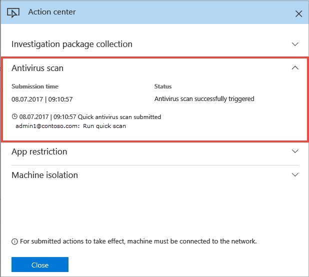
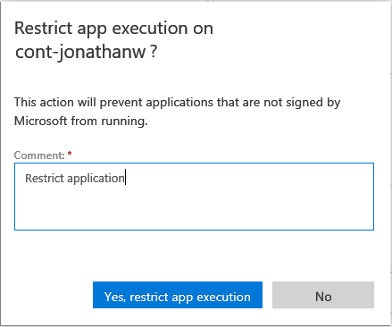
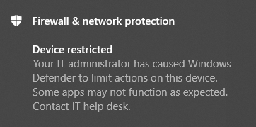
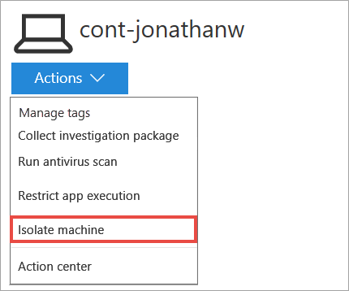
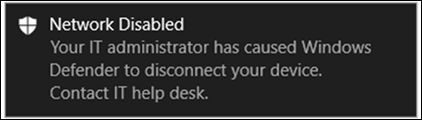
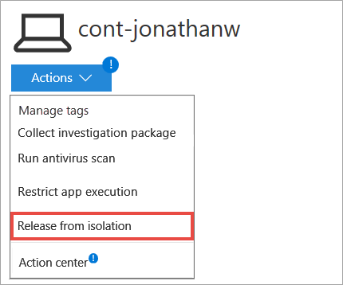

# Take response actions on a machine

**Applies to:**
- [Microsoft Defender Advanced Threat Protection (Microsoft Defender ATP)](https://go.microsoft.com/fwlink/p/?linkid=2069559)

>Want to experience Microsoft Defender ATP? [Sign up for a free trial.](https://www.microsoft.com/en-us/WindowsForBusiness/windows-atp?ocid=docs-wdatp-respondmachine-abovefoldlink) 

Quickly respond to detected attacks by isolating machines or collecting an investigation package. After taking action on machines, you can check activity details on the Action center.

>[!IMPORTANT]
> - These response actions are only available for machines on Windows 10, version  1703 or later. 
> - For non-Windows platforms, response capabilities (such as Machine isolation) are dependent on the third-party capabilities. 

## Collect investigation package from machines
As part of the investigation or response process, you can collect an investigation package from a machine. By collecting the investigation package, you can identify the current state of the machine and further understand the tools and techniques used by the attacker.

>[!IMPORTANT]
> This response action is available for machines on Windows 10, version  1703 or later.

You can download the package (Zip file) and investigate the events that occurred on a machine.

The package contains the following folders:

| Folder                                      | Description                                                                                                                                                                                                                                                                                                                                                                                                                                                                                                                                                                                                                                                                                                                                                                                                                                                                                                                                                                                                                                                                                                                                                                                                                                                           |
|:--------------------------------------------|:----------------------------------------------------------------------------------------------------------------------------------------------------------------------------------------------------------------------------------------------------------------------------------------------------------------------------------------------------------------------------------------------------------------------------------------------------------------------------------------------------------------------------------------------------------------------------------------------------------------------------------------------------------------------------------------------------------------------------------------------------------------------------------------------------------------------------------------------------------------------------------------------------------------------------------------------------------------------------------------------------------------------------------------------------------------------------------------------------------------------------------------------------------------------------------------------------------------------------------------------------------------------|
| Autoruns                                    | Contains a set of files that each represent the content of the registry of a known auto start entry point (ASEP) to help identify attacker’s persistency on the machine.    NOTE: If the registry key is not found, the file will contain the following message: “ERROR: The system was unable to find the specified registry key or value.”                                                                                                                                                                                                                                                                                                                                                                                                                                                                                                                                                                                                                                                                                                                                                                                                                                                                                                                  |
| Installed programs                          | This .CSV file contains the list of installed programs that can help identify what is currently installed on the machine. For more information, see [Win32_Product class](https://go.microsoft.com/fwlink/?linkid=841509).                                                                                                                                                                                                                                                                                                                                                                                                                                                                                                                                                                                                                                                                                                                                                                                                                                                                                                                                                                                                                                            |
| Network connections                         | This folder contains a set of data points related to the connectivity information which can help in identifying connectivity to suspicious URLs, attacker’s command and control (C&C) infrastructure, any lateral movement, or remote connections.   -	ActiveNetworkConnections.txt – Displays protocol statistics and current TCP/IP network connections. Provides the ability to look for suspicious connectivity made by a process.    - Arp.txt – Displays the current address resolution protocol (ARP) cache tables for all interfaces.    ARP cache can reveal additional hosts on a network that have been compromised or suspicious systems on the network that night have been used to run an internal attack.   -	Dnscache.txt - Displays the contents of the DNS client resolver cache, which includes both entries preloaded from the local Hosts file and any recently obtained resource records for name queries resolved by the computer. This can help in identifying suspicious connections.    - Ipconfig.txt – Displays the full TCP/IP configuration for all adapters. Adapters can represent physical interfaces, such as installed network adapters, or logical interfaces, such as dial-up connections. |
| Prefetch files                              | Windows Prefetch files are designed to speed up the application startup process. It can be used to track all the files recently used in the system and find traces for applications that might have been deleted but can still be found in the prefetch file list.    - Prefetch folder –  Contains a copy of the prefetch files from `%SystemRoot%\Prefetch`. NOTE: It is suggested to download a prefetch file viewer to view the prefetch files.    - PrefetchFilesList.txt – Contains the list of all the copied files which can be used to track if there were any copy failures to the prefetch folder.                                                                                                                                                                                                                                                                                                                                                                                                                                                                                                                                                                                                                                         |
| Processes                                   | Contains a .CSV file listing the running processes which provides the ability to identify current processes running on the machine. This can be useful when identifying a suspicious process and its state.                                                                                                                                                                                                                                                                                                                                                                                                                                                                                                                                                                                                                                                                                                                                                                                                                                                                                                                                                                                                                                                           |
| Scheduled tasks                             | Contains a .CSV file listing the scheduled tasks which can be used to identify routines performed automatically on a chosen machine to look for suspicious code which was set to run automatically.                                                                                                                                                                                                                                                                                                                                                                                                                                                                                                                                                                                                                                                                                                                                                                                                                                                                                                                                                                                                                                                                   |
| Security event log                          | Contains the security event log which contains records of login or logout activity, or other security-related events specified by the system's audit policy.   NOTE: Open the event log file using Event viewer.                                                                                                                                                                                                                                                                                                                                                                                                                                                                                                                                                                                                                                                                                                                                                                                                                                                                                                                                                                                                                                              |
| Services                                    | Contains the services.txt file which lists services and their states.                                                                                                                                                                                                                                                                                                                                                                                                                                                                                                                                                                                                                                                                                                                                                                                                                                                                                                                                                                                                                                                                                                                                                                                                 |
| Windows Server Message Block (SMB) sessions | Lists shared access to files, printers, and serial ports and miscellaneous communications between nodes on a network. This can help identify data exfiltration or lateral movement.    Contains files for SMBInboundSessions and SMBOutboundSession.    NOTE: If the file contains the following message: “ERROR: The system was unable to find the specified registry key or value.”, it means that there were no SMB sessions of this type (inbound or outbound).                                                                                                                                                                                                                                                                                                                                                                                                                                                                                                                                                                                                                                                                                                                                                                                   |
| Temp Directories                            | Contains a set of text files that lists the files located in %Temp% for every user in the system.    This can help to track suspicious files that an attacker may have dropped on the system.    NOTE: If the file contains the following message: “The system cannot find the path specified”, it means that there is no temp directory for this user, and might be because the user didn’t log in to the system.                                                                                                                                                                                                                                                                                                                                                                                                                                                                                                                                                                                                                                                                                                                                                                                                                                    |
| Users and Groups                            | Provides a list of files that each represent a group and its members.                                                                                                                                                                                                                                                                                                                                                                                                                                                                                                                                                                                                                                                                                                                                                                                                                                                                                                                                                                                                                                                                                                                                                                                                 |
| CollectionSummaryReport.xls                 | This file is a summary of the investigation package collection, it contains the list of data points, the command used to extract the data, the execution status, and the error code in case of failure. You can use this report to track if the package includes all the expected data and identify if there were any errors.                                                                                                                                                                                                                                                                                                                                                                                                                                                                                                                                                                                                                                                                                                                                                                                                                                                                                                                                         |

1.	Select the machine that you want to investigate. You can select or search for a machine from any of the following views:

  - **Security operations dashboard** - Select the machine name from the Top machines with active alerts section.
  - **Alerts queue** - Select the machine name beside the machine icon from the alerts queue.
  - **Machines list** - Select the heading of the machine name from the machines list.
  - **Search box** - Select Machine from the drop-down menu and enter the machine name.

2.	Open the **Actions** menu and select **Collect investigation package**.

    

3.  Type a comment and select **Yes, collect package** to take action on the machine.
  
    

    The Action center shows the submission information:

    

    - **Submission time** - Shows when the action was submitted.
    -	**Status** - Indicates if the package was successfully collected from the network. When the collection is complete, you can download the package.

3.	Select **Package available** to download the package.  
    When the package is available a new event will be added to the machine timeline. 
    You can download the package from the machine page, or the Action center.

    

    You can also search for historical packages in the machine timeline.

## Run Windows Defender Antivirus scan on machines
As part of the investigation or response process, you can remotely initiate an antivirus scan to help identify and remediate malware that might be present on a compromised machine.

>[!IMPORTANT]
>- This action is available for machines on Windows 10, version  1709 or later.
>- A Windows Defender Antivirus (Windows Defender AV) scan can run alongside other antivirus solutions, whether Windows Defender AV is the active antivirus solution or not. Windows Defender AV can be in Passive mode. For more information, see [Windows Defender Antivirus compatibility](../windows-defender-antivirus/windows-defender-antivirus-compatibility.md).

1.	Select the machine that you want to run the scan on. You can select or search for a machine from any of the following views:

  - **Security operations dashboard** - Select the machine name from the Top machines with active alerts section.
  - **Alerts queue** - Select the machine name beside the machine icon from the alerts queue.
  - **Machines list** - Select the machine name from the list of machines.
  - **Search box** - Select Machine from the drop-down menu and enter the machine name.
2.	Open the **Actions** menu and select **Run antivirus scan**.

    
    
3. Select the scan type that you'd like to run. You can choose between a quick or a full scan.

    
    

4. Type a comment and select **Yes, run scan** to start the scan. 

    The Action center shows the scan information:

    

    - **Submission time** - Shows when the action was submitted.
    - **Status** - Indicates any pending actions or the results of completed actions.

The machine timeline will include a new event, reflecting that a scan action was submitted on the machine. Windows Defender AV alerts will reflect any detections that surfaced during the scan.

## Restrict app execution
In addition to the ability of containing an attack by stopping malicious processes, you can also lock down a device and prevent subsequent attempts of potentially malicious programs from running.

>[!IMPORTANT]
> - This action is available for machines on Windows 10, version  1709 or later.
> - This feature is available if your organization uses Windows Defender Antivirus. 
> - This action needs to meet the Windows Defender Application Control code integrity policy formats and signing requirements. For more information, see [Code integrity policy formats and signing](https://docs.microsoft.com/windows/device-security/device-guard/requirements-and-deployment-planning-guidelines-for-device-guard#code-integrity-policy-formats-and-signing).

The action to restrict an application from running applies a code integrity policy that only allows running of files that are signed by a Microsoft issued certificate. This method of restriction can help prevent an attacker from controlling compromised machines and performing further malicious activities.

>[!NOTE]
>You’ll be able to reverse the restriction of applications from running at any time.

1. Select the machine where you'd like to restrict an application from running from. You can select or search for a machine from any of the following views:

  - **Security operations dashboard** - Select the machine name from the Top machines with active alerts section.
  - **Alerts queue** - Select the machine name beside the machine icon from the alerts queue.
  - **Machines list** - Select the machine name from the list of machines.
  - **Search box** - Select Machine from the drop-down menu and enter the machine name.

2.	Open the **Actions** menu and select **Restrict app execution**.

    

3. Type a comment and select **Yes, restict app execution** to take action on the file.

   

    The Action center shows the submission information:
    

  - **Submission time** - Shows when the action was submitted.
  - **Status** - Indicates any pending actions or the results of completed actions.

When the application execution restriction configuration is applied, a new event is reflected in the machine timeline.

**Notification on machine user**: 
When an app is restricted, the following notification is displayed to inform the user that an app is being restricted from running:

 

## Remove app restriction 
Depending on the severity of the attack and the state of the machine, you can choose to reverse the restriction of applications policy after you have verified that the compromised machine has been remediated.

1.	Select the machine where you restricted an application from running from.

2.	Open the **Actions** menu and select **Remove app restrictions**. 

    

3.	Type a comment and select **Yes, remove restriction** to take action on the application. The machine application restriction will no longer apply on the machine.  

## Isolate machines from the network
Depending on the severity of the attack and the sensitivity of the machine, you might want to isolate the machine from the network. This action can help prevent the attacker from controlling the compromised machine and performing further activities such as data exfiltration and lateral movement.

>[!IMPORTANT]
>- Full isolation is available for machines on Windows 10, version 1703.
>- Selective isolation is available for machines on Windows 10, version 1709 or later.

This machine isolation feature disconnects the compromised machine from the network while retaining connectivity to the Microsoft Defender ATP service, which continues to monitor the machine.

On Windows 10, version 1709 or later, you'll have additional control over the network isolation level. You can also choose to enable Outlook and Skype for Business connectivity (a.k.a 'Selective Isolation').

>[!NOTE]
>You’ll be able to reconnect the machine back to the network at any time.

1.	Select the machine that you want to isolate. You can select or search for a machine from any of the following views:

  - **Security operations dashboard** - Select the machine name from the Top machines with active alerts section.
  - **Alerts queue** - Select the machine name beside the machine icon from the alerts queue.
  - **Machines list** - Select the machine name from the list of machines.
  - **Search box** - Select Machine from the drop-down menu and enter the machine name.

2.	Open the **Actions** menu and select **Isolate machine**.

    

3. Select the check-box if you'd like to enable Outlook and Skype communication while the machine is isolated (a.k.a. 'Selective Isolation').

    

4. Type a comment and select **Yes, isolate machine** to take action on the machine.
  
    >[!NOTE]
    >The machine will remain connected to the Microsoft Defender ATP service even if it is isolated from the network. If you've chosen to enable Outlook and Skype for Business communication, then you'll be able to communicate to the user while the machine is isolated.

   The Action center shows the submission information:
    

   - **Submission time** - Shows when the action was submitted.
   - **Status** - Indicates any pending actions or the results of completed actions. Additional indications will be provided if you've enabled Outlook and Skype for Business communication.  

When the isolation configuration is applied, a new event is reflected in the machine timeline.

**Notification on machine user**: 
When a machine is being isolated, the following notification is displayed to inform the user that the machine is being isolated from the network:

## Release machine from isolation
Depending on the severity of the attack and the state of the machine you can choose to release the machine from isolation after you have verified that the compromised machine has been remediated.

1.	Select a machine that was previously isolated.

2.	Open the **Actions** menu and select **Release from isolation**.

    

3.	Type a comment and select **Yes, release machine** to take action on the machine. The machine will be reconnected to the network.

## Check activity details in Action center
The **Action center** provides information on actions that were taken on a machine or file. You’ll be able to view the following details:

- Investigation package collection
- Antivirus scan
- App restriction
- Machine isolation

All other related details are also shown, for example, submission time, submitting user, and if the action succeeded or failed.

## Related topic
- [Take response actions on a file](respond-file-alerts.md)
