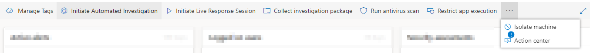
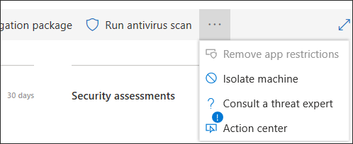
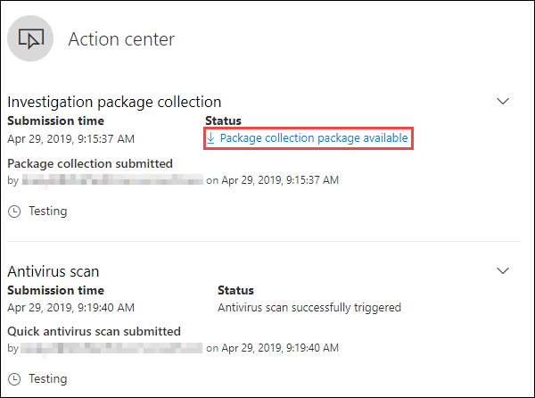
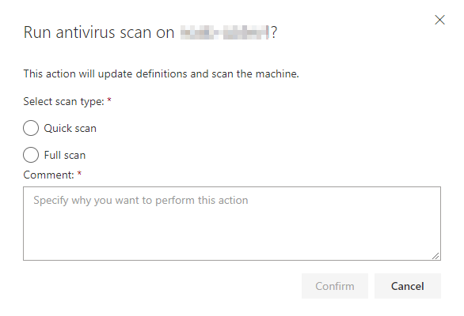
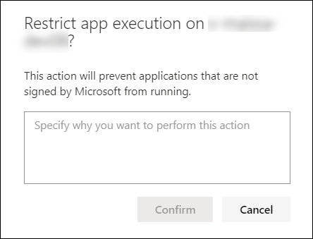
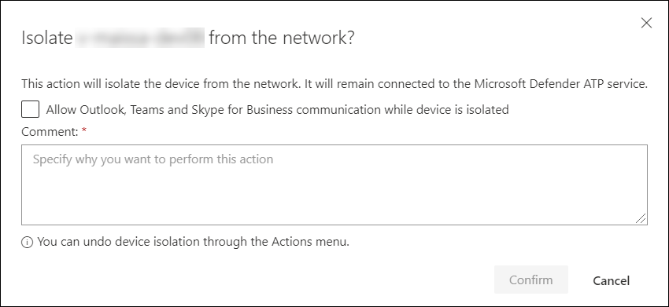

# Take response actions on a device

**Applies to:**
- [Microsoft Defender Advanced Threat Protection (Microsoft Defender ATP)](https://go.microsoft.com/fwlink/p/?linkid=2069559)

>Want to experience Microsoft Defender ATP? [Sign up for a free trial.](https://www.microsoft.com/microsoft-365/windows/microsoft-defender-atp?ocid=docs-wdatp-respondmachine-abovefoldlink) 

Quickly respond to detected attacks by isolating devices or collecting an investigation package. After taking action on devices, you can check activity details on the Action center.

Response actions run along the top of a specific device page and include:

- Manage tags
- Initiate Automated Investigation
- Initiate Live Response Session
- Collect investigation package
- Run antivirus scan
- Restrict app execution
- Isolate device
- Consult a threat expert
- Action center

 You can find device pages from any of the following views:

- **Security operations dashboard** - Select a device name from the Devices at risk card.
- **Alerts queue** - Select the device name beside the device icon from the alerts queue.
- **Devices list** - Select the heading of the device name from the devices list.
- **Search box** - Select Device from the drop-down menu and enter the device name.

>[!IMPORTANT]
> - These response actions are only available for devices on Windows 10, version  1703 or later. 
> - For non-Windows platforms, response capabilities (such as Device isolation) are dependent on the third-party capabilities.

## Manage tags

Add or manage tags to create a logical group affiliation. Device tags support proper mapping of the network, enabling you to attach different tags to capture context and to enable dynamic list creation as part of an incident.

For more information on device tagging, see [Create and manage device tags](machine-tags.md).

## Initiate Automated Investigation

You can start a new general purpose automated investigation on the device if needed. While an investigation is running, any other alert generated from the device will be added to an ongoing Automated investigation until that investigation is completed. In addition, if the same threat is seen on other devices, those devices are added to the investigation.

For more information on automated investigations, see [Overview of Automated investigations](automated-investigations.md).

## Initiate Live Response Session

Live response is a capability that gives you instantaneous access to a device using a remote shell connection. This gives you the power to do in-depth investigative work and take immediate response actions to promptly contain identified threats – real-time.

Live response is designed to enhance investigations by enabling you to collect forensic data, run scripts, send suspicious entities for analysis, remediate threats, and proactively hunt for emerging threats.

For more information on live response, see [Investigate entities on devices using live response](live-response.md)

## Collect investigation package from devices

As part of the investigation or response process, you can collect an investigation package from a device. By collecting the investigation package, you can identify the current state of the device and further understand the tools and techniques used by the attacker.

To download the package (Zip file) and investigate the events that occurred on a device

1. Select **Collect investigation package** from the row of response actions at the top of the device page.
2. Specify in the text box why you want to perform this action. Select **Confirm**.
3. The zip file will download

Alternate way:

1. Select **Action center** from the response actions section of the device page.

    

3. In the Action center fly-out, select **Package collection package available** to download the zip file.
  
    

The package contains the following folders:

| Folder | Description |
|:---|:---------|
|Autoruns | Contains a set of files that each represent the content of the registry of a known auto start entry point (ASEP) to help identify attacker’s persistency on the device.    NOTE: If the registry key is not found, the file will contain the following message: “ERROR: The system was unable to find the specified registry key or value.”                                                                                                                                  |
|Installed programs | This .CSV file contains the list of installed programs that can help identify what is currently installed on the device. For more information, see [Win32_Product class](https://go.microsoft.com/fwlink/?linkid=841509).                                                                                  |
|Network connections | This folder contains a set of data points related to the connectivity information which can help in identifying connectivity to suspicious URLs, attacker’s command and control (C&C) infrastructure, any lateral movement, or remote connections.   - ActiveNetConnections.txt – Displays protocol statistics and current TCP/IP network connections. Provides the ability to look for suspicious connectivity made by a process.    - Arp.txt – Displays the current address resolution protocol (ARP) cache tables for all interfaces.    ARP cache can reveal additional hosts on a network that have been compromised or suspicious systems on the network that night have been used to run an internal attack.   - DnsCache.txt - Displays the contents of the DNS client resolver cache, which includes both entries preloaded from the local Hosts file and any recently obtained resource records for name queries resolved by the computer. This can help in identifying suspicious connections.    - IpConfig.txt – Displays the full TCP/IP configuration for all adapters. Adapters can represent physical interfaces, such as installed network adapters, or logical interfaces, such as dial-up connections.    - FirewallExecutionLog.txt and pfirewall.log                                                                                  |
| Prefetch files| Windows Prefetch files are designed to speed up the application startup process. It can be used to track all the files recently used in the system and find traces for applications that might have been deleted but can still be found in the prefetch file list.    - Prefetch folder –  Contains a copy of the prefetch files from `%SystemRoot%\Prefetch`. NOTE: It is suggested to download a prefetch file viewer to view the prefetch files.    - PrefetchFilesList.txt – Contains the list of all the copied files which can be used to track if there were any copy failures to the prefetch folder.                                                                                                      |
| Processes| Contains a .CSV file listing the running processes which provides the ability to identify current processes running on the device. This can be useful when identifying a suspicious process and its state.                                                                                                                                                                                                       |
| Scheduled tasks| Contains a .CSV file listing the scheduled tasks which can be used to identify routines performed automatically on a chosen device to look for suspicious code which was set to run automatically.                                                                                                                                                                                                      |
| Security event log| Contains the security event log which contains records of login or logout activity, or other security-related events specified by the system's audit policy.   NOTE: Open the event log file using Event viewer.                                                                                      |
| Services| Contains a .CSV file which lists services and their states.                                                                                      |
| Windows Server Message Block (SMB) sessions | Lists shared access to files, printers, and serial ports and miscellaneous communications between nodes on a network. This can help identify data exfiltration or lateral movement.    Contains files for SMBInboundSessions and SMBOutboundSession.    NOTE: If there are no sessions (inbound or outbound), you'll get a text file which tell you that there are no SMB sessions found.                                                                                                                            |
| System Information| Contains a SystemInformation.txt file which lists system information such as OS version and network cards.                                                                                     |
| Temp Directories| Contains a set of text files that lists the files located in %Temp% for every user in the system.    This can help to track suspicious files that an attacker may have dropped on the system.    NOTE: If the file contains the following message: “The system cannot find the path specified”, it means that there is no temp directory for this user, and might be because the user didn’t log in to the system.                                                                                                                                            |
| Users and Groups| Provides a list of files that each represent a group and its members.                                                                                                                   |
|WdSupportLogs| Provides the MpCmdRunLog.txt and MPSupportFiles.cab                                                                                                                   |
| CollectionSummaryReport.xls| This file is a summary of the investigation package collection, it contains the list of data points, the command used to extract the data, the execution status, and the error code in case of failure. You can use this report to track if the package includes all the expected data and identify if there were any errors. |

## Run Microsoft Defender Antivirus scan on devices

As part of the investigation or response process, you can remotely initiate an antivirus scan to help identify and remediate malware that might be present on a compromised device.

>[!IMPORTANT]
>- This action is available for devices on Windows 10, version  1709 or later.
>- A Microsoft Defender Antivirus (Microsoft Defender AV) scan can run alongside other antivirus solutions, whether Microsoft Defender AV is the active antivirus solution or not. Microsoft Defender AV can be in Passive mode. For more information, see [Microsoft Defender Antivirus compatibility](../microsoft-defender-antivirus/microsoft-defender-antivirus-compatibility.md).

One you have selected **Run antivirus scan**, select the scan type that you'd like to run (quick or full) and add a comment before confirming the scan.

The Action center will show the scan information and the device timeline will include a new event, reflecting that a scan action was submitted on the device. Microsoft Defender AV alerts will reflect any detections that surfaced during the scan.

>[!NOTE]
>When triggering a scan using Microsoft Defender ATP response action, Microsoft Defender antivirus 'ScanAvgCPULoadFactor' value still applies and limits the CPU impact of the scan.  
>If ScanAvgCPULoadFactor is not configured, the default value is a limit of 50% maximum CPU load during a scan. 
>For more information, see [configure-advanced-scan-types-microsoft-defender-antivirus](https://docs.microsoft.com/en-us/windows/security/threat-protection/microsoft-defender-antivirus/configure-advanced-scan-types-microsoft-defender-antivirus).

## Restrict app execution

In addition to containing an attack by stopping malicious processes, you can also lock down a device and prevent subsequent attempts of potentially malicious programs from running.

>[!IMPORTANT]
> - This action is available for devices on Windows 10, version  1709 or later.
> - This feature is available if your organization uses Microsoft Defender Antivirus.
> - This action needs to meet the Windows Defender Application Control code integrity policy formats and signing requirements. For more information, see [Code integrity policy formats and signing](https://docs.microsoft.com/windows/device-security/device-guard/requirements-and-deployment-planning-guidelines-for-device-guard#code-integrity-policy-formats-and-signing).

To restrict an application from running, a code integrity policy is applied that only allows files to run if they are signed by a Microsoft issued certificate. This method of restriction can help prevent an attacker from controlling compromised devices and performing further malicious activities.

>[!NOTE]
>You’ll be able to reverse the restriction of applications from running at any time. The button on the device page will change to say **Remove app restrictions**, and then you take the same steps as restricting app execution.

Once you have selected **Restrict app execution** on the device page, type a comment and select **Confirm**. The Action center will show the scan information and the device timeline will include a new event.

**Notification on device user**: 
When an app is restricted, the following notification is displayed to inform the user that an app is being restricted from running:

## Isolate devices from the network

Depending on the severity of the attack and the sensitivity of the device, you might want to isolate the device from the network. This action can help prevent the attacker from controlling the compromised device and performing further activities such as data exfiltration and lateral movement.

>[!IMPORTANT]
>- Full isolation is available for devices on Windows 10, version 1703.
>- Selective isolation is available for devices on Windows 10, version 1709 or later.

This device isolation feature disconnects the compromised device from the network while retaining connectivity to the Microsoft Defender ATP service, which continues to monitor the device.

On Windows 10, version 1709 or later, you'll have additional control over the network isolation level. You can also choose to enable Outlook, Microsoft Teams, and Skype for Business connectivity (a.k.a 'Selective Isolation').

>[!NOTE]
>You’ll be able to reconnect the device back to the network at any time. The button on the device page will change to say **Release from isolation**, and then you take the same steps as isolating the device.

Once you have selected **Isolate device** on the device page, type a comment and select **Confirm**. The Action center will show the scan information and the device timeline will include a new event.

>[!NOTE]
>The device will remain connected to the Microsoft Defender ATP service even if it is isolated from the network. If you've chosen to enable Outlook and Skype for Business communication, then you'll be able to communicate to the user while the device is isolated.

**Notification on device user**: 
When a device is being isolated, the following notification is displayed to inform the user that the device is being isolated from the network:

## Consult a threat expert

You can consult a Microsoft threat expert for more insights regarding a potentially compromised device or already compromised ones. Microsoft Threat Experts can be engaged directly from within the Microsoft Defender Security Center for timely and accurate response. Experts provide insights not just regarding a potentially compromised device, but also to better understand complex threats, targeted attack notifications that you get, or if you need more information about the alerts, or a threat intelligence context that you see on your portal dashboard.

See [Consult a Microsoft Threat Expert](https://docs.microsoft.com/windows/security/threat-protection/microsoft-defender-atp/configure-microsoft-threat-experts#consult-a-microsoft-threat-expert-about-suspicious-cybersecurity-activities-in-your-organization) for details.

## Check activity details in Action center

The **Action center** provides information on actions that were taken on a device or file. You’ll be able to view the following details:

- Investigation package collection
- Antivirus scan
- App restriction
- Device isolation

All other related details are also shown, for example, submission date/time, submitting user, and if the action succeeded or failed.

## Related topic
- [Take response actions on a file](respond-file-alerts.md)
- [Report inaccuracy](https://docs.microsoft.com/windows/security/threat-protection/microsoft-defender-atp/tvm-security-recommendation#report-inaccuracy)
