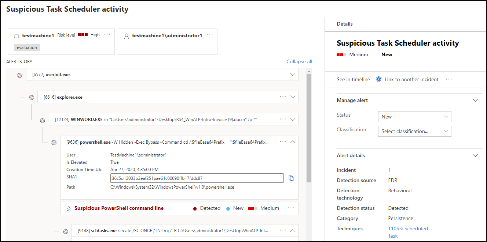
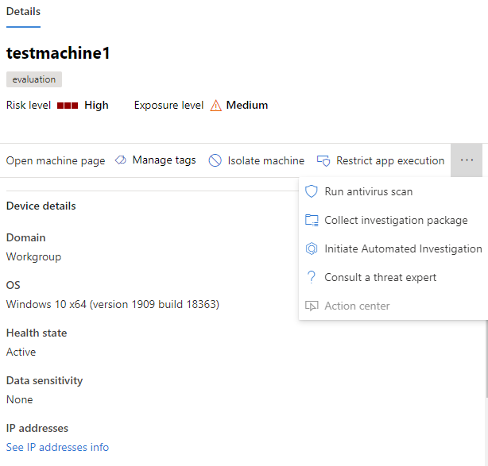
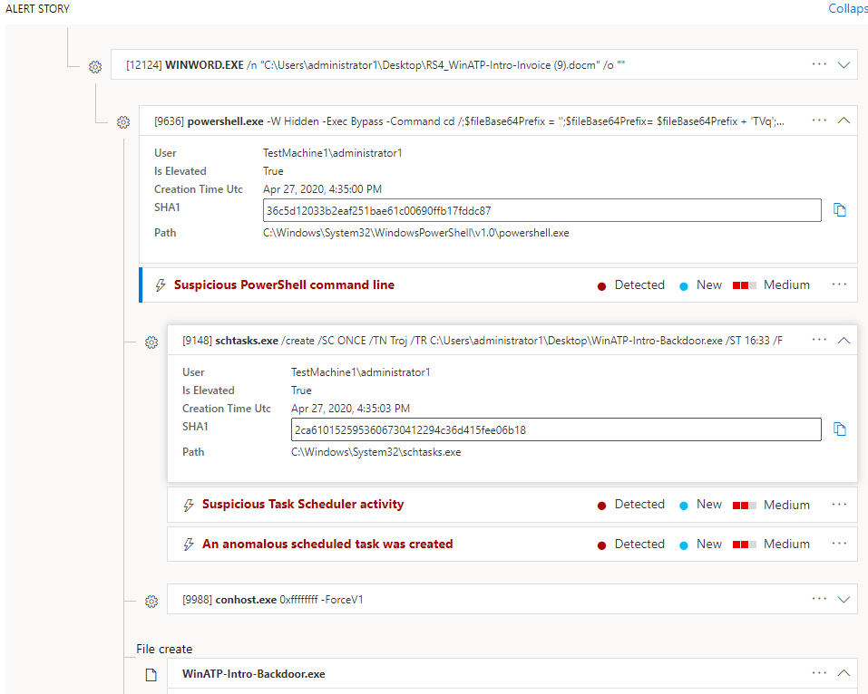

# Review alerts in Microsoft Defender Advanced Threat Protection

**Applies to:**

- [Microsoft Defender Advanced Threat Protection (Microsoft Defender ATP)](https://go.microsoft.com/fwlink/p/?linkid=2069559)

>Want to experience Microsoft Defender ATP? [Sign up for a free trial.](https://www.microsoft.com/microsoft-365/windows/microsoft-defender-atp?ocid=docs-wdatp-managealerts-abovefoldlink)

[!include[Prerelease information](../../includes/prerelease.md)]

The new alert details page in Microsoft Defender Advanced Threat Protection (Microsoft Defender ATP) provides full context to the alert, by combining attack signals and alerts related to the selected alert, to construct a detailed attack story.

Quickly triage, investigate and take effective action on alerts that affect your organization. Understand why they were triggered, and their impact from one location.

## Getting started with an alert

Clicking on an alert's name in Microsoft Defender ATP will land you on its alert page. On the alert page, all the information will be shown in context of the selected alert. Each alert page consists of 4 sections:

1. **The alert title** shows the alert's name and is there to remind you which alert started your current investigation regardless of what you have selected on the page.
2. **Affected assets** lists cards of devices and users affected by this alert that are clickable for further information and actions.
3. **The alert story** displays all entities related to the alert, interconnected by a tree view in chronological order. The alert in the title will be the one in focus when you first land on your selected alert's page. Entities in the alert story are expandable and clickable, to provide additional information and expedite response by allowing you to take actions right in the context of the alert page.
4. **The details pane** will show the details of the alert in the title at first, with details and actions related to this alert. If you click on any of the affected assets or entities in the alert story, the details pane will change to provide contextual information and actions for the selected object.

## Review affected assets

Clicking on a device or a user card in the affected assets sections will switch to the details of the device or user in the details pane.

- **For devices** the details pane will display information about the device itself, like Domain, Operating System, and IP. Active alerts and the logged on users on that device are also available. You can take immediate action by isolating the device, restricting app execution or running an antivirus scan. Alternatively, you could collect an investigation package, initiate an automated investigation or go to the machine page to investigate from the device's point of view.
- **For users** the details pane will display detailed user information, such as the user's SAM name and SID, as well as logon types performed by this user and any alerts and incidents related to it. You can click *Open user page* to continue the investigation from that user's point of view.

## Investigate using the alert story

The alert story details why the alert was triggered, related events that happened before and after in chronological order, as well as other related entities.

Entities are clickable and every entity that isn't an alert is expandable using the expand icon on the right side of that entity's card. The entity in focus will be indicated by a blue stripe to the left side of that entity's card, with the alert in the title being in focus at first.

Expand entities to view details at-a-glance about them. Clicking on an entity will switch the context of the details pane to this entity, and will allow you to review further information, as well as manage that entity. Clicking on *...* to the right of the entity card will reveal all actions available for that entity. These same actions appear in the details pane when that entity is in focus.

> [!NOTE]
> The attack story section may contain more than one alert, with additional alerts related to the same execution tree appearing before or after the alert you've selected.

## Take action from the details pane

Once you've selected an entity of interest, the details pane will change to display information about the selected entity type, historic information when its available, and offer controls to **take action** on this entity directly from the alert page.

Aside for device and user, detailed in the [affected assets part](#review-affected-assets), the following entity types are available:

- Alert
- Command
- File
- Network connection
- Process
- Registry
- Script
- URL

Once you're done investigating, go back to the alert you started with, mark the alert's status as **Resolved** and classify it as either **False alert** or **True alert**. If you classify it as a true alert, you can also select a determination.

## Related topics

- [Incidents overview](incidents-overview.md)
- [Investigate incidents](investigate-incidents.md)
- [Prioritize incidents](incident-queue.md)
- [Manage incidents](manage-incidents.md)