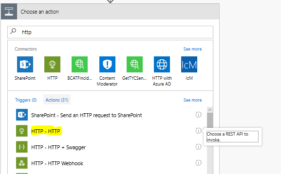
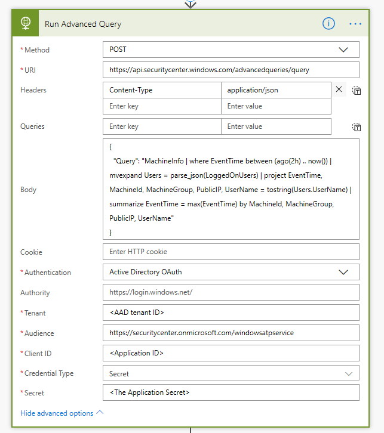
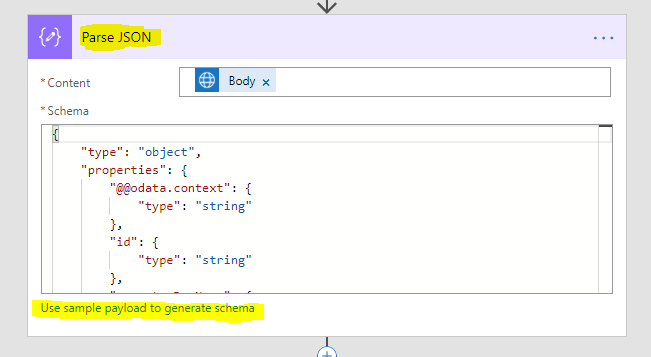
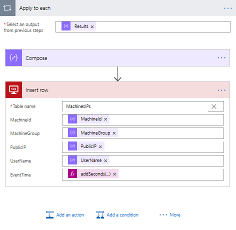

# Schedule Advanced Hunting using Microsoft Flow 
**Applies to:**
- Microsoft Defender Advanced Threat Protection (Microsoft Defender ATP)

[!include[Prerelease information](prerelease.md)]

Schedule advanced query.

## Before you begin
You first need to [create an app](apis-intro.md).

## Use case

A common scenario is scheduling an advanced query and using the results for follow up actions and processing.
In this section we share sample for this purpose using [Microsoft Flow](https://flow.microsoft.com/) (or [Logic Apps](https://azure.microsoft.com/en-us/services/logic-apps/)).

## Define a flow to run query and parse results

Use the following basic flow as an example.

1. Define the trigger – Recurrence by time.

2. Add an action: Select HTTP.

	

	- Set method to be POST
	- Uri is https://api.securitycenter.windows.com/api/advancedqueries/run or one of the region specific locations
		- US: https://api-us.securitycenter.windows.com/api/advancedqueries/run
		- Europe: https://api-eu.securitycenter.windows.com/api/advancedqueries/run
		- United Kingdom: https://api-uk.securitycenter.windows.com/api/advancedqueries/run
	- Add the Header: Content-Type              application/json
	- In the body write your query surrounded by single quotation mark (')
	- In the Advanced options select Authentication to be Active Directory OAuth
	- Set the Tenant with proper AAD Tenant Id
	- Audience is https://api.securitycenter.windows.com
	- Client ID is your application ID
	- Credential Type should be Secret
	- Secret is the application secret generated in the Azure Active directory.

	

3. You can use the "Parse JSON" action to get the schema of data – just "use sample payload to generate schema" and copy an output from of the expected result.

	

## Expand the flow to use the query results

The following section shows how to use the parsed results to insert them in SQL database.

This is an example only, you can  use other actions supported by  Microsoft Flow.

- Add an 'Apply to each' action
- Select the Results json (which was an output of the last parse action)
- Add an 'Insert row' action – you will need to supply the connection details
- Select the table you want to update and define the mapping between the WD-ATP output to the SQL. Note it is possible to manipulate the data inside the flow. In the example I changed the type of the EventTime.

The output in the SQL DB is getting updates and can be used for correlation with other data sources. You can now read from your table:

## Full flow definition

You can find below the full definition

## Related topic
- [Microsoft Defender ATP APIs](apis-intro.md)
- [Advanced Hunting API](run-advanced-query-api.md)
- [Advanced Hunting using PowerShell](run-advanced-query-sample-powershell.md)
