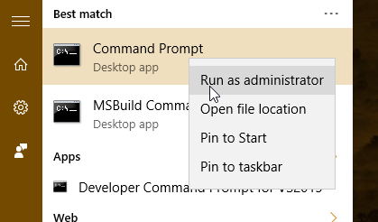

#  Run a detection test on a newly onboarded Microsoft Defender ATP machine 

**Applies to:**
- Supported Windows 10 versions
- Windows Server 2012 R2
- Windows Server 2016
- Windows Server, version 1803
- Windows Server, 2019
- [Microsoft Defender Advanced Threat Protection (Microsoft Defender ATP)](https://go.microsoft.com/fwlink/p/?linkid=2069559)


Run the following PowerShell script on a newly onboarded machine to verify that it is properly reporting to the Microsoft Defender ATP service.

1. Create a folder:  'C:\test-WDATP-test'.
2. Open an elevated command-line prompt on the machine and run the script:

    a.  Go to **Start** and type **cmd**.

    b.  Right-click **Command Prompt** and select **Run as administrator**.

    

3. At the prompt, copy and run the following command:

    ```
    powershell.exe -NoExit -ExecutionPolicy Bypass -WindowStyle Hidden $ErrorActionPreference= 'silentlycontinue';(New-Object System.Net.WebClient).DownloadFile('http://127.0.0.1/1.exe', 'C:\\test-WDATP-test\\invoice.exe');Start-Process 'C:\\test-WDATP-test\\invoice.exe'
    ```

The Command Prompt window will close automatically. If successful, the detection test will be marked as completed and a new alert will appear in the portal for the onboarded machine in approximately 10 minutes.

## Related topics
- [Onboard Windows 10 machines](configure-endpoints.md)
- [Onboard servers](configure-server-endpoints.md)
