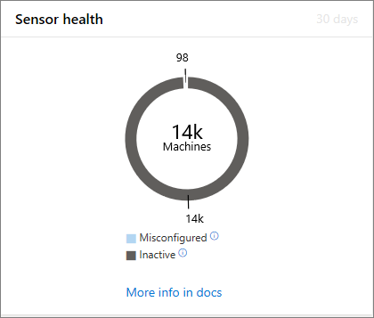
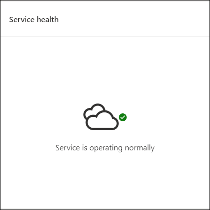
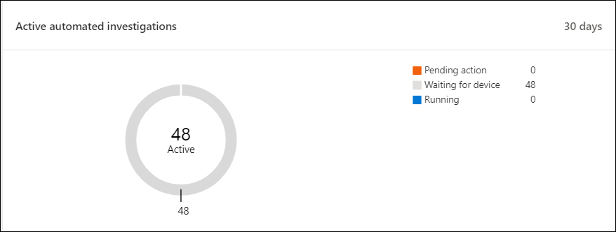
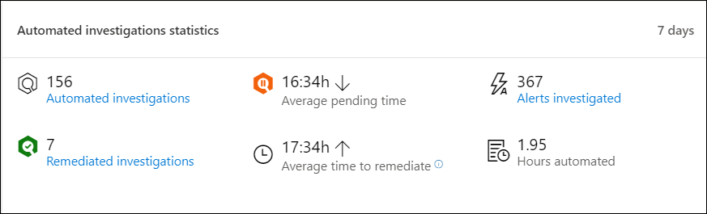
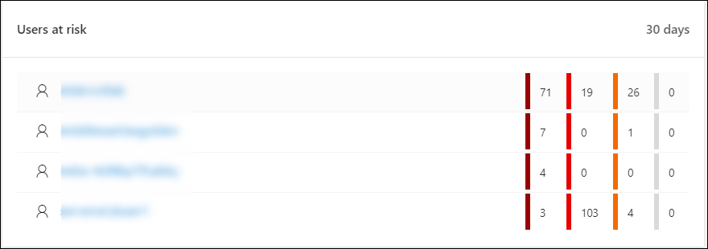

# Microsoft Defender Security Center Security operations dashboard

**Applies to:**
- [Microsoft Defender Advanced Threat Protection (Microsoft Defender ATP)](https://go.microsoft.com/fwlink/p/?linkid=2069559)

>Want to experience Microsoft Defender ATP? [Sign up for a free trial.](https://www.microsoft.com/en-us/WindowsForBusiness/windows-atp?ocid=docs-wdatp-secopsdashboard-abovefoldlink) 

The **Security operations dashboard** is where the endpoint detection and response capabilities are surfaced. It provides a high level overview of where detections were seen and highlights where response actions are needed. 

The dashboard displays a snapshot of:

- Active alerts
- Machines at risk
- Sensor health
- Service health
- Daily machines reporting
- Active automated investigations
- Automated investigations statistics
- Users at risk
- Suspicious activities

You can explore and investigate alerts and machines to quickly determine if, where, and when suspicious activities occurred in your network to help you understand the context they appeared in.

From the **Security operations dashboard** you will see aggregated events to facilitate the identification of significant events or behaviors on a machine. You can also drill down into granular events and low-level indicators.

It also has clickable tiles that give visual cues on the overall health state of your organization. Each tile opens a detailed view of the corresponding overview.

## Active alerts
You can view the overall number of active alerts from the last 30 days in your network from the tile. Alerts are grouped into **New** and **In progress**.

Each group is further sub-categorized into their corresponding alert severity levels. Click the number of alerts inside each alert ring to see a sorted view of that category's queue (**New** or **In progress**).

For more information see, [Alerts overview](alerts-queue.md).

Each row includes an alert severity category and a short description of the alert. You can click an alert to see its detailed view. For more information see,  [Investigate Microsoft Defender Advanced Threat Protection alerts](investigate-alerts.md) and [Alerts overview](alerts-queue.md).

## Machines at risk
This tile shows you a list of machines with the highest number of active alerts. The total number of alerts for each machine is shown in a circle next to the machine name, and then further categorized by severity levels at the far end of the tile (hover over each severity bar to see its label).

Click the name of the machine to see details about that machine. For more information see, [Investigate machines in the Microsoft Defender Advanced Threat Protection Machines list](investigate-machines.md).

You can also click **Machines list** at the top of the tile to go directly to the **Machines list**, sorted by the number of active alerts. For more information see, [Investigate machines in the Microsoft Defender Advanced Threat Protection Machines list](investigate-machines.md).

## Sensor health
The **Sensor health** tile provides information on the individual machine’s ability to provide sensor data to the Microsoft Defender ATP service. It reports how many machines require attention and helps you identify problematic machines.

There are two status indicators that provide information on the number of machines that are not reporting properly to the service:
-	**Misconfigured** – These machines might partially be reporting sensor data to the Microsoft Defender ATP service and might have configuration errors that need to be corrected.
- **Inactive** - Machines that have stopped reporting to the Microsoft Defender ATP service for more than seven days in the past month.

When you click any of the groups, you’ll be directed to machines list, filtered according to your choice. For more information, see [Check sensor state](check-sensor-status.md) and [Investigate machines](investigate-machines.md).

## Service health
The **Service health** tile informs you if the service is active or if there are issues.

For more information on the service health, see [Check the Microsoft Defender ATP service health](service-status.md).

## Daily machines reporting
The **Daily machines reporting** tile shows a bar graph that represents the number of machines reporting daily in the last 30 days. Hover over individual bars on the graph to see the exact number of machines reporting in each day.

## Active automated investigations
You can view the overall number of automated investigations from the last 30 days in your network from the **Active automated investigations** tile. Investigations are grouped into **Pending action**, **Waiting for machine**, and **Running**.

## Automated investigations statistics
This tile shows statistics related to automated investigations in the last 30 days. It shows the number of investigations completed, the number of successfully remediated investigations, the average pending time it takes for an investigation to be initiated, the average time it takes to remediate an alert, the number of alerts investigated, and the number of hours of automation saved from a typical manual investigation. 

You can click on **Automated investigations**, **Remidated investigations**, and **Alerts investigated** to navigate to the **Investigations** page, filtered by the appropriate category. This lets you see a detailed breakdown of investigations in context.

## Users at risk
The tile shows you a list of user accounts with the most active alerts and the number of alerts seen on high, medium, or low alerts. 

Click the user account to see details about the user account. For more information see [Investigate a user account](investigate-user.md).

## Suspicious activities
This tile shows audit events based on detections from various security components.

>Want to experience Microsoft Defender ATP? [Sign up for a free trial.](https://www.microsoft.com/en-us/WindowsForBusiness/windows-atp?ocid=docs-wdatp-secopsdashboard-belowfoldlink)

## Related topics
- [Understand the Microsoft Defender Advanced Threat Protection portal](use.md)
- [Portal overview](portal-overview.md)
- [View the Secure Score dashboard and improve your secure score](secure-score-dashboard.md)
- [View the Threat analytics dashboard and take recommended mitigation actions](threat-analytics.md)

