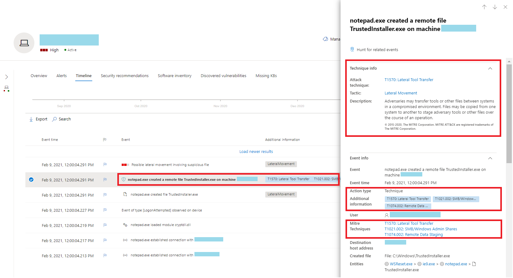
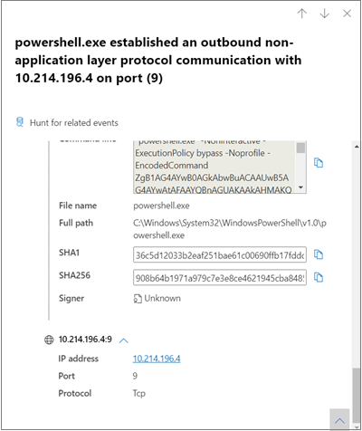
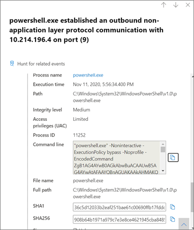
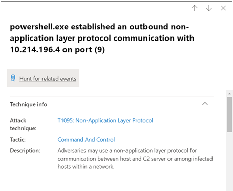
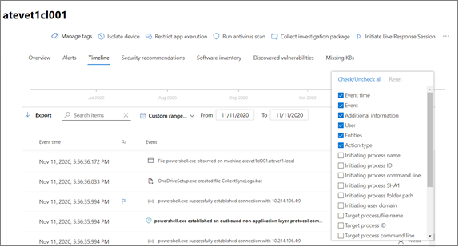
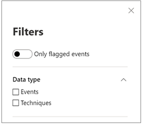

# Techniques in the device timeline

**Applies to:**
- [Microsoft Defender for Endpoint](https://go.microsoft.com/fwlink/p/?linkid=2146631)

You can gain more insight in an investigation by analyzing the events that happened on a specific device. First, select the device of interest from the [Devices list](machines-view-overview.md). On the device page, you can select the **Timeline** tab to view all the events that occurred on the device.

## Understand techniques in the timeline

>[!IMPORTANT]
>Some information relates to a prereleased product feature in public preview which may be substantially modified before it's commercially released. Microsoft makes no warranties, express or implied, with respect to the information provided here.

In Microsoft Defender for Endpoint, **Techniques** are an additional data type in the event timeline. Techniques provide more insight on activities associated with [MITRE ATT&CK](https://attack.mitre.org/) techniques or sub-techniques. 

This feature simplifies the investigation experience by helping analysts understand the activities that were observed on a device. Analysts can then decide to investigate further.

For public preview, Techniques are available by default and shown together with events when a device's timeline is viewed. 

Techniques are highlighted in bold text and appear with a blue icon on the left. The corresponding MITRE ATT&CK ID and technique name also appear as tags under Additional information. 

Search and Export options are also available for Techniques.

## Investigate using the side pane

Select a Technique to open its corresponding side pane. Here you can see additional information and insights like related ATT&CK techniques, tactics, and descriptions. 

Select the specific *Attack technique* to open the related ATT&CK technique page where you can find more information about it.

You can copy an entity's details when you see a blue icon on the right. For instance, to copy a related file's SHA1, select the blue page icon.

You can do the same for command lines.

## Investigate related events

To use [advanced hunting](advanced-hunting-overview.md) to find events related to the selected Technique, select **Hunt for related events**. This leads to the advanced hunting page with a query to find events related to the Technique.

>[!NOTE]
>Querying using the **Hunt for related events** button from a Technique side pane displays all the events related to the identified technique but does not include the Technique itself in the query results.

## Customize your device timeline

On the upper right-hand side of the device timeline, you can choose a date range to limit the number of events and techniques in the timeline. 

You can customize which columns to expose. You can also filter for flagged events by data type or by event group.

### Choose columns to expose
You can choose which columns to expose in the timeline by selecting the **Choose columns** button.

From there you can select which information set to include.

### Filter to view techniques or events only

To view only either events or techniques, select **Filters** from the device timeline and choose your preferred Data type to view.

## See also
- [View and organize the Devices list](machines-view-overview.md)
- [Microsoft Defender for Endpoint device timeline event flags](device-timeline-event-flag.md) 

 
