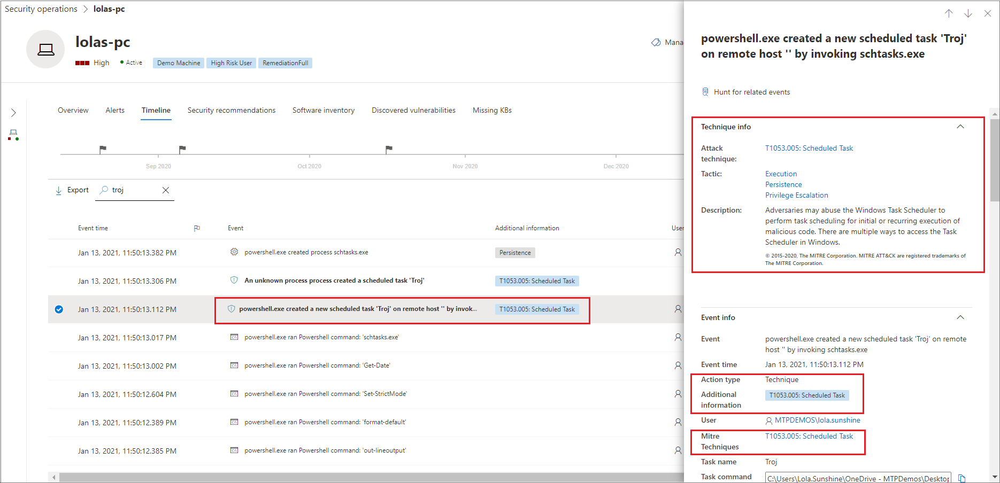

# ATT&CK techniques in the device timeline

**Applies to:**
- [Microsoft Defender for Endpoint](https://go.microsoft.com/fwlink/p/?linkid=2146631)

>[!IMPORTANT]
>Some information relates to a prereleased product feature in public preview which may be substantially modified before it's commercially released. Microsoft makes no warranties, express or implied, with respect to the information provided here.

In Microsoft Defender for Endpoint, **Techniques** are a grouping of events that when taken together indicate activity associated with certain [MITRE ATT&CK](https://attack.mitre.org/) techniques or sub-techniques. 

This feature simplifies the investigation experience by helping analysts understand at a glance whether suspicious activities happened on or affected a device and whether those activities indicate a need for closer investigation.

## Techniques in the device timeline

For public preview customers, Techniques are available by default and are shown together with events when a device's timeline is viewed. 

Techniques are highlighted in bold text and appear with a blue icon on the left. The corresponding MITRE ATT&CK ID and technique name also appears as tags under Additional information. 

Selecting a Technique opens the side pane and shows additional information and insights like related ATT&CK techniques, tactics, and descriptions.

Search and Export options are also available for Techniques.

## Filtering to view techniques or events only

To view only either events or techniques, select Filters from the device timeline and choose your preferred Data type to view.

>[!IMPORTANT]
>Event group filters do not affect Techniques, so when Techniques data type is selected, all techniques are shown.

To view File events only without Techniques, select Events data type and File events event group.

Selecting Techniques automatically shows all techniques. 

## See also

- [View and organize the Devices list](machines-view-overview.md)
- [Microsoft Defender for Endpoint device timeline event flags](device-timeline-event-flag.md) 

 
