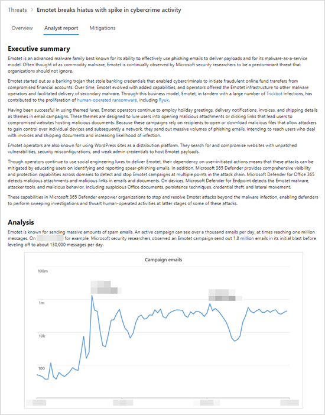

# Understand the analyst report in threat analytics

[!INCLUDE [Microsoft 365 Defender rebranding](../../includes/microsoft-defender.md)]

**Applies to:**
- [Microsoft Defender Advanced Threat Protection (Microsoft Defender ATP)](https://go.microsoft.com/fwlink/p/?linkid=2069559)
- [Microsoft Defender for Endpoint](https://go.microsoft.com/fwlink/p/?linkid=2146631)
- [Microsoft 365 Defender](https://go.microsoft.com/fwlink/?linkid=2118804)

> Want to experience Microsoft Defender for Endpoint? [Sign up for a free trial.](https://www.microsoft.com/microsoft-365/windows/microsoft-defender-atp?ocid=docs-wdatp-exposedapis-abovefoldlink)

Each [threat analytics report](threat-analytics.md) includes dynamic sections and a comprehensive written section called the _analyst report_. To access this section, open the report about the tracked threat and select the **Analyst report** tab.

_Analyst report section of a threat analytics report_

## Scan the analyst report 
Each section of the analyst report is designed to provide actionable information. While reports vary, most reports include the sections described in the following table.

| Report section | Description |
|--|--|
| Executive summary | Overview of the threat, including when it was first seen, its motivations, notable events, major targets, and distinct tools and techniques. You can use this information to further assess how to prioritize the threat in the context of your industry, geographic location, and network. |
| Analysis | Technical information about the threats, including the details of an attack and how attackers might utilize a new technique or attack surface | 
| MITRE ATT&CK techniques observed | How observed techniques map to the [MITRE ATT&CK attack framework](https://attack.mitre.org/) | 
| [Mitigations](#apply-additional-mitigations) | Recommendations that can stop or help reduce the impact of the threat. This section also includes mitigations that aren't tracked dynamically as part of the threat analytics report. |
| [Detection details](#understand-how-each-threat-can-be-detected) | Specific and generic detections provided by Microsoft security solutions that can surface activity or components associated with the threat. | 
| [Advanced hunting](#find-subtle-threat-artifacts-using-advanced-hunting) | [Advanced hunting queries](advanced-hunting-overview.md) for proactively identifying possible threat activity. Most queries are provided to supplement detections, especially for locating potentially malicious components or behaviors that couldn't be dynamically assessed to be malicious. | 
| References | Microsoft and third-party publications referenced by analysts during the creation of the report. Threat analytics content is based on data validated by Microsoft researchers. Information from publicly available, third-party sources are identified clearly as such. | 
| Change log | The time the report was published and when significant changes were made to the report. |

## Apply additional mitigations
Threat analytics dynamically tracks the [status of security updates and secure configurations](threat-analytics.md#mitigations-review-list-of-mitigations-and-the-status-of-your-devices). This information is available as charts and tables in the **Mitigations** tab.

In addition to these tracked mitigations, the analyst report also discusses mitigations that are _not_ dynamically monitored. Here are some examples of important mitigations that are not dynamically tracked:

- Block emails with _.lnk_ attachments or other suspicious file types
- Randomize local administrator passwords
- Educate end users about phishing email and other threat vectors
- Turn on specific [attack surface reduction rules](attack-surface-reduction.md)

While you can use the **Mitigations** tab to assess your security posture against a threat, these recommendations let you take additional steps towards improving your security posture. Carefully read all the mitigation guidance in the analyst report and apply them whenever possible.

## Understand how each threat can be detected
The analyst report also provides the detections from Microsoft Defender for Endpoint antivirus and _endpoint detection and response_ (EDR) capabilities.

### Antivirus detections
These detections are available on devices with [Microsoft Defender Antivirus](https://docs.microsoft.com/windows/security/threat-protection/microsoft-defender-antivirus/microsoft-defender-antivirus-in-windows-10) turned on. When these detections occur on devices that have been onboarded to Microsoft Defender for Endpoint, they also trigger alerts that light up the charts in the report.

>[!NOTE]
>The analyst report also lists **generic detections** that can identify a wide-range of threats, in addition to components or behaviors specific to the tracked threat. These generic detections don't reflect in the charts.

### Endpoint detection and response (EDR) alerts
EDR alerts are raised for [devices onboarded to Microsoft Defender for Endpoint](onboard-configure.md). These alerts generally rely on security signals collected by the Microsoft Defender for Endpoint sensor and other endpoint capabilities—such as antivirus, network protection, tamper protection—that serve as powerful signal sources.

Like the list of antivirus detections, some EDR alerts are designed to generically flag suspicious behavior that might not be associated with the tracked threat. In such cases, the report will clearly identify the alert as "generic" and that it doesn't influence any of the charts in the report.

## Find subtle threat artifacts using advanced hunting
While detections allow you to identify and stop the tracked threat automatically, many attack activities leave subtle traces that require additional inspection. Some attack activities exhibit behaviors that can also be normal, so detecting them dynamically can result in operational noise or even false positives.

[Advanced hunting](advanced-hunting-overview.md) provides a query interface based on Kusto Query Language that simplifies locating subtle indicators of threat activity. It also allows you to surface contextual information and verify whether indicators are connected to a threat.

Advanced hunting queries in the analyst reports have been vetted by Microsoft analysts and are ready for you to run in the [advanced hunting query editor](https://securitycenter.windows.com/advanced-hunting). You can also use the queries to create [custom detection rules](custom-detection-rules.md) that trigger alerts for future matches.

## Related topics
- [Threat analytics overview](threat-analytics.md)
- [Proactively find threats with advanced hunting](advanced-hunting-overview.md) 
- [Custom detection rules](custom-detection-rules.md)