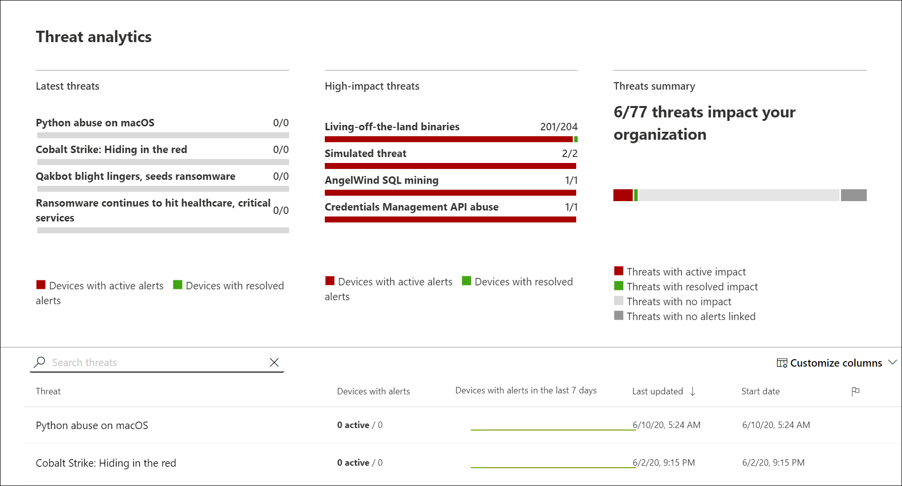
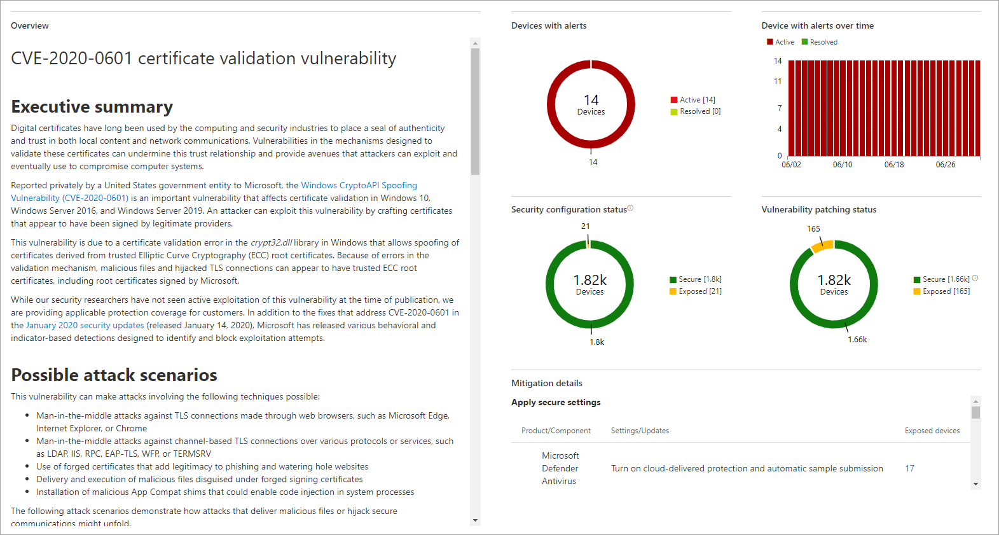

# Track and respond to emerging threats with threat analytics 
**Applies to:**
- [Microsoft Defender Advanced Threat Protection (Microsoft Defender ATP)](https://go.microsoft.com/fwlink/p/?linkid=2069559)

Cyberthreats are emerging more frequently and prevalently. It is critical for organizations to quickly assess their security posture, covering the impact of emerging threats and resilience to these threats.  

Threat analytics is a set of reports published by Microsoft security researchers as soon as emerging threats and outbreaks are identified. The reports help you assess the impact of threats to your environment and identify actions that contain them and increase organizational resilience.

## View the threat analytics dashboard

The threat analytics dashboard is a great jump off point for getting to the reports that are most relevant to your organization. It provides several overviews about the threats covered in the reports:

- **Latest threats** — lists the most recently published threat reports, along with the number of machines with resolved and unresolved alerts.
- **High-impact threats** — lists the threats that have had the highest impact on the organization in terms of the number of machines that have had related alerts, along with the number of machines with resolved and unresolved alerts.
- **Threat summary** — shows the number of threats among the threats reported in threat analytics with actual alerts.

Select a threat on any of the overviews or on the table to view the report for that threat.

## View a threat analytics report

Each threat report generally provides an overview of the threat and an analysis of the techniques and tools used by the threat. It also provides worldwide impact information, mitigation recommendations, and detection information. It includes several cards that show dynamic data about how your organization is impacted by the threat and how prepared it is to stop the threat. 

### Organizational impact
Each report includes cards designed to provide information about the organizational impact of a threat:
- **Machines with alerts** — shows the current number of distinct machines in your organization that have been impacted by the threat. A machine is categorized as **Active** if there is at least 1 alert associated with that threat and **Resolved** if *all* alerts associated with the threat on the machine have been resolved.
- **Machines with alerts over time** — shows the number of distinct machines with **Active** and **Resolved** alerts over time. The number of resolved alerts indicates how quickly your organization responds to alerts associated with a threat. Ideally, the chart should be showing alerts resolved within a few days.

### Organizational resilience
Each report also includes cards that provide an overview of how resilient your organization can be against a given threat:
- **Mitigation status** — shows the number of machines that have and have not applied mitigations for the threat. Machines are considered mitigated if they have all the measurable mitigations in place.
- **Vulnerability patching status** — shows the number of machines that have applied security updates or patches that address vulnerabilities exploited by the threat.
- **Mitigation recommendations** — lists specific actionable recommendations to improve your visibility into the threat and increase your organizational resilience. This card lists only measurable mitigations along with the number of machines that don't have these mitigations in place.

>[!IMPORTANT]
>- Charts only reflect mitigations that are measurable, meaning an evaluation can be made on whether a machine has applied the mitigations or not. Check the report overview for additional mitigations that are not reflected in the charts.
>- Even if all mitigations were measurable, they don't guarantee complete resilience. They reflect the best possible actions needed to improve resiliency.

>[!NOTE]
>Machines are counted as "unavailable" if they have been unable to transmit data to the service.
