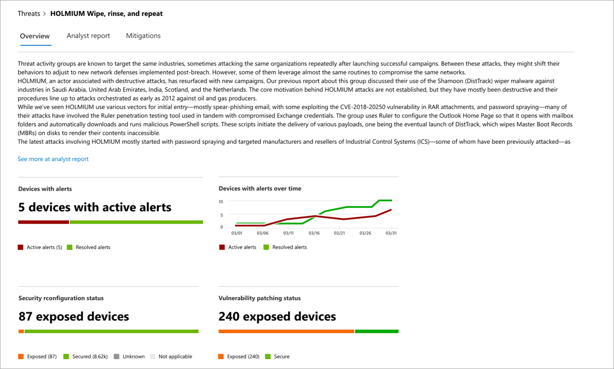
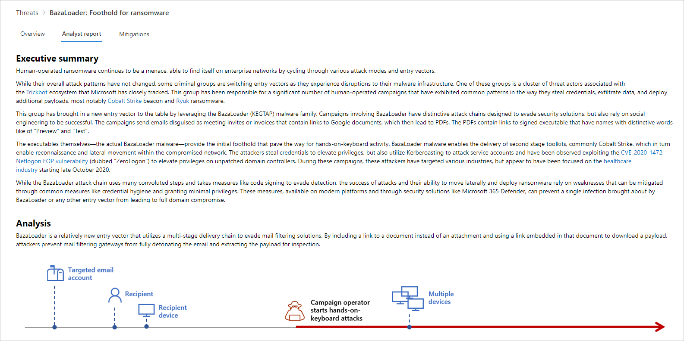
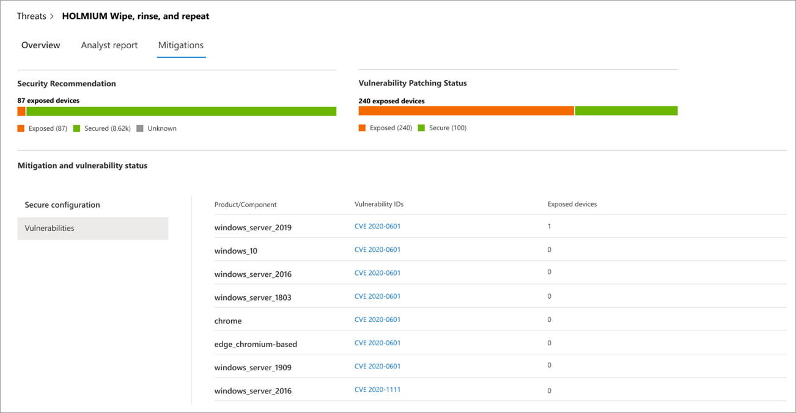

# Track and respond to emerging threats with threat analytics 
**Applies to:**
- [Microsoft Defender Advanced Threat Protection (Microsoft Defender ATP)](https://go.microsoft.com/fwlink/p/?linkid=2069559)

With more sophisticated adversaries and new threats emerging frequently and prevalently, it is critical to be able to quickly:

- Assess the impact of new threats
- Review your resilience against or exposure to the threats
- Identify the actions you can take to stop or contain the threats

Threat analytics is a set of reports from expert Microsoft security researchers covering the most relevant threats, including:

- Active threat actors and their campaigns
- Popular and new attack techniques
- Critical vulnerabilities
- Common attack surfaces
- Prevalent malware

Each report provides a detailed analysis of a threat and extensive guidance on how to defend against the threat. It also incorporates data from your network, indicating whether the threat is active and if you have applicable security updates and recommended settings in place.

Watch this short video to learn more about how threat analytics can help you track the latest threats and stop them.

> [!VIDEO https://www.microsoft.com/en-us/videoplayer/embed/RE4bw1f]

## View the threat analytics dashboard

The threat analytics dashboard is a great jump off point for getting to the reports that are most relevant to your organization. It summarizes the threats in the following sections:

- **Latest threats**—lists the most recently published threat reports, along with the number of devices with active and resolved alerts.
- **High-impact threats**—lists the threats that have had the highest impact to the organization. This card ranks threats by the number of devices that have active alerts.
- **Threat summary**—shows the overall impact of all the threats reported in threat analytics by showing the number of threats with active and resolved alerts.

Select a threat from the dashboard to view the report for that threat.

## View a threat analytics report

Each threat analytics report provides information in three sections: **Overview**, **Analyst report**, and **Mitigations**.

### Quickly understand a threat and assess its impact to your network in the overview

The **Overview** section provides a preview of the detailed analyst report. It also provides charts that highlight the impact of the threat to your organization and your exposure through misconfigured and unpatched devices.

_Overview section of a threat analytics report_

#### Organizational impact
Each report includes cards designed to provide information about the organizational impact of a threat:
- **Devices with alerts**—shows the current number of distinct devices that have been impacted by the threat. A device is categorized as **Active** if there is at least one alert associated with that threat and **Resolved** if *all* alerts associated with the threat on the device have been resolved.
- **Devices with alerts over time**—shows the number of distinct devices with **Active** and **Resolved** alerts over time. The number of resolved alerts indicates how quickly your organization responds to alerts associated with a threat. Ideally, the chart should be showing alerts resolved within a few days.

#### Organizational resilience and exposure
Each report includes cards that provide an overview of how resilient your organization can be against a given threat:
- **Security configuration status**—shows the number of devices that have applied the recommended security settings that can help mitigate the threat. Devices are considered **Secure** if they have applied _all_ the tracked settings.
- **Vulnerability patching status**—shows the number of devices that have applied security updates or patches that address vulnerabilities exploited by the threat.

### Get expert insight from the analyst report
Go to the **Analyst report** section to read through the detailed expert write-up. Most reports provide detailed descriptions of attack chains, including tactics and techniques mapped to the MITRE ATT&CK framework, exhaustive lists of recommendations, and powerful [threat hunting](advanced-hunting-overview.md) guidance.

_Analyst report section of a threat analytics report_

### Review list of mitigations and the status of your devices
In the **Mitigations** section, review the list of specific actionable recommendations that can help you increase your organizational resilience against the threat. The list of tracked mitigations includes recommended settings and vulnerability patches, along with the number of devices that don't have the mitigations in place.

Mitigation information in this section incorporates data from [threat and vulnerability management](next-gen-threat-and-vuln-mgt.md), which also provides detailed drill-down information from various links in the report.

_Mitigations section of a threat analytics report_

## Additional report details and limitations
When using the reports, keep the following in mind: 

- Data is scoped based on your role-based access control (RBAC) scope. You will only see the status of devices in [groups that you can access](machine-groups.md).
- Charts reflect only mitigations that are tracked. Check the report overview for additional mitigations that are not reflected in the charts.
- Mitigations don't guarantee complete resilience. The provided mitigations reflect the best possible actions needed to improve resiliency.
- Devices are counted as "unavailable" if they have been unable to transmit data to the service.
- Antivirus related statistics are based on Microsoft Defender Antivirus settings. Devices with third-party antivirus solutions can appear as "exposed".

## Related topics
- [Hunt for cyberthreats](advanced-hunting-overview.md) 
- [Assess and resolve security weaknesses and exposures](next-gen-threat-and-vuln-mgt.md)
