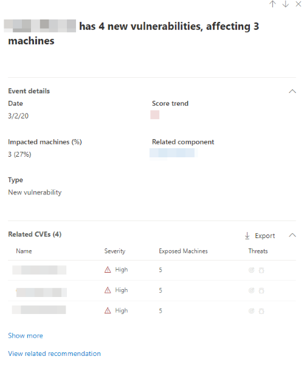

# Event Insights

**Applies to:**

- [Microsoft Defender Advanced Threat Protection (Microsoft Defender ATP)](https://go.microsoft.com/fwlink/p/?linkid=2069559)

Event insights is a "risk news feed" which will help you interpret how risk is introduced into the organization and which mitigations happened to reduce it.

With events insight, you can check which impactful events occurred in your organization. For example, new vulnerabilities that were introduced, vulnerabilities that became exploitable, the number of impacted machines, and more.

The goal of event insights is to tell the story of your [exposure score](tvm-exposure-score.md).

- Quickly understand and identify high-level takeaways about the state of security in your organization.
- Detect and respond to areas that require investigation or action to improve the current state.
- Communicate with peers and management about the impact of security efforts.

You can reduce you exposure score by addressing what needs to be remediated based on the prioritized security recommendations. See [Security recommendations](tvm-security-recommendation.md) for details.

## Navigation

You can access Event insights through the [Threat & Vulnerability Management dashboard](tvm-dashboard-insights.md) or in the navigation menu of the Microsoft Defender Security Center.

On the Event insights page, you can view the date, event, related component, number of impacted machines, and type. You can also filter by type, or percent impacted machines.

Once you select an event insight, a flyout will appear listing the details and related CVEs. You can show more CVEs or view the related recommendation.

## Event types

The following event types reflect time-stamped events that impact the score:

- Exploit added to an exploit kit
- Exploit was verified
- New public exploit
- New vulnerability

## Icons

The following icons show up next to events:

-  New public exploit. A vulnerability became exploitable.
- [page with caution symbol] New vulnerability was published.

## Related topics

- [Supported operating systems and platforms](tvm-supported-os.md)
- [Risk-based Threat & Vulnerability Management](next-gen-threat-and-vuln-mgt.md) 
- [Threat & Vulnerability Management dashboard overview](tvm-dashboard-insights.md)
- [Configuration score](configuration-score.md)
- [Security recommendations](tvm-security-recommendation.md)
- [Remediation and exception](tvm-remediation.md)
- [Software inventory](tvm-software-inventory.md)
- [Weaknesses](tvm-weaknesses.md)
- [Scenarios](threat-and-vuln-mgt-scenarios.md)
- [Configure data access for Threat & Vulnerability Management roles](https://docs.microsoft.com/windows/security/threat-protection/microsoft-defender-atp/user-roles#create-roles-and-assign-the-role-to-an-azure-active-directory-group)
- [Score APIs](https://docs.microsoft.com/windows/security/threat-protection/microsoft-defender-atp/score)
- [Software APIs](https://docs.microsoft.com/windows/security/threat-protection/microsoft-defender-atp/software)
- [Vulnerability APIs](https://docs.microsoft.com/windows/security/threat-protection/microsoft-defender-atp/vulnerability)
- [Recommendation APIs](https://docs.microsoft.com/windows/security/threat-protection/microsoft-defender-atp/vulnerability)
