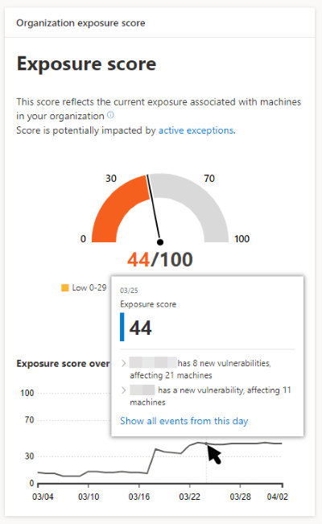
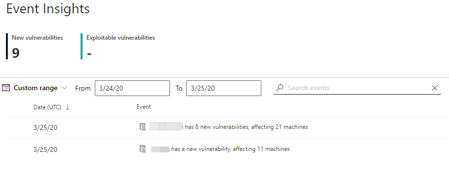
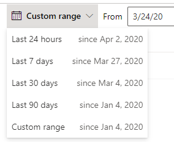
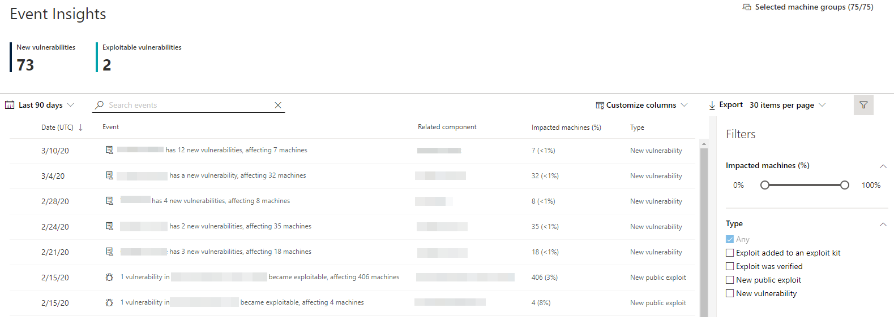
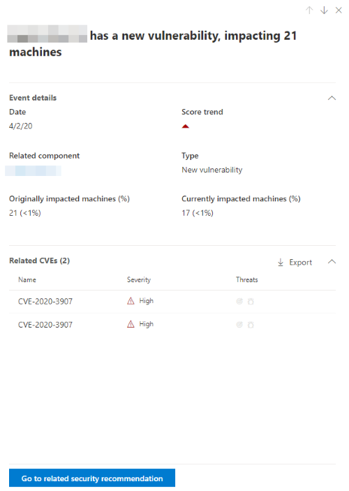

# Event insights

**Applies to:**

- [Microsoft Defender Advanced Threat Protection (Microsoft Defender ATP)](https://go.microsoft.com/fwlink/p/?linkid=2069559)

Event insights is a risk news feed which helps you interpret how risk, through new vulnerabilities or exploits, is introduced into the organization. You can view events which may impact your organization's risk. For example, you can find new vulnerabilities that were introduced, vulnerabilities that became exploitable, exploit that was addd to an exploit kit, and more.

Event insights also tells the story of your [exposure score](tvm-exposure-score.md) so you can determine the cause of large changes. Reduce you exposure score by addressing what needs to be remediated based on the prioritized [security recommendations](tvm-security-recommendation.md).

## Navigate to the Event insights page

You can access Event insights mainly through three ways:

- In the Threat & Vulnerability Management navigation menu in the Microsoft Defender Security Center.
- Top events card in the [Threat & Vulnerability Management dashboard](tvm-dashboard-insights.md). The highest impact events (for example, affect the most machines or critical vulnerabilities)
- Hovering over the Exposure Score graph in the [Threat & Vulnerability Management dashboard](tvm-dashboard-insights.md)

### Navigation menu

Go to the Threat & Vulnerability Management navigation menu and select **Event insights** to view impactful events.

### Top events card

In the Threat & Vulnerability Management dashboard, the Top events card displays the three most impactful events in the last 7 days. Select **Show more** to go to the Event insights page.

### Exposure score graph

In the Threat & Vulnerability Management dashboard, hover over the Exposure score graph to view top events from that day that impacted your machines. If there are no events, then no insights will be shown.

Selecting **Show all events from this day** will lead you to the Event insights page with a pre-populated custom date range for that day.

Select **Custom range** to change the date range to another custom one, or a pre-set time range.

## Event insights overview

On the Event insights page, you can view the date, event, related software component, number of impacted machines for when the event occurred, and type. You can also customize columns and filter by type or percent of impacted machines.

The two large numbers at the top of the page show the number of new vulnerabilities and exploitable vulnerabilities, not events. Some events can have multiple vulnerabilities, and some vulnerabilities can have multiple events.

### Icons and event types

The following icons show up next to events:

-  New public exploit
-  New vulnerability was published
-  Exploit found in exploit kit
-  Exploit verified

The following event types reflect time-stamped events that impact the score:

- Exploit added to an exploit kit
- Exploit was verified
- New public exploit
- New vulnerability

### Drill down to a specific event

Once you select an event insight, a flyout will appear listing the details and current CVEs that affect your machines. You can show more CVEs or view the related recommendation.

The arrow below "score trend" helps you determine whether this event potentially raised or lowered your organizational exposure score. Higher exposure score means machines are more vulnerable to exploitation.

## Related topics

- [Supported operating systems and platforms](tvm-supported-os.md)
- [Risk-based Threat & Vulnerability Management](next-gen-threat-and-vuln-mgt.md) 
- [Threat & Vulnerability Management dashboard overview](tvm-dashboard-insights.md)
- [Configuration score](configuration-score.md)
- [Security recommendations](tvm-security-recommendation.md)
- [Remediation and exception](tvm-remediation.md)
- [Software inventory](tvm-software-inventory.md)
- [Weaknesses](tvm-weaknesses.md)
- [Scenarios](threat-and-vuln-mgt-scenarios.md)
- [Configure data access for Threat & Vulnerability Management roles](user-roles.md#create-roles-and-assign-the-role-to-an-azure-active-directory-group)
- [Score APIs](software.md)
- [Vulnerability APIs](vulnerability.md)