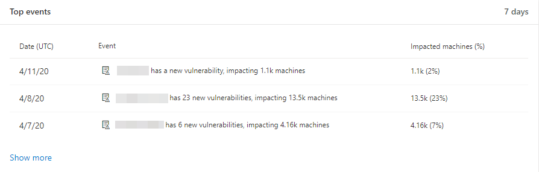
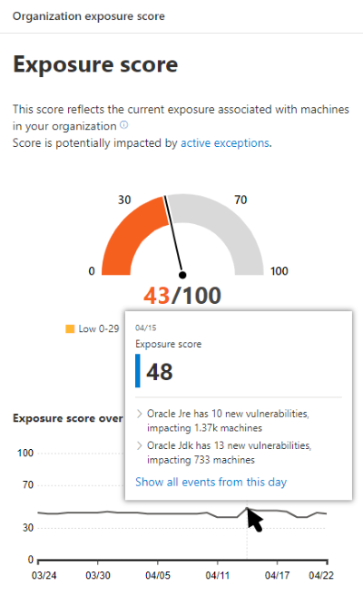
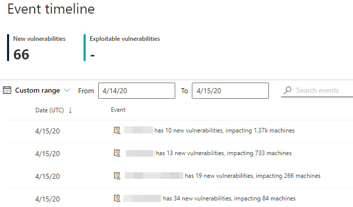
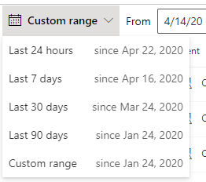
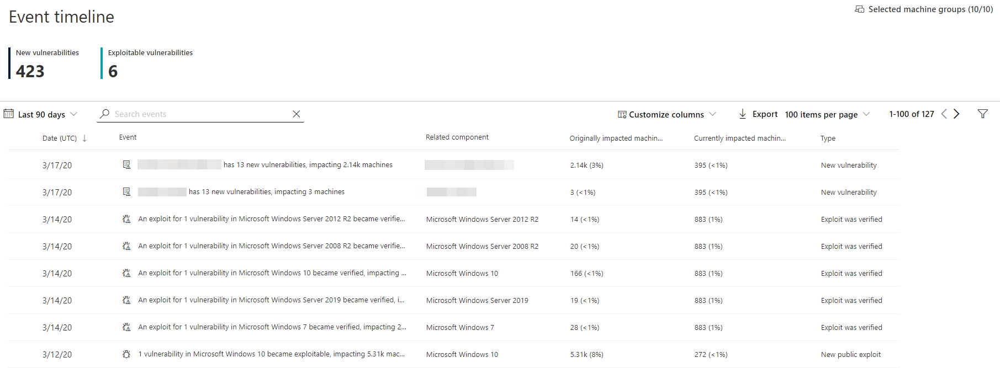
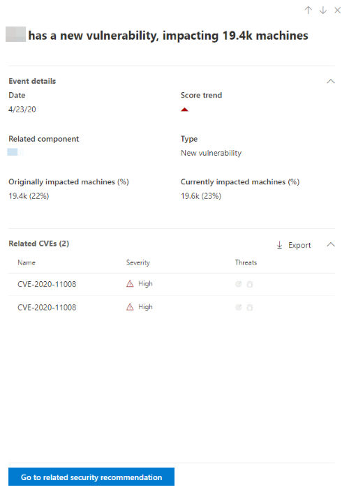
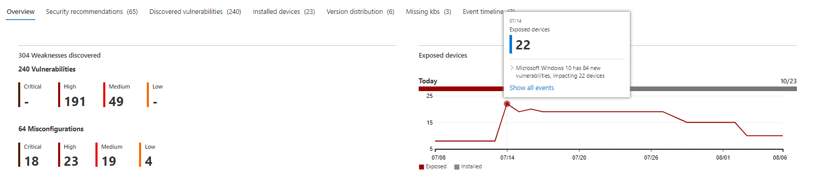

# Event timeline - threat and vulnerability management

**Applies to:**
- [Microsoft Defender Advanced Threat Protection (Microsoft Defender ATP)](https://go.microsoft.com/fwlink/p/?linkid=2069559)

>Want to experience Microsoft Defender ATP? [Sign up for a free trial.](https://www.microsoft.com/microsoft-365/windows/microsoft-defender-atp?ocid=docs-wdatp-portaloverview-abovefoldlink)

[!include[Prerelease information](../../includes/prerelease.md)]

Event timeline is a risk news feed which helps you interpret how risk, through new vulnerabilities or exploits, is introduced into the organization. You can view events which may impact your organization's risk. For example, you can find new vulnerabilities that were introduced, vulnerabilities that became exploitable, exploit that was addd to an exploit kit, and more.

Event timeline also tells the story of your [exposure score](tvm-exposure-score.md) so you can determine the cause of large changes. Reduce you exposure score by addressing what needs to be remediated based on the prioritized [security recommendations](tvm-security-recommendation.md).

## Navigate to the Event timeline page

You can access Event timeline mainly through three ways:

- In the threat and vulnerability management navigation menu in the Microsoft Defender Security Center
- Top events card in the [threat and vulnerability management dashboard](tvm-dashboard-insights.md). The highest impact events (for example, affect the most machines or critical vulnerabilities)
- Hovering over the Exposure Score graph in the [threat and vulnerability management dashboard](tvm-dashboard-insights.md)

### Navigation menu

Go to the threat and vulnerability management navigation menu and select **Event timeline** to view impactful events.

### Top events card

In the Tthreat and vulnerability management dashboard, the "Top events" card displays the three most impactful events in the last 7 days. Select **Show more** to go to the Event timeline page.

### Exposure score graph

In the threat and vulnerability management dashboard, hover over the Exposure score graph to view top events from that day that impacted your machines. If there are no events, then none will be shown.

Selecting **Show all events from this day** will lead you to the Event timeline page with a pre-populated custom date range for that day.

Select **Custom range** to change the date range to another custom one, or a pre-set time range.

## Event timeline overview

On the Event timeline page, you can view the all the necesssary info related to an event. 

Features:

- Customize columns
- Filter by event type or percent of impacted machines
- View 30, 50, or 100 items per page

The two large numbers at the top of the page show the number of new vulnerabilities and exploitable vulnerabilities, not events. Some events can have multiple vulnerabilities, and some vulnerabilities can have multiple events.

>[!NOTE]
>New configuration assessments are coming soon.

### Columns

- **Date**: month, day, year
- **Event**: impactful event, including component, type, and number of impacted machines
- **Related component**: software
- **Originally impacted machines**: the number, and percentage, of impacted machines when this event originally occurred. You can also filter by the percent of originally impacted machines, out of your total number of machines.
- **Currently impacted machines**: the current number, and percentage, of machines that this event currently impacts. You can find this field by selecting **Customize columns**.
- **Types**: reflect time-stamped events that impact the score. They can be filtered.
    - Exploit added to an exploit kit
    - Exploit was verified
    - New public exploit
    - New vulnerability
- **Score trend**: exposure score trend

### Icons

The following icons show up next to events:

-  New public exploit
-  New vulnerability was published
-  Exploit found in exploit kit
-  Exploit verified

### Drill down to a specific event

Once you select an event, a flyout will appear listing the details and current CVEs that affect your machines. You can show more CVEs or view the related recommendation.

The arrow below "score trend" helps you determine whether this event potentially raised or lowered your organizational exposure score. Higher exposure score means machines are more vulnerable to exploitation.

From there, select **Go to related security recommendation** to go to the [security recommendations page](tvm-security-recommendation.md) and the recommendation that will address the new software vulnerability. After reading the description and vulnerability details in the security recommendation, you can [submit a remediation request](tvm-security-recommendation.md#request-remediation), and track the request in the [remediation page](tvm-remediation.md).  

## View Event timelines in software pages

To open a software page, select an event > select the hyperlinked software name (like Visual Studio 2017) in the section called "Related component" in the flyout. [Learn more about software pages](tvm-software-inventory.md#software-pages)

A full page will appear with all the details of a specific software. Mouse over the graph to see the timeline of events for that specific software.

 You can also navigate to the event timeline tab to view all the events related to that software, along with security recommendations, discovered vulnerabilities, installed machines, and version distribution.

## Related topics

- [Threat and vulnerability management overview](next-gen-threat-and-vuln-mgt.md)
- [Supported operating systems and platforms](tvm-supported-os.md)
- [Threat and vulnerability management dashboard](tvm-dashboard-insights.md)
- [Exposure score](tvm-exposure-score.md)
- [Microsoft Secure Score for Devices](tvm-microsoft-secure-score-devices.md)
- [Security recommendations](tvm-security-recommendation.md)
- [Remediation and exception](tvm-remediation.md)
- [Software inventory](tvm-software-inventory.md)
- [Weaknesses](tvm-weaknesses.md)
- [Event timeline](threat-and-vuln-mgt-event-timeline.md)
- [Scenarios](threat-and-vuln-mgt-scenarios.md)
- [APIs](next-gen-threat-and-vuln-mgt.md#apis)
- [Configure data access for threat and vulnerability management roles](user-roles.md#create-roles-and-assign-the-role-to-an-azure-active-directory-group)
- [Advanced hunting overview](overview-hunting.md)
- [All advanced hunting tables](advanced-hunting-reference.md)
