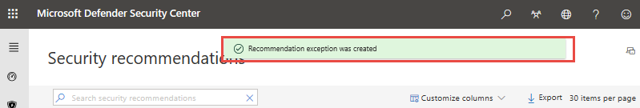
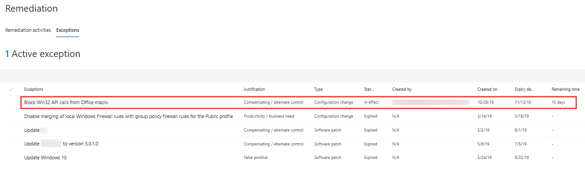
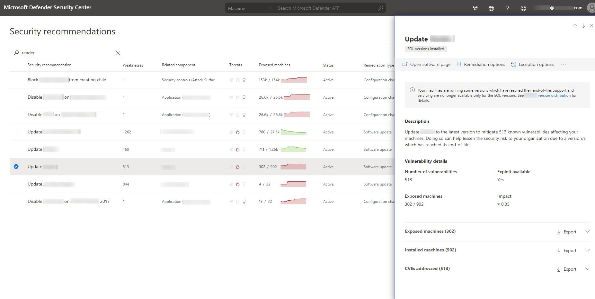
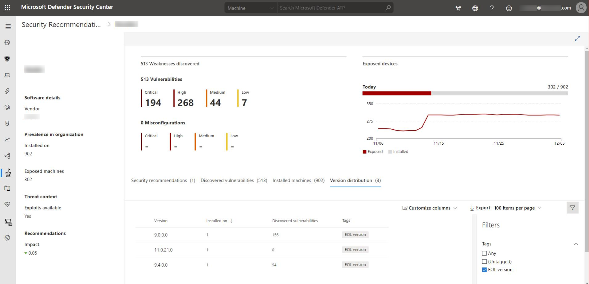

# Threat & Vulnerability Management scenarios

**Applies to:**

- [Microsoft Defender Advanced Threat Protection (Microsoft Defender ATP)](https://go.microsoft.com/fwlink/p/?linkid=2069559)

>Want to experience Microsoft Defender ATP? [Sign up for a free trial.](https://www.microsoft.com/microsoft-365/windows/microsoft-defender-atp?ocid=docs-wdatp-portaloverview-abovefoldlink)

[!include[Prerelease information](../../includes/prerelease.md)]

## Before you begin

Ensure that your machines:

- Are onboarded to Microsoft Defender Advanced Threat Protection
- Run with Windows 10 1709 (Fall Creators Update) or later

>[!NOTE]
>Threat & Vulnerability Management can also scan machines that run on Windows 7 and Windows Server 2019 operating systems and detects vulnerabilities addressed in patch Tuesday.

- Have the following mandatory updates installed and deployed in your network to boost your vulnerability assessment detection rates:

> Release | Security update KB number and link
> :---|:---
> RS3 customers | [KB4493441](https://support.microsoft.com/help/4493441/windows-10-update-kb4493441) and [KB 4516071](https://support.microsoft.com/help/4516071/windows-10-update-kb4516071)
> RS4 customers| [KB4493464](https://support.microsoft.com/help/4493464) and [KB 4516045](https://support.microsoft.com/help/4516045/windows-10-update-kb4516045)
> RS5 customers | [KB 4516077](https://support.microsoft.com/help/4516077/windows-10-update-kb4516077)
> 19H1 customers | [KB 4512941](https://support.microsoft.com/help/4512941/windows-10-update-kb4512941)

- Are onboarded to Microsoft Intune and  Microsoft Endpoint Configuration Manager. If you are using Configuration Manager, update your console to the latest version.
- Have at least one security recommendation that can be viewed in the machine page
- Are tagged or marked as co-managed

## Improve your security configuration

>[!NOTE]
> Secure score is now part of Threat & Vulnerability Management as [Configuration score](configuration-score.md).

You can improve your security configuration when you remediate issues from the security recommendations list. As you do so, your configuration score improves, which means your organization becomes more resilient against cybersecurity threats and vulnerabilities.

1. From the Configuration score widget, select **Security controls**. The **Security recommendations** page opens and shows the list of issues related to security controls.

2. Select the first item on the list. The flyout panel will open with a description of the security controls issue, a short description of the potential risk, insights, configuration ID, exposed machines, and business impact. Click **Remediation options**.

   

3. Read the description to understand the context of the issue and what to do next. Select a due date, add notes, and select **Export all remediation activity data to CSV** so you can attach it to the email that you can send to your IT Administrator for follow-up.

   >.

   You will see a confirmation message that the remediation task has been created.
   >

4. Save your CSV file.
   

5. Send a follow-up email to your IT Administrator and allow the time that you have allotted for the remediation to propagate in the system.

6. Review the machine **Configuration score** widget again. The number of the security controls issues will decrease. When you click **Security controls** to go back to the **Security recommendations** page, the item that you have addressed will not be listed there anymore, and your configuration score should increase.

## Request a remediation 

>[!NOTE]
>To use this capability, enable your Microsoft Intune connections. Navigate to **Settings** > **General** > **Advanced features**. Scroll down and look for **Microsoft Intune connection**. By default, the toggle is turned off. Turn your **Microsoft Intune connection** toggle on.

The Threat & Vulnerability Management capability in Microsoft Defender ATP bridges the gap between Security and IT Administrators through the remediation request workflow. 

Security Administrators like you can request for the IT Administrator to remediate a vulnerability from the **Security recommendation** pages to Intune.

1. Click a security recommendation you would like to request remediation for, and then click **Remediation options**.

2. Select **Open a ticket in Intune (for AAD joined devices)**, select a due date, and add optional notes for the IT Administrator. Click **Submit request**.

3. Notify your IT Administrator about the new request and have them log into Intune to approve or reject the request and start a package deployment.

4. Go to the **Remediation** page to view the status of your remediation request.

See [Use Intune to remediate vulnerabilities identified by Microsoft Defender ATP](https://docs.microsoft.com/intune/atp-manage-vulnerabilities) for details.

>[!NOTE]
>If your request involves remediating more than 10,000 machines, we can only send 10,000 machines for remediation to Intune.

## File for exception

With Threat & Vulnerability Management, you can create exceptions for recommendations, as an alternative to a remediation request.

There are many reasons why organizations create exceptions for a recommendation. For example, if there's a business justification that prevents the company from applying the recommendation, the existence of a compensating or alternative control that provides as much protection than the recommendation would, a false positive, among other reasons.

Exceptions can be created for both *Security update* and *Configuration change* recommendations.

When an exception is created for a recommendation, the recommendation is no longer active. The recommendation state changes to **Exception**, and it no longer shows up in the security recommendations list.

1. Navigate to the **Security recommendations** page under the **Threat & Vulnerability Management** section menu.

2. Click the top-most recommendation. A flyout panel opens with the recommendation details.

3. Click **Exception options**.


4. Select your justification for the exception you need to file instead of remediating the security recommendation in question. Fill out the justification context, then set the exception duration.

> 

5. Click **Submit**. A confirmation message at the top of the page indicates that the exception has been created.


6. Navigate to the **Remediation** page under the **Threat & Vulnerability Management** menu and click the **Exceptions** tab to view all your exceptions (current and past).


## Use advanced hunting query to search for machines with High active alerts or critical CVE public exploit

1. Go to **Advanced hunting** from the left-hand navigation pane.

2. Scroll down to the TVM advanced hunting schemas to familiarize yourself with the column names.

3. Enter the following queries:

```kusto
// Search for machines with High active alerts or Critical CVE public exploit
DeviceTvmSoftwareInventoryVulnerabilities
| join kind=inner(DeviceTvmSoftwareVulnerabilitiesKB) on CveId
| where IsExploitAvailable == 1 and CvssScore >= 7
| summarize NumOfVulnerabilities=dcount(CveId),
DeviceName=any(DeviceName) by DeviceId
| join kind =inner(DeviceAlertEvents) on DeviceId  
| summarize NumOfVulnerabilities=any(NumOfVulnerabilities),
DeviceName=any(DeviceName) by DeviceId, AlertId
| project DeviceName, NumOfVulnerabilities, AlertId  
| order by NumOfVulnerabilities desc

```

## Conduct an inventory of software or software versions which have reached end-of-support (EOS)

End-of-support (otherwise known as end-of-life) for software or software versions means that they will no longer be supported or serviced. When you use software or software versions which have reached end-of-support, you're exposing your organization to security vulnerabilities, legal, and financial risks.

It is crucial for Security and IT Administrators to work together and ensure that the organization's software inventory is configured for optimal results, compliance, and a healthy network ecosystem.

To conduct an inventory of software or software versions which have reached end-of-support:

1. From the Threat & Vulnerability Management menu, navigate to **Security recommendations**.
2. Go to the **Filters** panel and select **Software uninstall** from **Remediation Type** options to see the list of software recommendations associated with software which have reached end of support (tagged as **EOS software**).
3. Select **Software update** from **Remediation Type** options to see the list of software recommendations associated with software and software versions which have reached end-of-support (tagged as **EOS versions installed**).
4. Select software that you'd like to investigate. A fly-out screen opens where you can select **Open software page**.


5. In the **Software page** select the **Version distribution** tab to know which versions of the software have reached their end-of-support, and how many vulnerabilities were discovered in it.


After you have identified which software and software versions are vulnerable due to its end-of-support status, remediate them to lower your organizations exposure to vulnerabilities and advanced persistent threats. See [Remediation and exception](tvm-remediation.md) for details.

## Related topics

- [Supported operating systems and platforms](tvm-supported-os.md)
- [Risk-based Threat & Vulnerability Management](next-gen-threat-and-vuln-mgt.md)
- [Threat & Vulnerability Management dashboard overview](tvm-dashboard-insights.md)
- [Exposure score](tvm-exposure-score.md)
- [Configuration score](configuration-score.md)
- [Security recommendations](tvm-security-recommendation.md)
- [Remediation and exception](tvm-remediation.md)
- [Software inventory](tvm-software-inventory.md)
- [Weaknesses](tvm-weaknesses.md)
- [Advanced hunting overview](overview-hunting.md)
- [All advanced hunting tables](advanced-hunting-reference.md)
- [Configure data access for Threat & Vulnerability Management roles](https://docs.microsoft.com/windows/security/threat-protection/microsoft-defender-atp/user-roles#create-roles-and-assign-the-role-to-an-azure-active-directory-group)
- [Machine APIs](https://docs.microsoft.com/windows/security/threat-protection/microsoft-defender-atp/machine)
- [Vulnerability APIs](https://docs.microsoft.com/windows/security/threat-protection/microsoft-defender-atp/vulnerability)
- [Software APIs](https://docs.microsoft.com/windows/security/threat-protection/microsoft-defender-atp/software)
- [Recommendation APIs](https://docs.microsoft.com/windows/security/threat-protection/microsoft-defender-atp/vulnerability)
- [Score APIs](https://docs.microsoft.com/windows/security/threat-protection/microsoft-defender-atp/score)

