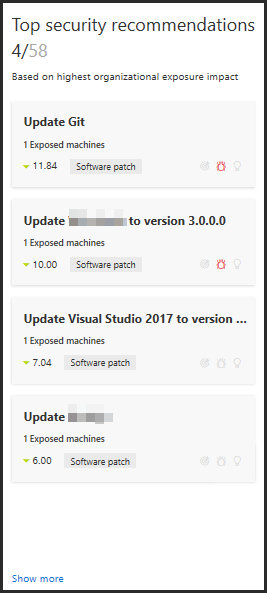
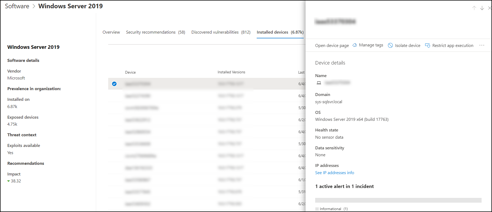
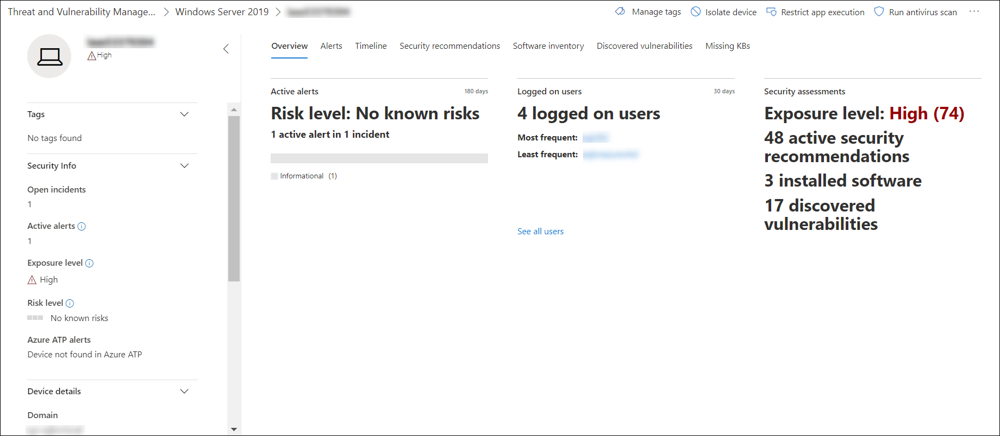
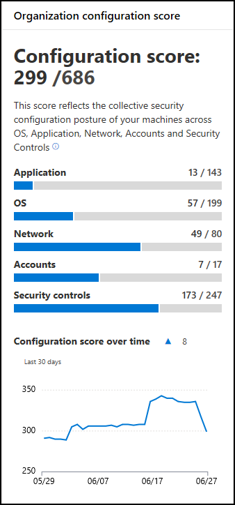
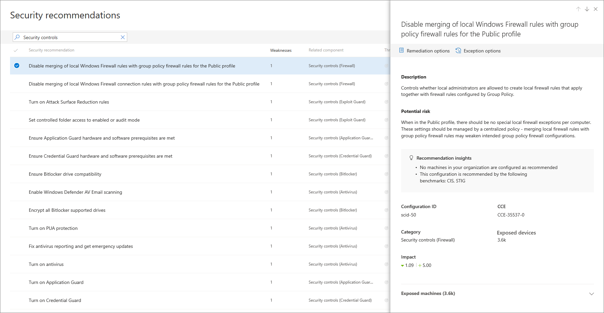
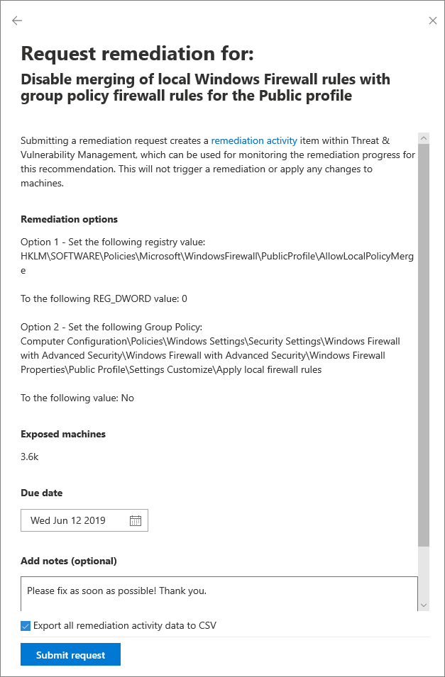
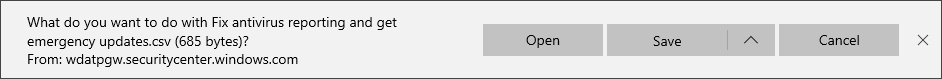

# Threat & Vulnerability Management scenarios
**Applies to:**
- [Microsoft Defender Advanced Threat Protection (Microsoft Defender ATP)](https://go.microsoft.com/fwlink/p/?linkid=2069559)

[!include[Prerelease information](prerelease.md)]

## Before you begin
Ensure that your machines:
- Are onboarded to Microsoft Defender Advanced Threat Protection
- Running with Windows 10 1709 (Fall Creators Update) or later
- Have the following mandatory updates installed:
- (1) RS3 customers | [KB4493441](https://support.microsoft.com/en-us/help/4493441/windows-10-update-kb4493441)
- (2) RS4 customers | [KB4493464](https://support.microsoft.com/en-us/help/4493464)
- Have at least one security recommendation that can be viewed in the machine page
- Are tagged or marked as co-managed

## Reduce your threat and vulnerability exposure
Threat & Vulnerability Management introduces a new exposure score metric which visually represents how exposed your machines are to imminent threats.

The exposure score is continuously calculated on each device in the organization and influenced by the following factors:
- Weaknesses, such as vulnerabilities and misconfigurations discovered on the device
- External and internal threats such as public exploit code and security alerts
- Likelihood of the device getting breached given its current security posture
- Value of the device to the organization given its role and content

The exposure score is broken down into the following levels:
- 0 to 29: low exposure score
- 30 to 69: medium exposure score
- 70 to 100: high exposure score

You can reduce the exposure score by remediating issues based on prioritized security recommendations. Each software has weaknesses that are transformed into recommendations and prioritized based on risk to the organization.

To lower down your threat and vulnerability exposure:

1. Review the **Top security recommendations** from your **Threat & Vulnerability Management dashboard**, and select the first item on the list. This opens the **Security recommendation** page.  
  
   >>

   >[!NOTE]
   > There are two types of recommendations: 
   > - <i>Security update</i> which refers to recommendations that require a package installation
   > - <i>Configuration</i> change which refers to recommendations that require a registry or GPO modification
   > Always prioritize recommendations that are associated with ongoing threats. These recommendations are marked with the threat insight  icon.  
   
2. In the **Security recommendations** page, you will see the description of what needs to be done and why. It shows the vulnerability details, such as the associated exploits affecting what machines and its business impact. Click **Open software page** option from the flyout menu.  

3. Click **Installed machines** and select the affected machine from the list to open the flyout page with the relevant machine details, exposure and risk levels, alert and incident activities. 

4. Click **Open machine page** to connect to the machine and apply the selected recommendation.  

5. Allow a few hours for the changes to propagate in the system.
    
6. Review the machine **Security recommendation** tab again. The recommendation you've chosen to remediate won't be listed there anymore, and the exposure score should decrease.

## Improve your security configuration
>[!NOTE]
> Secure score is now part of Threat & Vulnerability Management as [configuration score](configuration-score.md). We’ll keep the secure score page available for a few weeks. View the [secure score](https://securitycenter.windows.com/securescore) page. 

Remediating issues in the security recommendations list will improve your configuration. As you do so, your configuration score improves, which means building your organization's resilience against cybersecurity threats and vulnerabilities stronger.

1. From the Configuration score widget, select **Security controls**. This opens the **Security recommendations** page showing the list of issues related to security controls.

   >>

2. Select the first item on the list. This opens the flyout menu with the description of the security controls issue, a short description of the potential risk, insights, configuration ID, exposed machines, and business impact. Click **Remediation options**. 
   

3. Read the description to understand the context of the issue and what to do next. Select a due date, add notes, and select **Export all remediation activity data to CSV** so you can attach it to the email that you can send to your IT Administrator for follow-up.

   > >. 
   > 
   > You will see a confirmation message that the remediation task has been created.
   > 

4. Save your CSV file.
   

5. Send a follow up email to your IT Administrator and allow the time that you have alloted for the remediation to propagate in the system.

6. Review the machine **Configuration score** widget again. The number of the security controls issues will decrease. When you click **Security controls** to go back to the **Security recommendations** page, the item that you have addressed will not be listed there anymore, and your configuration score should increase.

## Related topics
- [Risk-based Threat & Vulnerability Management](next-gen-threat-and-vuln-mgt.md)
- [Threat & Vulnerability Management dashboard overview](tvm-dashboard-insights.md)
- [Configuration score](configuration-score.md)

