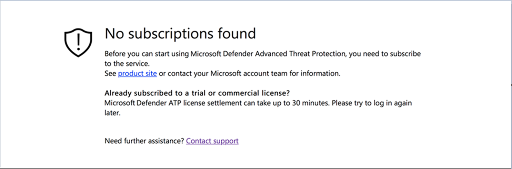
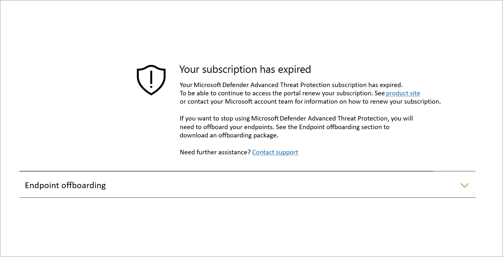
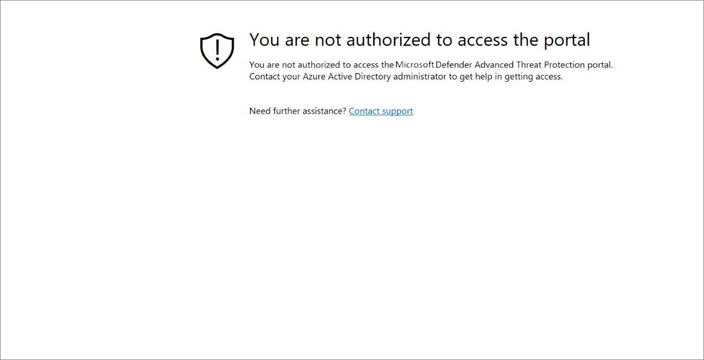
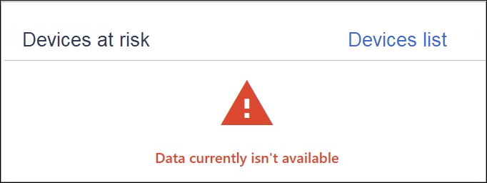

# Troubleshoot subscription and portal access issues

**Applies to:**

- [Microsoft Defender Advanced Threat Protection (Microsoft Defender ATP)](https://go.microsoft.com/fwlink/p/?linkid=2069559)

>Want to experience Microsoft Defender ATP? [Sign up for a free trial.](https://www.microsoft.com/WindowsForBusiness/windows-atp?ocid=docs-wdatp-troublshootonboarding-abovefoldlink)

This page provides detailed steps to troubleshoot issues that might occur when setting up your Microsoft Defender ATP service.

If you receive an error message, Microsoft Defender Security Center will provide a detailed explanation on what the issue is and relevant links will be supplied.

## No subscriptions found

If while accessing Microsoft Defender Security Center you get a **No subscriptions found** message, it means the Azure Active Directory (AAD) used to login the user to the portal, does not have a Microsoft Defender ATP license.

Potential reasons:
- The Windows E5 and Office E5 licenses are separate licenses.
- The license was purchased but not provisioned to this AAD instance.
    - It could be a license provisioning issue.
    - It could be you inadvertently provisioned the license to a different Microsoft AAD than the one used for authentication into the service.

For both cases you should contact Microsoft support at [General Microsoft Defender ATP Support](https://support.microsoft.com/getsupport?wf=0&tenant=ClassicCommercial&oaspworkflow=start_1.0.0.0&locale=en-us&supportregion=en-us&pesid=16055&ccsid=636419533611396913) or
[Volume license support](https://www.microsoft.com/licensing/servicecenter/Help/Contact.aspx).

## Your subscription has expired

If while accessing Microsoft Defender Security Center you get a **Your subscription has expired** message, your online service subscription has expired. Microsoft Defender ATP subscription, like any other online service subscription, has an expiration date. 

You can choose to renew or extend the license at any point in time. When accessing the portal after the expiration date a **Your subscription has expired** message will be presented with an option to download the machine offboarding package, should you choose to not renew the license.

> [!NOTE]
> For security reasons, the package used to Offboard machines will expire 30 days after the date it was downloaded. Expired offboarding packages sent to a machine will be rejected. When downloading an offboarding package you will be notified of the packages expiry date and it will also be included in the package name.

## You are not authorized to access the portal

If you receive a **You are not authorized to access the portal**, be aware that Microsoft Defender ATP is a security monitoring, incident investigation and response product, and as such, access to it is restricted and controlled by the user.
For more information see, [**Assign user access to the portal**](https://docs.microsoft.com/windows/threat-protection/windows-defender-atp/assign-portal-access-windows-defender-advanced-threat-protection).

## Data currently isn't available on some sections of the portal
If the portal dashboard, and other sections show an error message such as "Data currently isn't available":

You'll need to whitelist the `securitycenter.windows.com` and all sub-domains under it. For example `*.securitycenter.windows.com`.

## Portal communication issues
If you encounter issues with accessing the portal, missing data, or restricted access to portions of the portal, you'll need to verify that the following URLs are whitelisted and open for communciation.

- `*.blob.core.windows.net 
crl.microsoft.com`
- `https://*.microsoftonline-p.com`
- `https://*.securitycenter.windows.com` 
- `https://automatediracs-eus-prd.securitycenter.windows.com`
- `https://login.microsoftonline.com`
- `https://login.windows.net`
- `https://onboardingpackagescusprd.blob.core.windows.net`
- `https://secure.aadcdn.microsoftonline-p.com` 
- `https://securitycenter.windows.com` 
- `https://static2.sharepointonline.com` 

## Related topics
- [Validate licensing provisioning and complete setup for Microsoft Defender ATP](licensing.md)