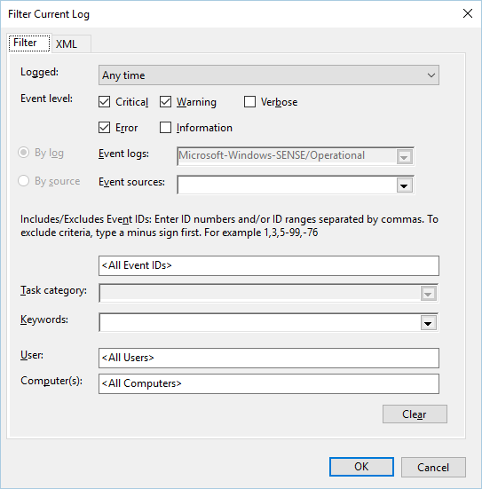
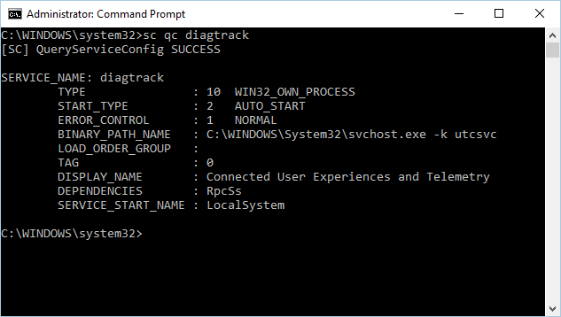
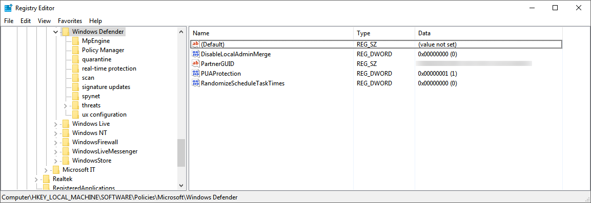
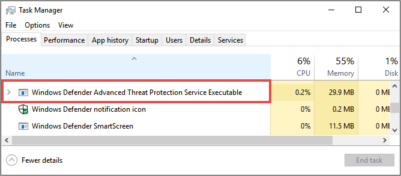

# Troubleshoot Microsoft Defender Advanced Threat Protection onboarding issues

**Applies to:**
- [Microsoft Defender Advanced Threat Protection (Microsoft Defender ATP)](https://go.microsoft.com/fwlink/p/?linkid=2069559)
- Windows Server 2012 R2
- Windows Server 2016


You might need to troubleshoot the Microsoft Defender ATP onboarding process if you encounter issues.
This page provides detailed steps to troubleshoot onboarding issues that might occur when deploying with one of the deployment tools and common errors that might occur on the machines.

If you have completed the onboarding process and don't see machines in the [Machines list](investigate-machines.md) after an hour, it might indicate an onboarding or connectivity problem.

## Troubleshoot onboarding when deploying with Group Policy
Deployment with Group Policy is done by running the onboarding script on the machines.  The Group Policy console does not indicate if the deployment has succeeded or not.

If you have completed the onboarding process and don't see machines in the [Machines list](investigate-machines.md) after an hour, you can check the output of the script on the machines. For more information, see [Troubleshoot onboarding when deploying with a script](#troubleshoot-onboarding-when-deploying-with-a-script).

If the script completes successfully, see [Troubleshoot onboarding issues on the machines](#troubleshoot-onboarding-issues-on-the-machine) for additional errors that might occur.

## Troubleshoot onboarding issues when deploying with System Center Configuration Manager
When onboarding machines using the following versions of System Center Configuration Manager:
- System Center 2012 Configuration Manager
- System Center 2012 R2 Configuration Manager
- System Center Configuration Manager (current branch) version 1511
- System Center Configuration Manager (current branch) version 1602


Deployment with the above-mentioned versions of System Center Configuration Manager is done by running the onboarding script on the machines. You can track the deployment in the Configuration Manager Console.

If the deployment fails, you can check the output of the script on the machines.

If the onboarding completed successfully but the machines are not showing up in the **Machines list** after an hour, see [Troubleshoot onboarding issues on the machine](#troubleshoot-onboarding-issues-on-the-machine) for additional errors that might occur.

## Troubleshoot onboarding when deploying with a script

**Check the result of the script on the machine**:
1. Click **Start**, type **Event Viewer**, and press **Enter**.

2. Go to **Windows Logs** > **Application**.

3. Look for an event from **WDATPOnboarding** event source.

If the script fails and the event is an error, you can check the event ID in the following table to help you troubleshoot the issue.
> [!NOTE]
> The following event IDs are specific to the onboarding script only.

Event ID | Error Type | Resolution steps
:---|:---|:---
5 | Offboarding data was found but couldn't be deleted | Check the permissions on the registry, specifically ```HKLM\SOFTWARE\Policies\Microsoft\Windows Advanced Threat Protection```.
10 | Onboarding data couldn't be written to registry |  Check the permissions on the registry, specifically<br> ```HKLM\SOFTWARE\Policies\Microsoft\Windows Advanced Threat```.<br>Verify that the script was ran as an administrator.
15 |  Failed to start SENSE service |Check the service health (```sc query sense``` command). Make sure it's not in an intermediate state (*'Pending_Stopped'*, *'Pending_Running'*) and try to run the script again (with administrator rights). <br> <br> If the machine is running Windows 10, version 1607 and running the command `sc query sense` returns `START_PENDING`, reboot the machine. If rebooting the machine doesn't address the issue, upgrade to KB4015217 and try onboarding again.
15 | Failed to start SENSE service | If the message of the error is: System error 577 has occurred. You need to enable the Windows Defender Antivirus ELAM driver, see [Ensure that Windows Defender Antivirus is not disabled by a policy](#ensure-that-windows-defender-antivirus-is-not-disabled-by-a-policy) for instructions.
30 |  The script failed to wait for the service to start running | The service could have taken more time to start or has encountered errors while trying to start. For more information on events and errors related to SENSE, see [Review events and errors using Event viewer](event-error-codes.md).
35 |  The script failed to find needed onboarding status registry value | When the SENSE service starts for the first time, it writes onboarding status to the registry location<br>```HKLM\SOFTWARE\Microsoft\Windows Advanced Threat Protection\Status```.<br>The script failed to find it after several seconds. You can manually test it and check if it's there. For more information on events and errors related to SENSE, see [Review events and errors using Event viewer](event-error-codes.md).
40 | SENSE service onboarding status is not set to **1** | The SENSE service has failed to onboard properly. For more information on events and errors related to SENSE, see [Review events and errors using Event viewer](event-error-codes.md).
65 | Insufficient privileges| Run the script again with administrator privileges.

## Troubleshoot onboarding issues using Microsoft Intune
You can use Microsoft Intune to check error codes and attempt to troubleshoot the cause of the issue.

If you have configured policies in Intune and they are not propagated on machines, you might need to configure automatic MDM enrollment. 

Use the following tables to understand the possible causes of issues while onboarding:

- Microsoft Intune error codes and OMA-URIs table
- Known issues with non-compliance table
- Mobile Device Management (MDM) event logs table

If none of the event logs and troubleshooting steps work, download the Local script from the **Machine management** section of the portal, and run it in an elevated command prompt.  

**Microsoft Intune error codes and OMA-URIs**:


Error Code Hex | Error Code Dec | Error Description | OMA-URI | Possible cause and troubleshooting steps
:---|:---|:---|:---|:---
0x87D1FDE8 | -2016281112 | Remediation failed | Onboarding <br> Offboarding | **Possible cause:** Onboarding or offboarding failed on a wrong blob: wrong signature or missing PreviousOrgIds fields. <br><br> **Troubleshooting steps:** <br> Check the event IDs in the [View agent onboarding errors in the machine event log](#view-agent-onboarding-errors-in-the-machine-event-log) section. <br><br> Check the MDM event logs in the following table or follow the instructions in [Diagnose MDM failures in Windows 10](https://msdn.microsoft.com/library/windows/hardware/mt632120%28v=vs.85%29.aspx).
 | | | | Onboarding <br> Offboarding <br> SampleSharing | **Possible cause:** Microsoft Defender ATP Policy registry key does not exist or the OMA DM client doesn't have permissions to write to it. <br><br> **Troubleshooting steps:** Ensure that the following registry key exists: ```HKEY_LOCAL_MACHINE\SOFTWARE\Policies\Microsoft\Windows Advanced Threat Protection``` <br> <br> If it doesn't exist, open an elevated command and add the key.
 | | | | SenseIsRunning <br> OnboardingState <br> OrgId |  **Possible cause:** An attempt to remediate by read-only property. Onboarding has failed. <br><br> **Troubleshooting steps:** Check the troubleshooting steps in [Troubleshoot onboarding issues on the machine](#troubleshoot-onboarding-issues-on-the-machine). <br><br> Check the MDM event logs in the following table or follow the instructions in [Diagnose MDM failures in Windows 10](https://msdn.microsoft.com/library/windows/hardware/mt632120%28v=vs.85%29.aspx).
 || | | All | **Possible cause:** Attempt to deploy Microsoft Defender ATP on non-supported SKU/Platform, particularly Holographic SKU. <br><br> Currently is supported platforms:  Enterprise, Education, and Professional. <br> Server is not supported.
 0x87D101A9 | -2016345687 |Syncml(425): The requested command failed because the sender does not have adequate access control permissions (ACL) on the recipient.  | All |  **Possible cause:** Attempt to deploy Microsoft Defender ATP on non-supported SKU/Platform, particularly Holographic SKU. <br><br> Currently is supported platforms:  Enterprise, Education, and Professional.

<br>
<strong>Known issues with non-compliance</strong>

The following table provides information on issues with non-compliance and how you can address the issues.

Case | Symptoms | Possible cause and troubleshooting steps
:---|:---|:---
1 | Machine is compliant by SenseIsRunning OMA-URI. But is non-compliant by OrgId, Onboarding and OnboardingState OMA-URIs. | **Possible cause:** Check that user passed OOBE after Windows installation or upgrade. During OOBE onboarding couldn't be completed but SENSE is running already. <br><br> **Troubleshooting steps:** Wait for OOBE to complete.
2 |  Machine is compliant by OrgId, Onboarding, and OnboardingState OMA-URIs, but is non-compliant by SenseIsRunning OMA-URI. |  **Possible cause:** Sense service's startup type is set as "Delayed Start". Sometimes this causes the Microsoft Intune server to report the machine as non-compliant by SenseIsRunning when DM session occurs on system start. <br><br> **Troubleshooting steps:** The issue should automatically be fixed within 24 hours.
3 | Machine is non-compliant | **Troubleshooting steps:** Ensure that Onboarding and Offboarding policies are not deployed on the same machine at same time.

<br>
<strong>Mobile Device Management (MDM) event logs</strong>

View the MDM event logs to troubleshoot issues that might arise during onboarding:

Log name: Microsoft\Windows\DeviceManagement-EnterpriseDiagnostics-Provider

Channel name: Admin

ID | Severity | Event description | Troubleshooting steps
:---|:---|:---|:---
1819 | Error | Microsoft Defender Advanced Threat Protection CSP: Failed to Set Node's Value. NodeId: (%1), TokenName: (%2), Result: (%3). | Download the [Cumulative Update for Windows 10, 1607](https://go.microsoft.com/fwlink/?linkid=829760).

## Troubleshoot onboarding issues on the machine
If the deployment tools used does not indicate an error in the onboarding process, but machines are still not appearing in the machines list in an hour, go through the following verification topics to check if an error occurred with the Microsoft Defender ATP agent:
- [View agent onboarding errors in the machine event log](#view-agent-onboarding-errors-in-the-machine-event-log)
- [Ensure the diagnostic data service is enabled](#ensure-the-diagnostics-service-is-enabled)
- [Ensure the service is set to start](#ensure-the-service-is-set-to-start)
- [Ensure the machine has an Internet connection](#ensure-the-machine-has-an-internet-connection)
- [Ensure that Windows Defender Antivirus is not disabled by a policy](#ensure-that-windows-defender-antivirus-is-not-disabled-by-a-policy)


### View agent onboarding errors in the machine event log

1. Click **Start**, type **Event Viewer**, and press **Enter**.

2. In the **Event Viewer (Local)** pane, expand **Applications and Services Logs** > **Microsoft** > **Windows** > **SENSE**.

   > [!NOTE]
	> SENSE is the internal name used to refer to the behavioral sensor that powers Microsoft Defender ATP.

3. Select **Operational** to load the log.

4. In the **Action** pane, click **Filter Current log**.

5. On the **Filter** tab, under **Event level:** select **Critical**, **Warning**, and **Error**, and click **OK**.

   

6. Events which can indicate issues will appear in the **Operational** pane. You can attempt to troubleshoot them based on the solutions in the following table:

Event ID | Message | Resolution steps
:---|:---|:---
5 | Microsoft Defender Advanced Threat Protection service failed to connect to the server at _variable_ | [Ensure the machine has Internet access](#ensure-the-machine-has-an-internet-connection).
6 | Microsoft Defender Advanced Threat Protection service is not onboarded and no onboarding parameters were found. Failure code: _variable_ | [Run the onboarding script again](configure-endpoints-script.md).
7 |  Microsoft Defender Advanced Threat Protection service failed to read the onboarding parameters. Failure code: _variable_ | [Ensure the machine has Internet access](#ensure-the-machine-has-an-internet-connection), then run the entire onboarding process again.
9 | Microsoft Defender Advanced Threat Protection service failed to change its start type. Failure code: variable | If the event happened during onboarding, reboot and re-attempt running the onboarding script. For more information, see [Run the onboarding script again](configure-endpoints-script.md). <br><br>If the event happened during offboarding, contact support.
10 | Microsoft Defender Advanced Threat Protection service failed to persist the onboarding information. Failure code: variable | If the event happened during onboarding, re-attempt running the onboarding script. For more information, see [Run the onboarding script again](configure-endpoints-script.md). <br><br>If the problem persists, contact support.
15 | Microsoft Defender Advanced Threat Protection cannot start command channel with URL: _variable_ | [Ensure the machine has Internet access](#ensure-the-machine-has-an-internet-connection).
17 | Microsoft Defender Advanced Threat Protection service failed to change the Connected User Experiences and Telemetry service location. Failure code: variable | [Run the onboarding script again](configure-endpoints-script.md). If the problem persists, contact support.
25 | Microsoft Defender Advanced Threat Protection service failed to reset health status in the registry. Failure code: _variable_ | Contact support.
27 | Failed to enable Microsoft Defender Advanced Threat Protection mode in Windows Defender. Onboarding process failed. Failure code: variable | Contact support.
29 | Failed to read the offboarding parameters. Error type: %1, Error code: %2, Description: %3 | Ensure the machine has Internet access, then run the entire offboarding process again.
30 | Failed to disable $(build.sense.productDisplayName) mode in Microsoft Defender Advanced Threat Protection. Failure code: %1 | Contact support.
32 | $(build.sense.productDisplayName) service failed to request to stop itself after offboarding process. Failure code: %1 | Verify that the service start type is manual and reboot the machine.
55 | Failed to create the Secure ETW autologger. Failure code: %1	| Reboot the machine.
63 | Updating the start type of external service. Name: %1, actual start type: %2, expected start type: %3, exit code: %4	| Identify what is causing changes in start type of mentioned service. If the exit code is not 0, fix the start type manually to expected start type.
64 |	Starting stopped external service. Name: %1, exit code: %2 |	Contact support if the event keeps re-appearing.
68 | The start type of the service is unexpected. Service name: %1, actual start type: %2, expected start type: %3	| Identify what is causing changes in start type. Fix mentioned service start type.
69 |	The service is stopped. Service name: %1	| Start the mentioned service. Contact support if persists.

<br>
There are additional components on the machine that the Microsoft Defender ATP agent depends on to function properly. If there are no onboarding related errors in the Microsoft Defender ATP agent event log, proceed with the following steps to ensure that the additional components are configured correctly.

<span id="ensure-the-diagnostics-service-is-enabled" />

### Ensure the diagnostic data service is enabled
If the machines aren&#39;t reporting correctly, you might need to check that the Windows 10 diagnostic data service is set to automatically start and is running on the machine. The service might have been disabled by other programs or user configuration changes.

First, you should check that the service is set to start automatically when Windows starts, then you should check that the service is currently running (and start it if it isn't).

### Ensure the service is set to start

**Use the command line to check the Windows 10 diagnostic data service startup type**:

1. Open an elevated command-line prompt on the machine:

   a.  Click **Start**, type **cmd**, and press **Enter**.

   b.  Right-click **Command prompt** and select **Run as administrator**.

2. Enter the following command, and press **Enter**:

   ```text
   sc qc diagtrack
   ```

   If the service is enabled, then the result should look like the following screenshot:

   

   If the `START_TYPE` is not set to `AUTO_START`, then you'll need to set the service to automatically start.


**Use the command line to set the Windows 10 diagnostic data service to automatically start:**

1. Open an elevated command-line prompt on the machine:

   a.  Click **Start**, type **cmd**, and press **Enter**.

   b.  Right-click **Command prompt** and select **Run as administrator**.

2. Enter the following command, and press **Enter**:

   ```text
   sc config diagtrack start=auto
   ```

3. A success message is displayed. Verify the change by entering the following command, and press **Enter**:

   ```text
   sc qc diagtrack
   ```

4. Start the service.

   a. In the command prompt, type the following command and press **Enter**:

   ```text
   sc start diagtrack
   ```

### Ensure the machine has an Internet connection

The Window Defender ATP sensor requires Microsoft Windows HTTP (WinHTTP) to report sensor data and communicate with the Microsoft Defender ATP service.

WinHTTP is independent of the Internet browsing proxy settings and other user context applications and must be able to detect the proxy servers that are available in your particular environment.

To ensure that sensor has service connectivity, follow the steps described in the [Verify client connectivity to Microsoft Defender ATP service URLs](configure-proxy-internet.md#verify-client-connectivity-to-microsoft-defender-atp-service-urls) topic.

If the verification fails and your environment is using a proxy to connect to the Internet, then follow the steps described in [Configure proxy and Internet connectivity settings](configure-proxy-internet.md) topic.

### Ensure that Windows Defender Antivirus is not disabled by a policy
**Problem**: The Microsoft Defender ATP service does not start after onboarding.

**Symptom**: Onboarding successfully completes, but you see error 577 when trying to start the service.

**Solution**: If your machines are running a third-party antimalware client, the Microsoft Defender ATP agent needs the Windows Defender Early Launch Antimalware (ELAM) driver to be enabled. You must ensure that it's not disabled in system policy.

- Depending on the tool that you use to implement policies, you'll need to verify that the following Windows Defender policies are cleared:

  - DisableAntiSpyware
  - DisableAntiVirus

  For example, in Group Policy there should be no entries such as the following values:

  - ```<Key Path="SOFTWARE\Policies\Microsoft\Windows Defender"><KeyValue Value="0" ValueKind="DWord" Name="DisableAntiSpyware"/></Key>```
  - ```<Key Path="SOFTWARE\Policies\Microsoft\Windows Defender"><KeyValue Value="0" ValueKind="DWord" Name="DisableAntiVirus"/></Key>```
- After clearing the policy, run the onboarding steps again.

- You can also check the following registry key values to verify that the policy is disabled:

  1. Open the registry ```key HKEY_LOCAL_MACHINE\SOFTWARE\Policies\Microsoft\Windows Defender```.
  2. Ensure that the value ```DisableAntiSpyware``` is not present.

     


## Troubleshoot onboarding issues on a server
If you encounter issues while onboarding a server, go through the following verification steps to address possible issues.

- [Ensure Microsoft Monitoring Agent (MMA) is installed and configured to report sensor data to the service](configure-server-endpoints.md#server-mma)
- [Ensure that the server proxy and Internet connectivity settings are configured properly](configure-server-endpoints.md#server-proxy)

You might also need to check the following:
- Check that there is a Microsoft Defender Advanced Threat Protection Service running in the **Processes** tab in **Task Manager**. For example:

    

- Check **Event Viewer** > **Applications and Services Logs** > **Operation Manager** to see if there are any errors.

- In **Services**, check if the **Microsoft Monitoring Agent** is running on the server. For example, 

    

- In **Microsoft Monitoring Agent** > **Azure Log Analytics (OMS)**, check the Workspaces and verify that the status is running. 

    

- Check to see that machines are reflected in the **Machines list** in the portal. 


## Licensing requirements
Microsoft Defender Advanced Threat Protection requires one of the following Microsoft Volume Licensing offers:

  - Windows 10 Enterprise E5
  - Windows 10 Education E5
  - Microsoft 365 Enterprise E5 which includes Windows 10 Enterprise E5

For more information, see [Windows 10 Licensing](https://www.microsoft.com/en-us/Licensing/product-licensing/windows10.aspx#tab=2).


>Want to experience Microsoft Defender ATP? [Sign up for a free trial.](https://www.microsoft.com/en-us/WindowsForBusiness/windows-atp?ocid=docs-wdatp-troubleshootonboarding-belowfoldlink)


## Related topics
- [Troubleshoot Microsoft Defender ATP](troubleshoot-mdatp.md)
- [Onboard machines](onboard-configure.md)
- [Configure machine proxy and Internet connectivity settings](configure-proxy-internet.md)

