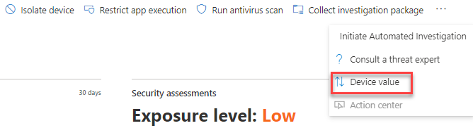
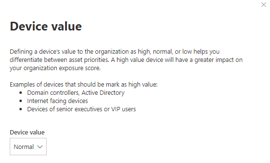

# Assign device value - threat and vulnerability management

[!INCLUDE [Microsoft 365 Defender rebranding](../../includes/microsoft-defender.md)]

**Applies to:**

- [Microsoft Defender for Endpoint](https://go.microsoft.com/fwlink/?linkid=2154037)
- [Threat and vulnerability management](next-gen-threat-and-vuln-mgt.md)
- [Microsoft 365 Defender](https://go.microsoft.com/fwlink/?linkid=2118804)

> Want to experience Microsoft Defender for Endpoint? [Sign up for a free trial.](https://www.microsoft.com/microsoft-365/windows/microsoft-defender-atp?ocid=docs-wdatp-portaloverview-abovefoldlink)

[!include[Prerelease information](../../includes/prerelease.md)]

Defining a device’s value helps you differentiate between asset priorities. The device value is used to incorporate the risk appetite of an individual asset into the threat and vulnerability management exposure score calculation. Devices assigned as “high value” will receive more weight.

You can also use the [set device value API](set-device-value.md).

Device value options:

- Low
- Normal (Default)
- High

Examples of devices that should be assigned a high value:

- Domain controllers, Active Directory
- Internet facing devices
- VIP devices
- Devices hosting internal/external production services

## Choose device value

1. Navigate to any device page, the easiest place is from the device inventory.

2. Select **Device value** from three dots next to the actions bar at the top of the page.

    

3. A flyout will appear with the current device value and what it means. Review the value of the device and choose the one that best fits your device.

## How device value impacts your exposure score

The exposure score is a weighted average across all devices. If you have device groups, you can also filter the score by device group.

- Normal devices have a weight of 1
- Low value devices have a weight of 0.75
- High value devices have a weight of NumberOfAssets / 10.
    - If you have 100 devices, each high value device will have a weight of 10 (100/10)

## Related topics

- [Threat and vulnerability management overview](next-gen-threat-and-vuln-mgt.md)
- [Exposure Score](tvm-exposure-score.md)
- [APIs](next-gen-threat-and-vuln-mgt.md#apis)