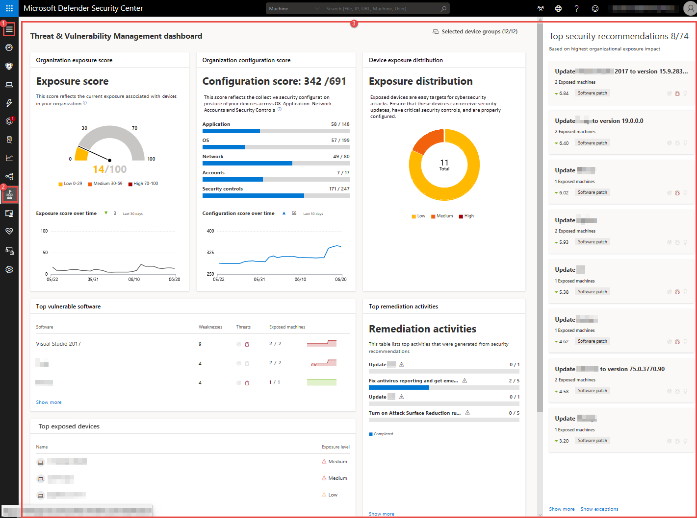
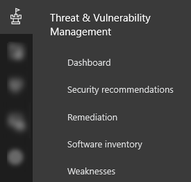

# Threat & Vulnerability Management dashboard overview

**Applies to:**
- [Microsoft Defender Advanced Threat Protection (Microsoft Defender ATP)](https://go.microsoft.com/fwlink/p/?linkid=2069559)

>Want to experience Microsoft Defender ATP? [Sign up for a free trial.](https://www.microsoft.com/en-us/WindowsForBusiness/windows-atp?ocid=docs-wdatp-portaloverview-abovefoldlink) 

Threat & Vulnerability Management is a component of Microsoft Defender ATP, and provides both security administrators and security operations teams with unique value, including:
- Real-time endpoint detection and response (EDR) insights correlated with endpoint vulnerabilities
- Invaluable machine vulnerability context during incident investigations
- Built-in remediation processes through Microsoft Intune and Microsoft System Center Configuration Manager (SCCM)  
  
You can use the Threat & Vulnerability Management capability in [Microsoft Defender Security Center](https://securitycenter.windows.com/) to:
- View exposure and configuration scores side-by-side with top security recommendations, software vulnerability, remediation activities, and exposed machines
- Correlate EDR insights with endpoint vulnerabilities and process them 
- Select remediation options, triage and track the remediation tasks

## Threat & Vulnerability Management in Microsoft Defender Security Center
When you open the portal, you’ll see the main areas of the capability:

 
 
 

- (1) Menu in the navigation pane
- (2) Threat & Vulnerability Management icon
- (3) Threat & Vulnerability Management dashboard

You can navigate through the portal using the menu options available in all sections. Refer to the following table for a description of each section.

Area | Description
:---|:---
(1) Menu | Select menu to expand the navigation pane and see the names of the Threat & Vulnerability Management capabilities.
(2) Threat & Vulnerability Management navigation pane | Use the navigation pane to move across the **Threat and Vulnerability Management Dashboard**, **Security recommendations**, **Remediation**, **Software inventory**, and **Weaknesses**.
**Dashboards**	| Get a high-level view of the organization exposure score, MDATP configuration score, top remediation activities, top security recommendations, top vulnerable software, and top exposed machines data.
**Security recommendations** | See the list of security recommendations, their related components, insights, number or exposed devices, impact, and request for remediation. You can click each item on the list and it will open a flyout pane where you will see vulnerability details, open the software page, and see the remediation options. You can also open a ticket in Intune if your machines are joined through Azure Active Directory and you have enabled your Intune connections in Microsoft Defender ATP. See [Security recommendations](https://docs.microsoft.com/en-us/windows/security/threat-protection/microsoft-defender-atp/tvm-security-recommendation) for more information.
**Remediation** | See the remediation activity, related component, remediation type, status, due date, and option to export the remediation and process data to CSV. See [Remediation](https://docs.microsoft.com/en-us/windows/security/threat-protection/microsoft-defender-atp/tvm-remediation) for more information.
**Software inventory** | See the list of applications, versions, weaknesses, whether there’s an exploit found on the application, prevalence in the organization, how many were installed, how many exposed devices are there, and the numerical value of the impact. You can select each item in the list and opt to open the software page which shows the associated vulnerabilities, misconfigurations, affected machine, version distribution details, and missing KBs or security updates. See [Software inventory](https://docs.microsoft.com/en-us/windows/security/threat-protection/microsoft-defender-atp/tvm-software-inventory) for more information.
**Weaknesses** | See the list of common vulnerabilities and exposures, the severity, its common vulnerability scoring system (CVSS) V3 score, related software, age, when it was published, related threat alerts, and how many exposed machines are there. You can select each item in the list and it opens a fly-in page with the vulnerability description and other details. See [Weaknesses](https://docs.microsoft.com/en-us/windows/security/threat-protection/microsoft-defender-atp/tvm-weaknesses) for more information.
(3) Threat & Vulnerability Management dashboard | Access the **Exposure score**, **Configuration score**, **Exposure distribution**, **Top security recommendations**, **Top vulnerable software**, **Top remediation activities**, and **Top exposed machines**.
**Selected machine groups (#/#)**	| Filter the Threat & Vulnerability Management data that you want to see in the dashboard and widgets by machine groups. What you select in the filter will be applied throughout the Threat & Vulnerability management pages only. 
**Organization Exposure score**	| See the current state of your organization’s device exposure to threats and vulnerabilities. Several factors affect your organization’s exposure score: weaknesses discovered in your devices, likelihood of your devices to be breached, value of the devices to your organization, and relevant alerts discovered with your devices. The goal is to lower down your organization’s exposure score to be more secure. To reduce the score, you need to remediate the related security configuration issues listed in the security recommendations. 
**MDATP Configuration score** | See the security posture of your organization’s operating system, applications, network, accounts and security controls. The goal is to increase your configuration score by remediating the related security configuration issues. You can click the bars and it will take you to the **Security recommendation** page for details. See [Configuration score](https://docs.microsoft.com/en-us/windows/security/threat-protection/microsoft-defender-atp/configuration-score) for more information.
**Machine exposure distribution** | See how many machines are exposed based on their exposure level. You can click the sections in the doughnut chart and it will take you to the **Machines list** page where you'll see the affected machine names, exposure level side by side with risk level, among other details such as domain, OS platform, its health state, when it was last seen, and its tags. 
**Top security recommendations** | See the collated security recommendations which are sorted and prioritized based on your organization’s risk exposure and the urgency that it requires. Useful icons also quickly calls your attention on possible active alerts , associated public exploits , and recommendation insights . You can drill down on the security recommendation to see the potential risks, list of exposed machines, and read the insights. Thus, providing you with an informed decision to either proceed with a remediation request. Click **Show more** to see the rest of the security recommendations in the list.
**Top vulnerable software** | Get real-time visibility into the organizational software inventory, with stack-ranked list of vulnerable software installed on your network’s devices and how they impact on your organizational exposure score. Click each item for details or **Show more** to see the rest of the vulnerable application list in the **Software inventory** page.
**Top remediation activities** | Track the remediation activities generated from the security recommendations. You can click each item on the list to see the details in the **Remediation** page or click **Show more** to see the rest of the remediation activities.
**Top exposed machines** | See the exposed machine names and their exposure level. You can click each machine name from the list and it will take you to the machine page where you can view the alerts, risks, incidents, security recommendations, installed software, discovered vulnerabilities associated with the exposed machines. You can also do other EDR-related tasks in it, such as: manage tags, initiate automated investigations, initiate a live response session, collect an investigation package, run antivirus scan, restrict app execution, and isolate machine. You can also click **Show more** to see the rest of the exposed machines list.

See [Microsoft Defender ATP icons](https://docs.microsoft.com/en-us/windows/security/threat-protection/windows-defender-atp/portal-overview-windows-defender-advanced-threat-protection#windows-defender-atp-icons) for more information on the icons used throughout the portal.

## Related topics
- [Risk-based Threat & Vulnerability Management](next-gen-threat-and-vuln-mgt.md)
- [Configuration score](configuration-score.md)
- [Scenarios](threat-and-vuln-mgt-scenarios.md)
- [Security recommendations](tvm-security-recommendation.md)
- [Remediation](tvm-remediation.md)
- [Software inventory](tvm-software-inventory.md)
- [Weaknesses](tvm-weaknesses.md)
