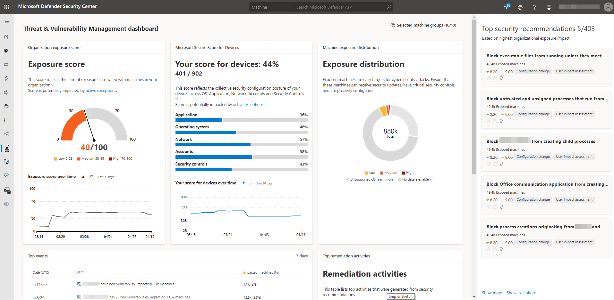

# Threat and vulnerability management dashboard insights

**Applies to:**

- [Microsoft Defender Advanced Threat Protection (Microsoft Defender ATP)](https://go.microsoft.com/fwlink/p/?linkid=2069559)

>Want to experience Microsoft Defender ATP? [Sign up for a free trial.](https://www.microsoft.com/microsoft-365/windows/microsoft-defender-atp?ocid=docs-wdatp-portaloverview-abovefoldlink)

Threat and vulnerability management is a component of Microsoft Defender ATP, and provides both security administrators and security operations teams with unique value, including:

- Real-time endpoint detection and response (EDR) insights correlated with endpoint vulnerabilities
- Invaluable device vulnerability context during incident investigations
- Built-in remediation processes through Microsoft Intune and Microsoft Endpoint Configuration Manager  
  
You can use the threat and vulnerability management capability in [Microsoft Defender Security Center](https://securitycenter.windows.com/) to:

- View you exposure score and Microsoft Secure Score for Devices, along with top security recommendations, software vulnerability, remediation activities, and exposed devices
- Correlate EDR insights with endpoint vulnerabilities and process them
- Select remediation options to triage and track the remediation tasks
- Select exception options and track active exceptions

> [!NOTE]
> Devices that are not active in the last 30 days are not factored in on the data that reflects your organization's threat and vulnerability management exposure score and Microsoft Secure Score for Devices.

Watch this video for a quick overview of what is in the threat and vulnerability management dashboard.

>[!VIDEO https://www.microsoft.com/en-us/videoplayer/embed/RE4r1nv]

## Threat and vulnerability management in Microsoft Defender Security Center

 

You can navigate through the portal using the menu options available in all sections. Refer to the following tables for a description of each section.

## Threat and vulnerability management navigation pane

Area | Description
:---|:---
**Dashboard**   | Get a high-level view of the organization exposure score, Microsoft Secure Score for Devices, device exposure distribution, top security recommendations, top vulnerable software, top remediation activities, and top exposed device data.
[**Security recommendations**](tvm-security-recommendation.md) | See the list of security recommendations, their related components, whether software or software versions in your network have reached end-of-support, insights, number or exposed devices, impact, and request for remediation. When you select an item from the list, a flyout panel opens with vulnerability details, a link to open the software page, and remediation and exception options. You can also open a ticket in Intune if your devices are joined through Azure Active Directory and you've enabled your Intune connections in Microsoft Defender ATP.
[**Remediation**](tvm-remediation.md) | See the remediation activity, related component, remediation type, status, due date, option to export the remediation and process data to CSV, and active exceptions.
[**Software inventory**](tvm-software-inventory.md) | See the list of software, versions, weaknesses, whether there's an exploit found on the software, whether the software or software version has reached end-of-support, prevalence in the organization, how many were installed, how many exposed devices there are, and the numerical value of the impact. You can select each item in the list and opt to open the software page that shows the associated vulnerabilities, misconfigurations, affected device, version distribution details, and missing KBs (security updates).
[**Weaknesses**](tvm-weaknesses.md) | See the list of common vulnerabilities and exposures, the severity, the common vulnerability scoring system (CVSS) V3 score, related software, age, when it was published, related threat alerts, and how many exposed devices there are. You can select each item in the list to see a flyout panel with the vulnerability description and other details.

## Threat and vulnerability management dashboard

Area | Description
:---|:---
**Selected device groups (#/#)**   | Filter the threat and vulnerability management data you want to see in the dashboard and cards by device groups. What you select in the filter applies throughout the threat and vulnerability management pages.
[**Exposure score**](tvm-exposure-score.md)   | See the current state of your organization's device exposure to threats and vulnerabilities. Several factors affect your organization's exposure score: weaknesses discovered in your devices, likelihood of your devices to be breached, value of the devices to your organization, and relevant alerts discovered with your devices. The goal is to lower the exposure score of your organization to be more secure. To reduce the score, you need to remediate the related security configuration issues listed in the security recommendations.
[**Microsoft Secure Score for Devices**](tvm-microsoft-secure-score-devices.md) | See the security posture of the operating system, applications, network, accounts, and security controls of your organization. The goal is to remediate the related security configuration issues to increase your score for devices. Selecting the bars will take you to the **Security recommendation** page.
**Device exposure distribution** | See how many devices are exposed based on their exposure level. Select a section in the doughnut chart to go to the **Devices list** page and view the affected device names, exposure level, risk level, and other details such as domain, operating system platform, its health state, when it was last seen, and its tags.
**Top security recommendations** | See the collated security recommendations that are sorted and prioritized based on your organization's risk exposure and the urgency that it requires. Select **Show more** to see the rest of the security recommendations in the list. Select **Show exceptions** for the list of recommendations that have an exception.
**Top vulnerable software** | Get real-time visibility into your organization's software inventory with a stack-ranked list of vulnerable software installed on your network's devices and how they impact your organizational exposure score. Select an item for details or **Show more** to see the rest of the vulnerable software list in the **Software inventory** page.
**Top remediation activities** | Track the remediation activities generated from the security recommendations. You can select each item on the list to see the details in the **Remediation** page or select **Show more** to view the rest of the remediation activities, and active exceptions.
**Top exposed devices** | View exposed device names and their exposure level. Select a device name from the list to go to the device page where you can view the alerts, risks, incidents, security recommendations, installed software, and discovered vulnerabilities associated with the exposed devices. Select **Show more** to see the rest of the exposed devices list. From the devices list, you can manage tags, initiate automated investigations, initiate a live response session, collect an investigation package, run antivirus scan, restrict app execution, and isolate device.

For more information on the icons used throughout the portal, see [Microsoft Defender ATP icons](portal-overview.md#microsoft-defender-atp-icons).

## Related topics

- [Threat and vulnerability management overview](next-gen-threat-and-vuln-mgt.md)
- [Supported operating systems and platforms](tvm-supported-os.md)
- [Exposure score](tvm-exposure-score.md)
- [Microsoft Secure Score for Devices](tvm-microsoft-secure-score-devices.md)
- [Security recommendations](tvm-security-recommendation.md)
- [Remediation and exception](tvm-remediation.md)
- [Software inventory](tvm-software-inventory.md)
- [Weaknesses](tvm-weaknesses.md)
- [Event timeline](threat-and-vuln-mgt-event-timeline.md)
- [Scenarios](threat-and-vuln-mgt-scenarios.md)
- [APIs](next-gen-threat-and-vuln-mgt.md#apis)
- [Configure data access for threat and vulnerability management roles](https://docs.microsoft.com/windows/security/threat-protection/microsoft-defender-atp/user-roles#create-roles-and-assign-the-role-to-an-azure-active-directory-group)
