# Create and view exceptions for security recommendations - threat and vulnerability management

[!INCLUDE [Microsoft 365 Defender rebranding](../../includes/microsoft-defender.md)]

**Applies to:**

- [Microsoft Defender for Endpoint](https://go.microsoft.com/fwlink/?linkid=2154037)
- [Threat and vulnerability management](next-gen-threat-and-vuln-mgt.md)
- [Microsoft 365 Defender](https://go.microsoft.com/fwlink/?linkid=2118804)

>Want to experience Microsoft Defender for Endpoint? [Sign up for a free trial.](https://www.microsoft.com/microsoft-365/windows/microsoft-defender-atp?ocid=docs-wdatp-portaloverview-abovefoldlink)

As an alternative to a remediation request when a recommendation is not relevant at the moment, you can create exceptions for recommendations. If your organization has device groups, you will be able to scope the exception to specific device groups. Exceptions can either be created for selected device groups, or for all device groups past and present.  

When an exception is created for a recommendation, the recommendation will not be active until the end of the exception duration. The recommendation state will change to **Full exception** or **Partial exception** (by device group).

## Permissions

Only users with “exceptions handling” permissions can manage exceptions (including creating or canceling). [Learn more about RBAC roles](user-roles.md).

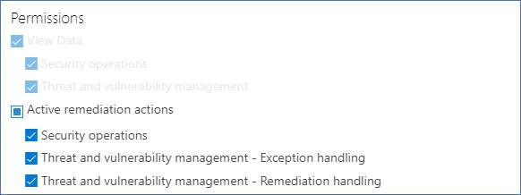

## Create an exception

Select a security recommendation you would like create an exception for, and then select **Exception options** and fill out the form.  

### Exception by device group

Apply the exception to all current device groups or choose specific device groups. Future device groups won't be included in the exception. Device groups that already have an exception will not be displayed in the list. If you only select certain device groups, the recommendation state will change from “active” to “partial exception.” The state will change to “full exception” if you select all the device groups.

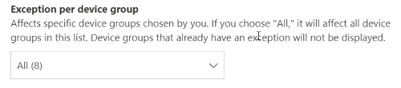

#### Filtered views

If you have filtered by device group on any of the threat and vulnerability management pages, only your filtered device groups will appear as options.

This is the button to filter by device group on any of the threat and vulnerability management pages: 

Exception view with filtered device groups:

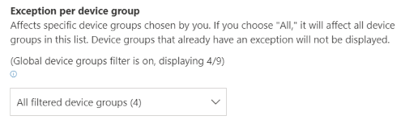

#### Large number of device groups

If your organization has more than 20 device groups, select **Edit** next to the filtered device group option.

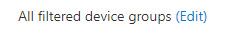

A flyout will appear where you can search and choose device groups you want included. Select the check mark icon below Search to check/uncheck all.

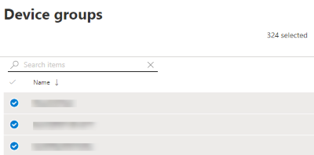

### Global exceptions

If you have global administrator permissions (called Microsoft Defender ATP administrator), you will be able to create and cancel a global exception. It affects **all** current and future device groups in your organization, and only a user with similar permission would be able to change it. The recommendation state will change from “active” to “full exception.”

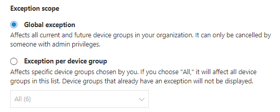

Some things to keep in mind:

- If a recommendation is under global exception, then newly created exceptions for device groups will be suspended until the global exception has expired or been cancelled. After that point, the new device group exceptions will go into effect until they expire.
- If a recommendation already has exceptions for specific device groups and a global exception is created, then the device group exception will be suspended until it expires or the global exception is cancelled before it expires.

### Justification

Select your justification for the exception you need to file instead of remediating the security recommendation in question. Fill out the justification context, then set the exception duration.

The following list details the justifications behind the exception options:

- **Third party control** - A third party product or software already addresses this recommendation
        - Choosing this justification type will lower your exposure score and increase your secure score because your risk is reduced
- **Alternate mitigation** - An internal tool already addresses this recommendation
        - Choosing this justification type will lower your exposure score and increase your secure score because your risk is reduced
- **Risk accepted** - Poses low risk and/or implementing the recommendation is too expensive
- **Planned remediation (grace)** - Already planned but is awaiting execution or authorization

## View all exceptions

Navigate to the **Exceptions** tab in the **Remediation** page. You can filter by justification, type, and status.

 Select an exception to open a flyout with more details. Exceptions per devices group will have a list of every device group the exception covers, which you can export. You can also view the related recommendation or cancel the exception.

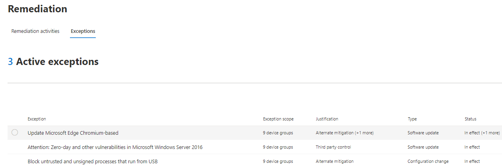

## How to cancel an exception

To cancel an exception, navigate to the **Exceptions** tab in the **Remediation** page. Select the exception.

To cancel the exception for all device groups or for a global exception, select the **Cancel exception for all device groups** button. You will only be able to cancel exceptions for device groups you have permissions for.

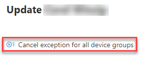

### Cancel the exception for a specific device group

Select the specific device group to cancel the exception for it. A flyout will appear for the device group, and you can select **Cancel exception**.

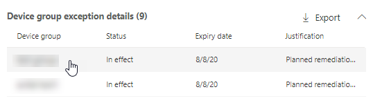

## View impact after exceptions are applied

In the Security Recommendations page, select **Customize columns** and check the boxes for **Exposed devices (after exceptions)** and **Impact (after exceptions)**.

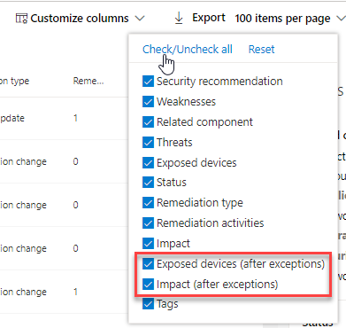

The exposed devices (after exceptions) column shows the remaining devices that are still exposed to vulnerabilities after exceptions are applied. Exception justifications that affect the exposure include ‘third party control’ and ‘alternate mitigation’. Other justifications do not reduce the exposure of a device, and they are still considered exposed.

The impact (after exceptions) shows remaining impact to exposure score or secure score after exceptions are applied. Exception justifications that affect the scores include ‘third party control’ and ‘alternate mitigation.’ Other justifications do not reduce the exposure of a device, and so the exposure score and secure score do not change.

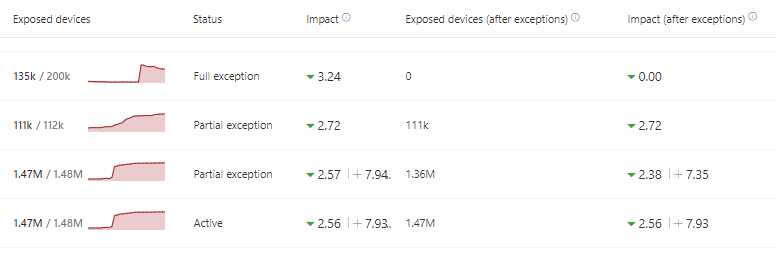

## Related topics

- [Threat and vulnerability management overview](next-gen-threat-and-vuln-mgt.md)
- [Remediate vulnerabilities](tvm-remediation.md)
- [Security recommendations](tvm-security-recommendation.md)
- [Exposure score](tvm-exposure-score.md)
- [Microsoft Secure Score for Devices](tvm-microsoft-secure-score-devices.md)
